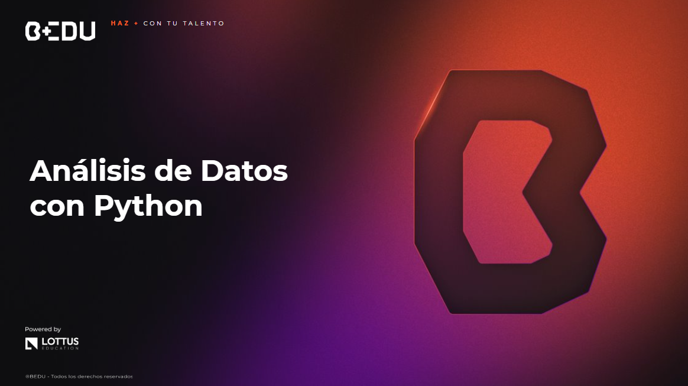

 🏠 [**Inicio**](../Readme.md)

    

---

## 📚 Links de archivos usados durante el modulo

Si deseas obtener más información sobre los datasets utilizados en el módulo, puedes acceder a los enlaces correspondientes a cada archivo. Además, cada sesión cuenta con su propio directorio que incluye los archivos utilizados, los cuales están disponibles para descargar.

1. 📁 [Sesión 01: Estimados de locación y variabilidad.](S01/)
    - 🔗 [Titanic_Dataset](https://www.kaggle.com/datasets/patelmanthan17/titanic-dataset)
    - 🔗 [Laptops_Dataset](https://www.kaggle.com/datasets/ishanp923/cleaned-laptops-dataset)
    - 🔗 [Salary_Professions](https://www.kaggle.com/datasets/krishujeniya/salary-prediction-of-data-professions)
    - 🔗 [Student_Performance](https://www.kaggle.com/datasets/aswanikrishnav/student-performance-dataset)

2. 📁 [Sesión 02: Introducción a la visualización de datos: distribuciones.](S02/)
    - 🔗 [Laptops_Dataset](https://www.kaggle.com/datasets/ishanp923/cleaned-laptops-dataset)
    - 🔗 [Salary_Professions](https://www.kaggle.com/datasets/krishujeniya/salary-prediction-of-data-professions)

3. 📁 [Sesión 03: Exploración de variables categóricas y análisis multivariable.](S03/)
    - 🔗 [Dogs_Dataset](https://www.kaggle.com/datasets/waqi786/dogs-dataset-3000-records)
    - 🔗 [Flowers_Dataset](https://www.kaggle.com/datasets/abhayayare/flower-dataset)
    - 🔗 [Financial_Risk](https://www.kaggle.com/datasets/preethamgouda/financial-risk)
    - 🔗 [Medical_Costs](https://www.kaggle.com/datasets/waqi786/medical-costs)

4. 📁 [Sesión 04: Correlaciones y regresión lineal simple.](S04/)
    - 🎲 Reto_01_Act_Extra_Desempeño: Valores aleatorios.

5. 📁 [Sesión 05: Distribuciones muestrales y técnicas de evaluación de modelos.](S05/)
    - 🎲 Ejemplo_01_Costos_Proyectos: Valores aleatorios.
    - 🎲 Ejemplo_03_04_Dataset_Quimico: Valores aleatorios.
    - 🎲 Reto_01_Recursos_Naturales: Valores aleatorios.
    - 🎲 Reto_02_Geografia_Clasificacion: Valores aleatorios.

6. 📁 [Sesión 06: Visualización de datos avanzada.](S06/)
    - 🎲 Ejemplo_02_03_Cybersecurity_Dataset: Valores aleatorios.
    - 🎲 Ejemplo_04_Cybersecurity_Word_Dataset: Valores aleatorios.
    - 🎲 Reto_01_02_Bio_Data: Valores aleatorios.

7. 📁 [Sesión 07: Pruebas A/B y procesamiento de lenguaje natural.](S07/)
    - 🎲 Ejemplo_01_03_Amazon_Sales_Dataset: Valores aleatorios.
    - 🎲 Ejemplo_02_Martial_Arts_Data: Valores aleatorios.
    - 🎲 pieza_metálica: Imagen de muestra.
    - 🎲 Reto_02_Tiempos_Ciclo_Produccion: Valores aleatorios.

8. 📁 [Sesión 08: Introducción a machine learning: clasificación no supervisada y supervisada.](S08/)
    - 🔗 [Crime_Dataset](https://www.kaggle.com/datasets/aishwaryatechie/nypd-arrest-data-2024)
    - 🔗 [Heart_Disease_Data](https://www.kaggle.com/datasets/aritrasarkar785/heart-diseases-detection-database)
    - 🔗 [Financial_Fraud_Detection](https://www.kaggle.com/datasets/smmmmmmmmmmmm/financial-fraud-detection)
    - 🔗 [Youtube_Spam_Dataset](https://www.kaggle.com/datasets/ahsenwaheed/youtube-comments-spam-dataset)
    - 🔗 [Mall_Customer_Segmentation_Data](https://www.kaggle.com/datasets/muzamillarr/mall-customer-segmentation-data)
    - 🔗 [Mental_Health_Survey](https://www.kaggle.com/datasets/willianoliveiragibin/student-mental)

---