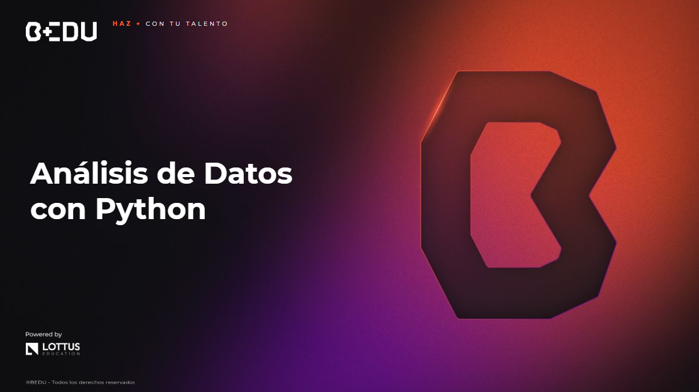

    

## 🎯 Objetivo del Curso

🐍 Aplicar el uso de Python para el análisis avanzado de datos, utilizando técnicas de estadística, visualización y la introducción a machine learning.

## 📚 Contenido del Curso

1. 📏 [Sesión 01: Estimados de locación y variabilidad.](Sesion-01/Readme.md)
2. 📈 [Sesión 02: Introducción a la visualización de datos: distribuciones.](Sesion-02/Readme.md)
3. 🧩 [Sesión 03: Exploración de variables categóricas y análisis multivariable.](Sesion-03/Readme.md)
4. ⚖️ [Sesión 04: Correlaciones y regresión lineal simple.](Sesion-04/Readme.md)
5. 📡 [Sesión 05: Distribuciones muestrales y técnicas de evaluación de modelos.](Sesion-05/Readme.md)
6. 🎨 [Sesión 06: Visualización de datos avanzada.](Sesion-06/Readme.md)
7. 🧪 [Sesión 07: Pruebas A/B y procesamiento de lenguaje natural.](Sesion-07/Readme.md)
8. 🤖 [Sesión 08: Introducción a machine learning: clasificación no supervisada y supervisada.](Sesion-08/Readme.md)
9. 📁 [Datasets](Datasets/)

➡️ [**Siguiente**](Sesion-01/Readme.md)