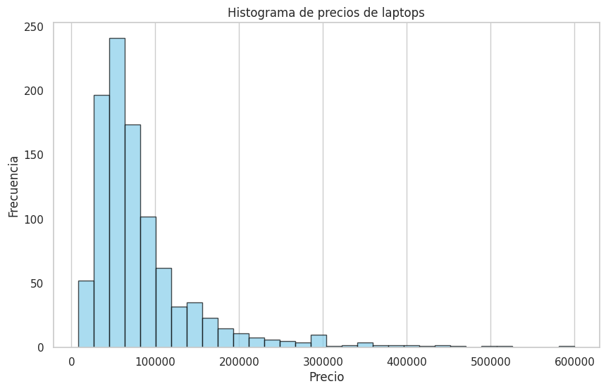
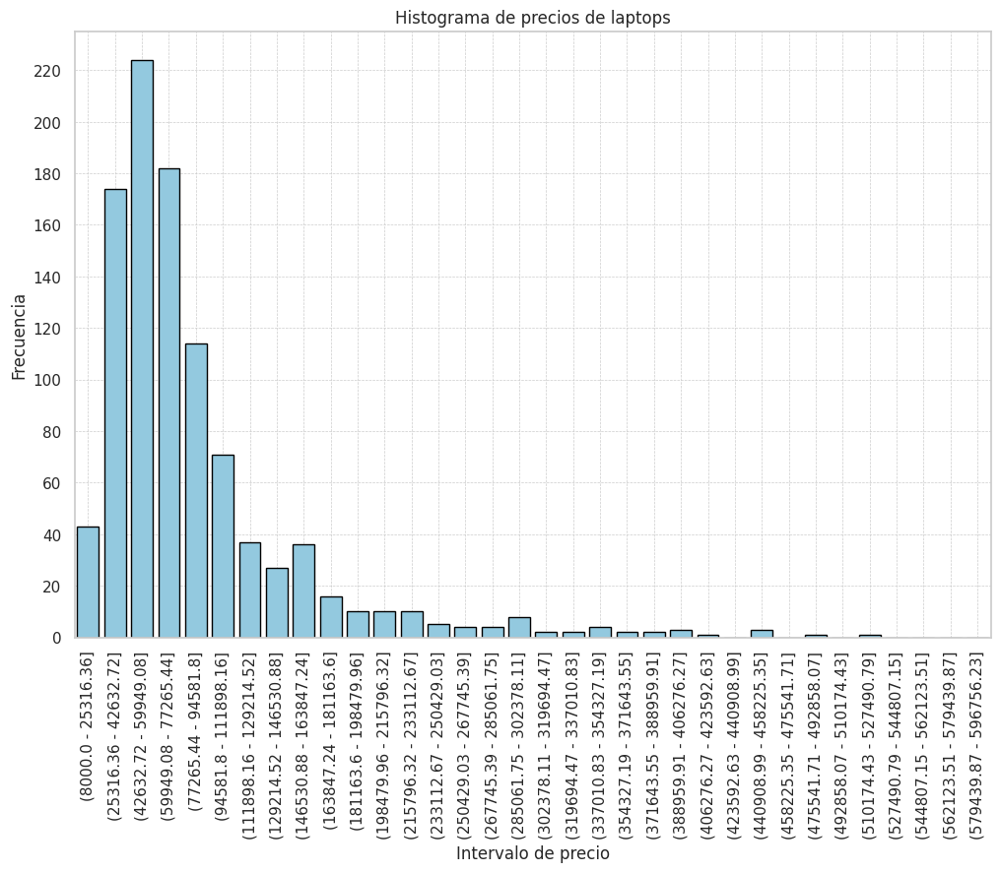

🏠 [**Inicio**](../../Readme.md) ➡️ / 📖 [**Sesión 02**](../Readme.md) ➡️ / 📝 `Ejemplo 02: Creación y análisis de histogramas`

## 🎯 Objetivo

Entender y aplicar los histogramas para visualizar la distribución de los datos en intervalos o categorías, identificar patrones y tendencias en los datos, y analizar la frecuencia con la que aparecen en cada intervalo.

---

## 🚀 Comencemos

En ocasiones, los datos pueden ser difíciles de interpretar si se presentan de forma cruda. Los histogramas son una forma visual de representar la distribución de los datos en intervalos o categorías, lo que nos permite identificar patrones, tendencias y valores atípicos en la información.

---

### 📚 **Definición y conceptos**

Un histograma es una gráfica de barras donde la escala horizontal representa clases de valores de datos y la escala vertical representa frecuencias. Las alturas de las barras corresponden a los valores de frecuencia; en tanto que las barras se dibujan de manera adyacente (sin huecos entre sí).

| Parte del histograma      | Descripción                                              |
| ------------------------- | -------------------------------------------------------- |
| **Eje X (horizontal)**    | Intervalos de clase (rangos de valores).                 |
| **Eje Y (vertical)**      | Frecuencia de datos en cada intervalo.                   |
| **Barras**                | Altura muestra la frecuencia en cada intervalo de clase. |
| **Etiquetas de ejes**     | Descripciones textuales de los datos en los ejes X e Y.  |
| **Título del histograma** | Encabezado que describe el contenido del histograma.     |
| **Leyenda (si aplica)**   | Explica colores/patrones si hay varias series de datos.  |

---

### 🛠️ **Construcción del histograma**

Para construir un histograma, se deben considerar los siguientes pasos:

1. **Construir la tabla de frecuencias:** Se agrupan los datos en intervalos o clases y se cuenta la frecuencia de datos en cada intervalo, esto ayudará a determinar la altura de las barras en el histograma.
2. **Dibujar las barras:** Se dibujan las barras en el histograma, donde la altura de cada barra representa la frecuencia de datos en cada intervalo de clase.
3. **Etiquetar los ejes:** Se añaden etiquetas a los ejes X e Y, describiendo los intervalos de clase y la frecuencia de datos respectivamente.
4. **Añadir título y leyenda:** Se añade un título al histograma describiendo el contenido de la gráfica, y una leyenda si se tienen varias series de datos.

<p>📌 Recuerda importar las librerías antes de crear el histograma:</p>

```python
import pandas as pd
import numpy as np
import seaborn as sns
import matplotlib.pyplot as plt
```

#### 📊 **Histograma datos numéricos**

```python
# 1.- Graficar el histograma de precios de laptops usando Matplotlib
plt.figure(figsize=(10, 6))
plt.hist(df['price'], bins=32, color='skyblue', edgecolor='black', alpha=0.7) # 32 intervalos puedes modificarlos para ver diferentes distribuciones.

# 2.- Configurar los títulos y las etiquetas
plt.title('Histograma de precios de laptops')
plt.xlabel('Precio')
plt.ylabel('Frecuencia')
plt.grid(axis='y')

# 3.- Mostrar el histograma
plt.show()
```

🔍 De acuerdo al histograma, debería de verse algo similar a la siguiente imagen:

<details>
  <summary><b>✨Haz clic aquí para ver el histograma✨</b></summary>
  
  ## Histograma de precios de laptops

  <div align="center">
      
  </div>
</details>

---

### 🎨 **Personalización de histogramas:**

```python
# 1.- Graficar el histograma a partir de la tabla de frecuencias usando Seaborn
plt.figure(figsize=(10, 6))
sns.set(style='whitegrid')
sns.barplot(x=tabla_frecuencias_num['Intervalo_de_clase'].astype(str), y=tabla_frecuencias_num['Frecuencia_absoluta'], color='skyblue', edgecolor='black')

# 2.- Configurar los títulos y las etiquetas
plt.title('Histograma de precios de laptops')
plt.xlabel('Intervalo de precio')
plt.ylabel('Frecuencia')
plt.xticks(rotation=90)
plt.grid(axis='y')

# 3.- Ajustar las líneas del eje Y
plt.yticks(np.arange(0, tabla_frecuencias_num['Frecuencia_absoluta'].max() + 1, 20))

# 4.- Fondo en cuadriculado
plt.grid(True, which='both', linestyle='--', linewidth=0.5)

# 5.- Mostrar el histograma
plt.show()
```

🔍 De acuerdo al histograma, debería de verse algo similar a la siguiente imagen:

<details>
  <summary><b>✨Haz clic aquí para ver el histograma✨</b></summary>
  
  ## Histograma de precios de laptops

  <div align="center">
      
  </div>
</details>


---

### 💡 **¿Sabías que?...**

Existen diferencias entre Matplotlib y Seaborn, dos de las bibliotecas de visualización de datos más populares. 
Algunas de las diferencias clave entre ambas son:

### Cuándo usar cada una

- **Matplotlib**: Matplotlib es ideal para usuarios que necesitan control completo sobre la visualización, permitiendo ajustes finos en la presentación y soportando una amplia gama de tipos de gráficos, desde básicos hasta complejos.

- **Seaborn**:  Seaborn facilita la creación rápida de gráficos atractivos y estadísticos directamente desde DataFrames de pandas, con estilos predefinidos y herramientas especializadas para análisis avanzados.

---

⬅️ [**Anterior**](../Readme.md) | [**Siguiente**](../Reto-01/Readme.md) ➡️
