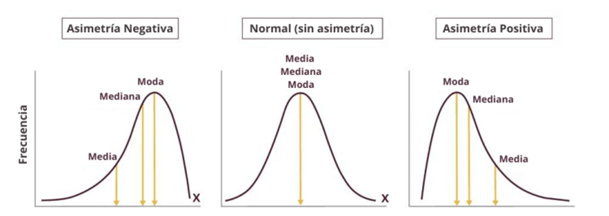
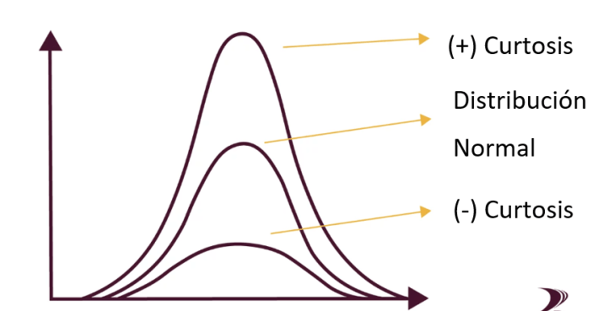
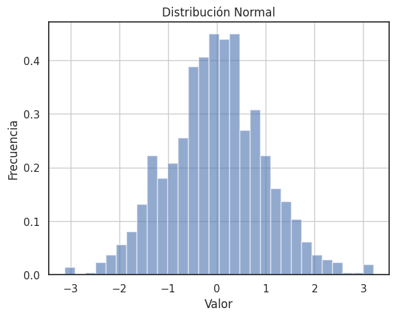
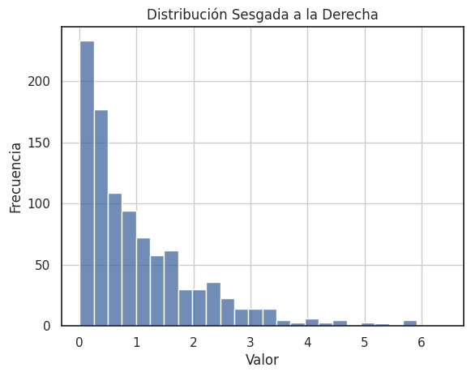
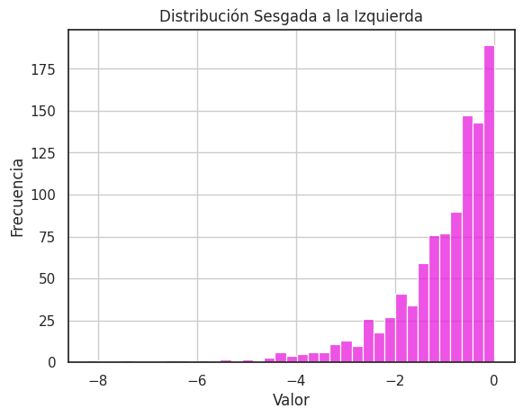
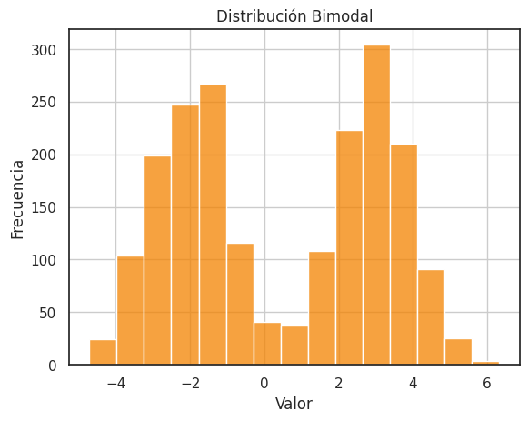
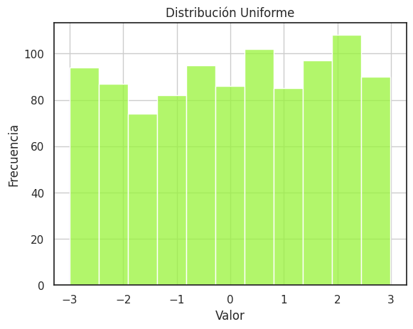

🏠 [**Inicio**](../../Readme.md) ➡️ / 📖 [**Sesión 02**](../Readme.md) ➡️ / 📝 `Ejemplo 03: Interpretación y descripción de histogramas`

## 🎯 Objetivo

Entender e interpretar la forma de un histograma y cómo se relaciona con la distribución de los datos.

---

## 🚀 Comencemos

La forma del histograma describe la apariencia general de la distribución de los datos y puede proporcionar información valiosa sobre el comportamiento de los datos.

---

## 📉 **Características de un histograma** 📊

Vamos a explorar algunas formas comunes que pueden adoptar los histogramas. Aunque las gráficas que obtenemos con datos del mundo real rara vez se ajustan perfectamente a estos modelos, es útil tener estas referencias para describir y analizar las gráficas de manera más precisa.

### **Asimetría (skewness)**

La asimetría describe la simetría de la distribución de los datos. Un histograma simétrico tiene la misma forma en ambos lados de la media. Un histograma asimétrico tiene una cola más larga en un lado de la media que en el otro.

- **Asimetría positiva**: La cola más larga está en el lado derecho de la media.
- **Asimetría negativa**: La cola más larga está en el lado izquierdo de la media.
- **Asimetría cero**: La distribución es simétrica.

<div align="center">
    
</div>

### **Curtosis (kurtosis)**

La curtosis describe la forma de la distribución de los datos en relación con una distribución normal. Una distribución normal tiene una curtosis de 0. Una curtosis positiva indica que la distribución tiene colas más pesadas y un pico más alto que una distribución normal. Una curtosis negativa indica que la distribución tiene colas más ligeras y un pico más bajo que una distribución normal.

- **Curtosis leptocúrtica**: La distribución tiene colas más pesadas y un pico más alto que una distribución normal.
- **Curtosis mesocúrtica**: La distribución es similar a una distribución normal.
- **Curtosis platicúrtica**: La distribución tiene colas más ligeras y un pico más bajo que una distribución normal.

<div align="center">
    
</div>

---

## 📈 **Diferentes distribuciones** 📊

Vamos a explorar diferentes formas que pueden adoptar los histogramas y cómo se relacionan con la distribución de los datos.

📌 Recuerda importar las librerías antes de crear las distribuciones:

```python
import numpy as np
import seaborn as sns
import matplotlib.pyplot as plt
from scipy.stats import skew, kurtosis

# Generar distribución
def generar_distribucion(data, titulo):
    # Calcular asimetría y curtosis
    asimetria = skew(data)
    curtosis = kurtosis(data)

    print(f"{titulo}: Asimetría = {asimetria:.2f}, Curtosis = {curtosis:.2f}")

    # Crear histograma
    sns.histplot(data, kde=False)
    plt.title(titulo)
    plt.xlabel('Valor')
    plt.ylabel('Frecuencia')
    plt.grid(True)
    plt.show()
```

---

### 📊 **Distribución normal**

```python
# Generar datos para una distribución normal
mu, sigma = 0, 1
dist_normal = np.random.normal(mu, sigma, 1000)

# Llamar a la función para generar la distribución
generar_distribucion(dist_normal, 'Distribución Normal')
```

<details>
  <summary>
    <b>✨Haz clic aquí para ver la distribución normal</b>
  </summary>

  ##### Distribución Normal: Asimetría = 0.07, Curtosis = 0.17
  <div align="center">
      
  </div>
</details>

---

### ➡️ **Distribución sesgada a la derecha**

```python
# Generar datos para una distribución sesgada a la derecha
dist_sesgada = np.random.exponential(1, 1000)

# Llamar a la función para generar la distribución sesgada a la derecha
generar_distribucion(dist_sesgada, 'Distribución Sesgada a la Derecha')
```

<details>
  <summary>
    <b>✨Haz clic aquí para ver la distribución sesgada a la derecha</b>
  </summary>

  ##### Distribución Sesgada a la Derecha: Asimetría = 1.99, Curtosis = 5.00
  <div align="center">
      
  </div>
</details>

---

### ⬅️ **Distribución sesgada a la izquierda**

```python
# Generar datos para una distribución sesgada a la izquierda
dist_sesgada = -np.random.exponential(1, 1000)

# Llamar a la función para generar la distribución sesgada a la izquierda
generar_distribucion(dist_sesgada, 'Distribución Sesgada a la Izquierda')
```

<details>
  <summary>
    <b>✨Haz clic aquí para ver la distribución sesgada a la izquierda</b>
  </summary>

  ##### Distribución Sesgada a la Izquierda: Asimetría = -1.99, Curtosis = 5.00
  <div align="center">
      
  </div>
</details>

---

### 📉 **Distribución bimodal**

```python
# Generar datos para una distribución bimodal
dist_bimodal = np.concatenate([np.random.normal(-2, 1, 500), np.random.normal(3, 1, 500)])

# Llamar a la función para generar la distribución bimodal
generar_distribucion(dist_bimodal, 'Distribución Bimodal')
```

<details>
  <summary>
    <b>✨Haz clic aquí para ver la distribución bimodal</b>
  </summary>

  ##### Distribución Bimodal: Asimetría = 0.00, Curtosis = -0.99
  <div align="center">
      
  </div>
</details>

---

### 🔄 **Distribución uniforme**

```python
# Generar datos para una distribución uniforme
dist_uniforme = np.random.uniform(-1, 1, 1000)

# Llamar a la función para generar la distribución uniforme
generar_distribucion(dist_uniforme, 'Distribución Uniforme')
```

<details>
  <summary>
    <b>✨Haz clic aquí para ver la distribución uniforme</b>
  </summary>
  
  ##### Distribución Uniforme: Asimetría = -0.09, Curtosis = -1.20
  <div align="center">
      
  </div>
</details>

---

### 💡 **¿Sabías que?...**

El objetivo no es la simple construcción de un histograma, sino entender algo acerca de los datos. Analiza el histograma para ver qué es posible aprender acerca de “CVDVT”: 

- **C**entro: valor promedio o mediano, indica donde se concentran los datos.
- **V**ariabilidad: rango de valores, indica la dispersión de los datos.
- **D**istribución: forma del histograma, indica la simetría y curtosis.
- **V**alores atípicos: valores que se alejan de la tendencia general de los datos.
- **T**endencias: patrones o comportamientos que se repiten en los datos.


---

⬅️ [**Anterior**](../Readme.md) | [**Siguiente**](../Ejemplo-04/Readme.md) ➡️
