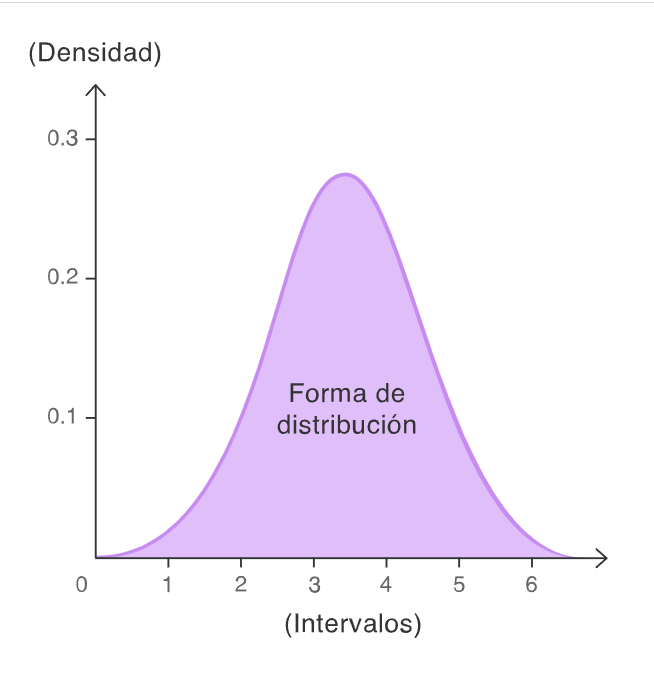
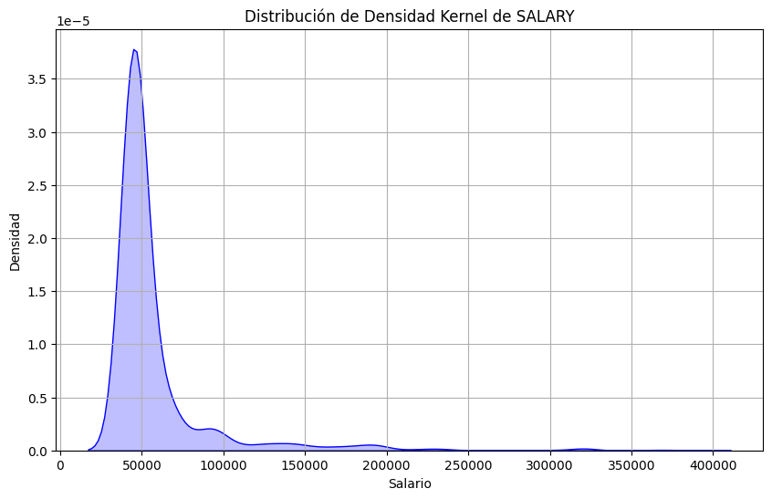

🏠 [**Inicio**](../../Readme.md) ➡️ / 📖 [**Sesión 02**](../Readme.md) ➡️ / 📝 `Ejemplo 04: Creación y análisis de gráficas de densidad`

## 🎯 Objetivo

Crear y analizar gráficas de densidad para interpretar la distribución de los datos a través de las probabilidades de cada valor dentro de un intervalo dado. Identificar patrones, tendencias y anomalías en los datos para mejorar la capacidad de toma de decisiones.

---

## 🚀 Comencemos

También conocido como gráfico de densidad de Kernel (Kernel Density Ploty) o gráfico de densidad de traza. Es una forma de visualizar la distribución de un conjunto de datos, es una variación del histograma que utiliza el suavizado de Kernel para trazar valores, permitiendo una representación más fluida al reducir el ruido. Los picos en un gráfico de densidad ayudan a identificar dónde se concentran los valores dentro del intervalo.

---

## 📚 **Características de un grafico de densidad** 

- **Picos**: Indican la concentración de valores en un intervalo.
- **Valles**: Indican la dispersión de valores en un intervalo.
- **Área bajo la curva**: Indica la probabilidad de que un valor caiga en un intervalo dado.
- **Suavizado de Kernel**: Reduce el ruido en la visualización de los datos.

<div align="center">
    
</div>

---

### 🛠️ **Construcción de grafica de densidad**

Para construir una gráfica de densidad, se deben considerar los siguientes pasos:

1. **Cargar el dataset**: Vamos a trabajar con el archivo [Ejemplo_04_Salary_Professions.csv](../../Datasets/S02/Ejemplo_04_Salary_Professions.csv), con el fin de realizar una ejemplo para variables numéricas continuas.

2. **Importar librerías**: Importar las librerías necesarias para el análisis de datos y la visualización de gráficos.

3. **Crear la gráfica de densidad**: Utilizar la función `kdeplot` de la librería `seaborn` para crear la gráfica de densidad.

4. **Personalizar la gráfica**: Añadir etiquetas, títulos y leyendas a la gráfica para mejorar la interpretación de los datos.

```python
import pandas as pd
import seaborn as sns
import matplotlib.pyplot as plt

# Cargar el dataset
data = pd.read_csv("/datasets/Salary_Professions.csv") # Modifica la ruta de acuerdo a tu entorno de trabajo.

# Convertir la columna SALARY a tipo numérico, forzando errores a NaN
data['SALARY'] = pd.to_numeric(data['SALARY'], errors='coerce')

# Filtrar los datos para eliminar valores nulos en la columna SALARY
data = data.dropna(subset=['SALARY'])

# Crear gráfico de densidad kernel para la columna SALARY
plt.figure(figsize=(10, 6))
sns.kdeplot(data['SALARY'], fill=True, color="b")  # Cambiar shade=True por fill=True
plt.title('Distribución de Densidad Kernel de SALARY')
plt.xlabel('Salario')
plt.ylabel('Densidad')
plt.grid(True)
plt.show()
```

---

### 📉 **Interpretación de graficas de densidad**


<div align="center">
    
</div>

De acuerdo a la gráfica de densidad kernel de SALARY, podemos observar que la mayoría de los salarios se concentran en un rango de valores entre 40,000 y 60,000, con un pico muy pronunciado alrededor de los 50,000. Esto indica que la probabilidad de que un salario caiga en este intervalo es alta. A medida que nos alejamos de este rango, la densidad disminuye significativamente, lo que sugiere que hay menos empleados con salarios mucho más altos. La distribución presenta una cola larga hacia la derecha, lo que indica la presencia de algunos salarios mucho más altos, pero con una probabilidad mucho menor.

---

### 💡 **¿Sabías que?...**

¿Cuándo utilizar graficas de densidad y cuando utilizar histogramas?

- **Histogramas**: Son útiles para visualizar la distribución de datos discretos o agrupados en intervalos, y permiten identificar patrones y tendencias en los datos.

- **Gráficas de densidad**: Son útiles para visualizar la distribución de datos continuos y suavizar la representación de los datos, permitiendo identificar picos y valles en la distribución de los datos.

---

⬅️ [**Anterior**](../Readme.md) | [**Siguiente**](../Reto-02/Readme.md)➡️