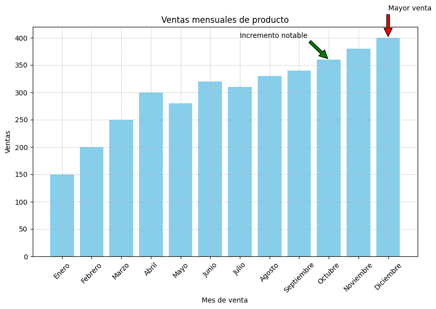
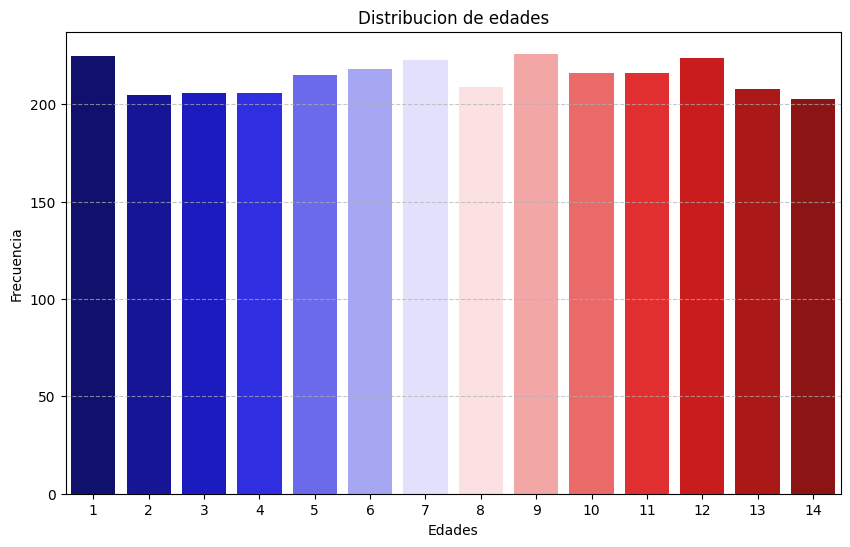

🏠 [**Inicio**](../../Readme.md) ➡️ / 📖 [**Sesión 03**](../Readme.md) ➡️ / 📝 `Ejemplo 01: Anotaciones y gráficas básicas`

## 🎯 Objetivo

Desarrollar habilidades para añadir anotaciones y etiquetas en gráficas, personalizando su apariencia y mejorando su entendimiento, facilitando la interpretación de los datos y resaltando puntos clave, para la toma de decisiones informadas.

---

## 🚀 Comencemos

Al momento de realizar gráficas es importante resaltar puntos clave, añadir anotaciones y etiquetas que faciliten la interpretación de los datos, proporcionando contexto adicional y mejorando la claridad y efectividad de la visualización.

---

### 📝 **Anotando nuestras gráficas**

Vamos a crear una gráfica de barras que muestra las ventas mensuales de un producto y añadir anotaciones para resaltar los meses con mayores ventas y proporcionar contexto adicional.

```python
import pandas as pd
import matplotlib.pyplot as plt

# Crear los datos
data = {
    'Mes': ['Enero', 'Febrero', 'Marzo', 'Abril', 'Mayo', 'Junio', 'Julio', 'Agosto', 'Septiembre', 'Octubre', 'Noviembre', 'Diciembre'],
    'Ventas': [150, 200, 250, 300, 280, 320, 310, 330, 340, 360, 380, 400]
}

# Crear un DataFrame
datos = pd.DataFrame(data)

# Crear la gráfica de barras
plt.figure(figsize=(10, 6))
plt.bar(datos['Mes'], datos['Ventas'], color='skyblue')

# Añadir título y etiquetas
plt.title('Ventas mensuales de producto')
plt.xlabel('Mes de venta')
plt.ylabel('Ventas')

# Rotar las etiquetas del eje x
plt.xticks(rotation=45)

# Añadir líneas de cuadrícula
plt.grid(True, which='both', linestyle='--', linewidth=0.5)

# Resaltar el mes con mayores ventas
max_ventas = datos['Ventas'].max()
mes_max_ventas = datos['Mes'][datos['Ventas'].idxmax()]

# Añadir anotación para la mayor venta
plt.annotate('Mayor venta', 
             xy=(mes_max_ventas, max_ventas), 
             xytext=(mes_max_ventas, max_ventas + 50),
             arrowprops=dict(facecolor='red', shrink=0.05))

# Añadir anotaciones para proporcionar contexto adicional
plt.annotate('Incremento notable', 
             xy=('Octubre', 360), 
             xytext=('Julio', 400),
             arrowprops=dict(facecolor='green', shrink=0.05))

# Mostrar la gráfica
plt.show()
```

<details>
  <summary><b>✨Haz clic aquí para ver la imagen✨</b></summary>
  <div align="center">
      
  </div>

  <!-- Breve interpretación -->
Una posible interpretación de esta gráfica es que las ventas del producto han ido aumentando a lo largo del año, con un incremento notable en octubre. Esto podría deberse a factores como la temporada de vacaciones o promociones especiales.
</details>

---

### 📊 **Gráficas de barras y la moda**

En esta sección, crearas una grafica de barras usando la columna de edad de un datasets de perritos, para visualizar la moda (valor más frecuente) en un conjunto de datos. Es especialmente útil para variables categóricas y puede proporcionar información valiosa sobre la distribución de los datos.

1. 📂 **Carga el dataset**: Descarga el archivo [Ejemplo_01_Dogs_Dataset.csv](../../Datasets/S03/Ejemplo_01_Dogs_Dataset.csv) y súbelo a tu Google Drive. Luego, convierte el dataset en un DataFrame de Pandas.

2. 📊 **Crear la gráfica de barras**: Crea una gráfica de barras que muestre la cantidad de perros en cada grupo de edad.

> **📝 Nota:** La columna "Age (Years)" puede ser tratada como una variable numérica o categórica, dependiendo del análisis que deseemos realizar. En este caso, la trataremos como una variable categórica para determinar cuántos perritos pertenecen a cada rango de edad.


```python
import matplotlib.pyplot as plt
import pandas as pd
import seaborn as sns

# Cargar el dataset
dogs_df = pd.read_csv('/Datasets/Ejemplo_01_Dogs_Dataset.csv') # Cambiar la ruta al archivo Dogs_Dataset.csv en tu Google Drive

# Contar la frecuencia de cada edad
age_counts = dogs_df['Age (Years)'].value_counts().sort_index()

# Convertir el conteo a un DataFrame para usar con Seaborn
age_counts_df = age_counts.reset_index()
age_counts_df.rename(columns={'Age (Years)': 'Edad', 'count': 'Frecuencia'}, inplace=True)

# Obtenemos las edades de los perros, como valores unicos
edades = dogs_df['Age (Years)'].unique()
print(f'Edades únicas: {edades}')

# Obtenemos el numero de categorias de edad
num_edades = dogs_df['Age (Years)'].nunique()
print(f'Número de categorias de edad: {num_edades}')

# Obtenemos la moda de las edades
moda_edad = dogs_df['Age (Years)'].mode()[0]
print(f'Moda de las edades: {moda_edad}')

# Generar la gráfica de barras usando Seaborn con colores personalizados
plt.figure(figsize=(10, 6))
colors = sns.color_palette("seismic", len(age_counts_df))  # Usar la paleta 'seismic' para los colores
sns.barplot(data=age_counts_df, x='Edad', y='Frecuencia', hue='Edad', palette=colors, legend=False)
plt.title('Distribucion de edades')
plt.xlabel('Edades')
plt.ylabel('Frecuencia')
plt.xticks(rotation=0)
plt.grid(axis='y', linestyle='--', alpha=0.7)
plt.show()
```

Si quieres sobre la paleta de colores de Seaborn, puedes consultar aquí [Paleta de colores](https://www.practicalpythonfordatascience.com/ap_seaborn_palette).

<details>
  <summary><b>✨Haz clic aquí para ver la imagen✨</b></summary>
  <div align="center">
      
  </div>

  <!-- Breve interpretación -->
La gráfica de barras muestra la distribución de edades en el dataset de perritos, con la moda (valor más frecuente) en el rango de 1 a 14 años. Esto sugiere que la mayoría de los perritos en el dataset tienen entre 1 y 9 años de edad.

Siendo 9 años el valor que más se repite en el dataset, con 226 perritos y 1 año con 225 perritos.
</details>

---

### 💡 **¿Sabías que?...**

Hay veces que resulta más cómodo y comprensible acomodar nuestras barras de manera horizontal. Esto puede hacerse muy fácilmente agregando la bandera orient='h' y cambiando el orden de nuestros inputs:

```python
plt.figure(figsize=(10, 6))
colors = sns.color_palette("Paired", len(age_counts_df))  # Usar la paleta 'Paired' para los colores
sns.barplot(data=age_counts_df, y='Edad', x='Frecuencia', hue='Edad', palette=colors, orient='h', legend=False)
plt.title('Distribucion de edades')
plt.xlabel('Frecuencia')
plt.ylabel('Edades')
plt.xticks(rotation=0)
plt.grid(axis='x', linestyle='--', alpha=0.7)
plt.show()
```

---

⬅️ [**Anterior**](../Readme.md) | [**Siguiente**](../Ejemplo-02/Readme.md) ➡️