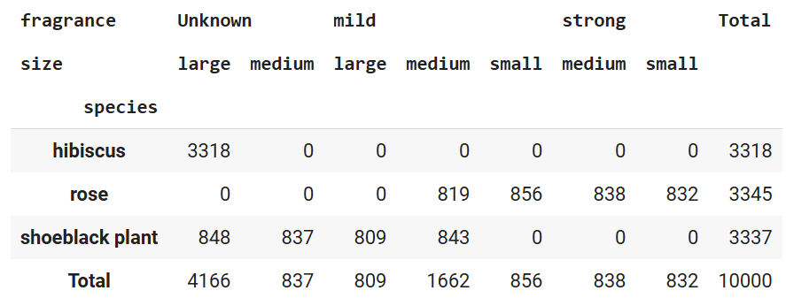

🏠 [**Inicio**](../../Readme.md) ➡️ / 📖 [**Sesión 03**](../Readme.md) ➡️ / 📝 `Ejemplo 02: Tablas de contingencia e indexación avanzada`

## 🎯 Objetivo

Desarrollar habilidades para realizar conteos de frecuencias utilizando dos o más variables categóricas y agrupar nuestros datos, empleando tablas de contingencia. Aprender a indexar dataframes con múltiples niveles de columnas para manejar y analizar datos complejos de manera sencilla.


---

## 🚀 Comencemos
Las tablas de contingencia, o tablas cruzadas, se utilizan principalmente para analizar la relación entre dos o más variables categóricas, mostrando la frecuencia de sus combinaciones en un conjunto de datos. Esto permite identificar patrones, asociaciones y posibles dependencias entre las variables. Aunque están diseñadas para variables categóricas, también pueden aplicarse a variables discretas con un número limitado de valores únicos. No son adecuadas para variables continuas, a menos que estas se conviertan en categorías antes de crear la tabla de contingencia.


---

### 📋 **Tablas de contingencia**

Imagina que eres la persona responsable de categorizar la información de un dataset de plantas en un vivero. Tienes información sobre las especies, el tamaño, la fragancia y la altura de las plantas. Para analizar la relación entre estas variables, puedes crear una tabla de contingencia que muestre la frecuencia de cada combinación de valores. 

Podemos usar el método crosstab para generar tablas de contingencia usando dos de nuestras variables categóricas, como especies y tamaño. 

1. 📂 **Carga el dataset**: Descarga el archivo [Ejemplo_02_Flower_Dataset.csv](../../Datasets/S03/Ejemplo_02_Flower_Dataset.csv) y súbelo a tu Google Drive. 

2. 📊 **Crear el dataframe principal**: Utiliza el archivo, conviértelo en un dataframe y muestra su información.

    ```python
    import pandas as pd

    # Cargar el dataset
    flowers_df = pd.read_csv('/Datasets/Flower_Dataset.csv') # Cambiar la ruta al archivo Flower_Dataset.csv en tu Google Drive

    # Limpiar la columna de fragancia, ya que tiene valores como none
    flowers_df['fragrance'] = flowers_df['fragrance'].replace('none', 'Unknown')

    # Mostrar las primeras filas del dataset
    flowers_df.head()
    ```


3. 📊 **Crear la tabla de contingencia**: Utiliza el método crosstab para generar la tabla usando dos variables categóricas.

    ```python
    # Generar la tabla de contingencia usando species y size
    contingency_table = pd.crosstab(flowers_df['species'], flowers_df['size'])

    # Mostrar la tabla de contingencia
    contingency_table.head()
    ```

4. 📊 **Mostrar la tabla de contingencia**: La tabla de contingencia muestra la frecuencia de cada combinación de valores de las variables categóricas. En este caso, la tabla de contingencia muestra la frecuencia de cada especie de planta en cada tamaño.

    | species / size  | large | medium | small |
    |-----------------|-------|--------|-------|
    | hibiscus        | 3318  | 0      | 0     |
    | rose            | 0     | 1657   | 1688  |
    | shoeblack plant | 1657  | 1680   | 0     |

5. 📊 **Agregar márgenes a la tabla de contingencia**:

    ```python
    # Agregar márgenes a la tabla de contingencia
    contingency_table = pd.crosstab(flowers_df['species'], flowers_df['size'], margins=True, margins_name='Total')

    # Mostrar la tabla de contingencia con márgenes
    contingency_table.head()
    ```
    El resultado seria algo similar a esto:

    <!-- Resultado -->
    | species / size    | large | medium | small | Total |
    |-----------------|-------|--------|-------|-------|
    | hibiscus        | 3318  | 0      | 0     | 3318  |
    | rose            | 0     | 1657   | 1688  | 3345  |
    | shoeblack plant | 1657  | 1680   | 0     | 3337  |
    | Total           | 4975  | 3337   | 1688  | 10000 |


6. 📊 **Crear una tabla de contingencia con más de dos variables**:

    ```python
    # Agregamos una tercer colunma fragrance
    contingency_table_2 = pd.crosstab(flowers_df['species'], [flowers_df['fragrance'],flowers_df['size']], margins=True, margins_name="Total")

    # Mostrar la tabla de contingencia
    contingency_table_2.head()
    ```
    <details>
      <summary><b>✨Haz clic aquí para ver la imagen✨</b></summary>
      <div align="center">
          
      </div>
    </details>


---

### 🏷️ **Indexación en múltiples niveles**

La indexación en múltiples niveles es una técnica que permite organizar y acceder a los datos de un dataframe de manera jerárquica. Esto es útil cuando se trabaja con datos complejos que requieren múltiples niveles de agrupación y organización.

#### 📝 **Ejemplo 1: Acceso a valores específicos**

Podemos acceder a valores específicos en la tabla de contingencia utilizando la indexación múltiple. Por ejemplo, para obtener el número de plantas de la especie "rose" que son de tamaño "medium" y tienen una fragancia "mild":

```python
# Acceder a un valor específico en la tabla de contingencia.
medium_mild_rose = contingency_table_2.loc['rose', ('mild', 'medium')]
print(f"El número de rosas de tamaño medio con fragancia suave es: {medium_mild_rose}")
```

<!-- Resultado -->
El número de rosas de tamaño medio con fragancia suave es: 819

#### 📝 **Ejemplo 2: Filtrar datos**

Podemos filtrar los datos para obtener todas las especies que tienen plantas de fragancia "Unknown":

```python
# Filtrar la tabla de contingencia para obtener solo las columnas con fragancia 'Unknown' y el total.
unknown_fragrance_plants = contingency_table_2.loc[:, ['Unknown', 'Total']]

# Mostrar la tabla resultante
unknown_fragrance_plants.head()
```

#### 📝 **Ejemplo 3: Pivotar los datos**

El método `stack()` nos permite pivotar los datos de la tabla de contingencia, convirtiendo las columnas en índices y viceversa. Por ejemplo, podemos pivotar la tabla de contingencia para mostrar la fragancia como índice y el tamaño como columnas:

```python
# Pivotar la tabla de contingencia para mostrar la fragancia como índice y el tamaño como columnas.
pivot_table = contingency_table_2.stack(level=1)

# Mostrar la tabla pivotada
pivot_table.head()
```

---

### 💡 **¿Sabías que?...**

La diferencia entre `.xs` y `.loc` en `pandas` radica en cómo y para qué se utilizan al acceder a datos en un `DataFrame` o `Series`, especialmente cuando se trata de índices jerárquicos (o `MultiIndex`). Ambos métodos son poderosos, pero tienen sus casos de uso específicos.

#### `.xs()`

- **Propósito**: Extraer datos de un `DataFrame` con un `MultiIndex` para un nivel específico.
- **Uso**: Selecciona todas las filas o columnas que comparten un valor en un nivel del índice.
- **Ejemplo**:
  ```python
  # Extrae todas las filas donde 'Smoker' es 'no'
  no_smokers = df.xs('no', level='Smoker')
  ```

#### `.loc[]`

- **Propósito**: Acceder a datos basados en etiquetas para uno o más ejes.
- **Uso**: Filtrar filas y columnas por etiquetas y condiciones booleanas.
- **Ejemplo**:
  ```python
  # Accede a datos específicos usando etiquetas
  specific_entry = df.loc[('north', 'yes')]
  # Filtrar por condiciones
  filtered_data = df.loc[df.index.get_level_values('Smoker') == 'no']
  ```

#### Diferencias clave

- **`.xs()`** es útil para extraer todas las entradas de un nivel de `MultiIndex`.
- **`.loc[]`** es más flexible, permitiendo combinaciones complejas de selecciones de filas y columnas.

#### En pocas palabras

- **`.xs()`**: Especializado en `MultiIndex`, selecciona por nivel.
- **`.loc[]`**: Generalizado, selecciona por etiquetas con flexibilidad en condiciones.

---

⬅️ [**Anterior**](../Readme.md) | [**Siguiente**](../Reto-01/Readme.md) ➡️