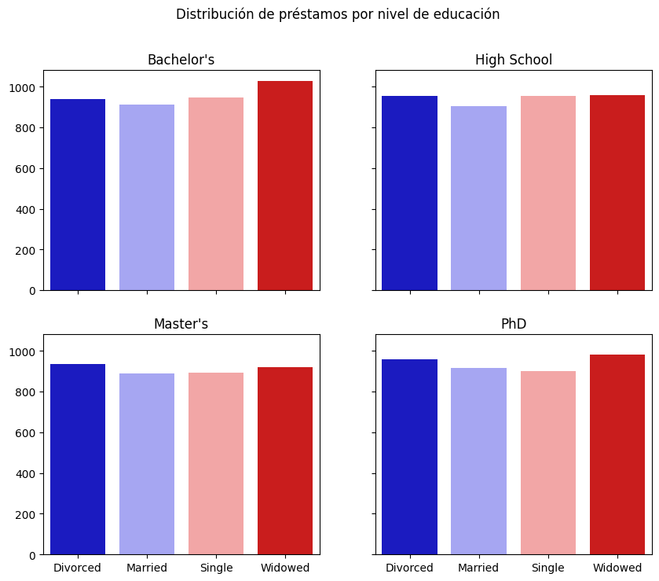
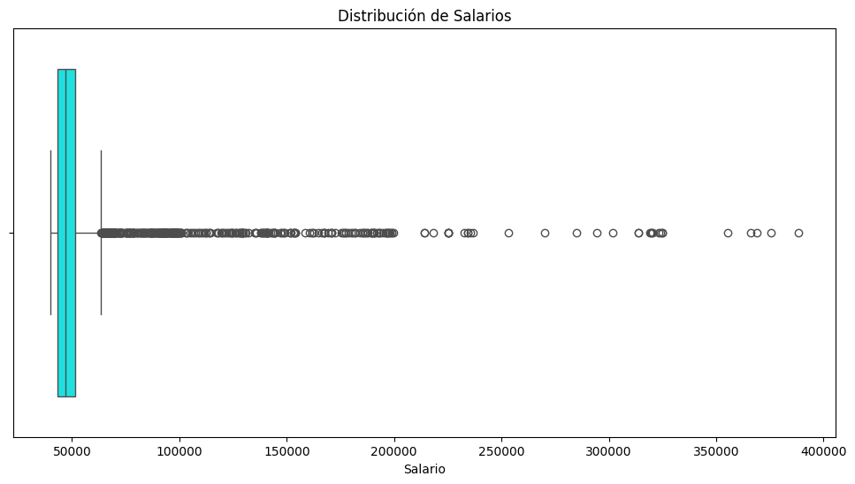
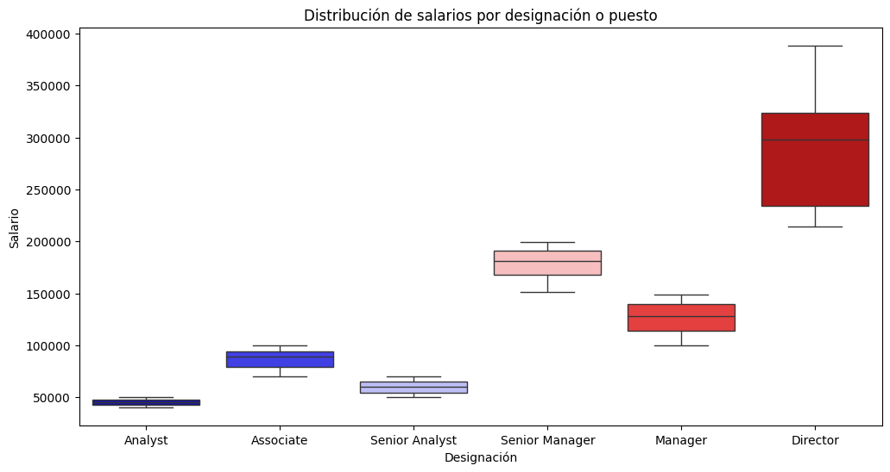

🏠 [**Inicio**](../../Readme.md) ➡️ / 📖 [**Sesión 03**](../Readme.md) ➡️ / 📝 `Ejemplo 03: Gráficas avanzadas y multiaxis`

## 🎯 Objetivo

Aprender a generar visualizaciones multi-axis, incluidas las de tipo boxplot, que permitan la comprensión de relaciones complejas y comparaciones simultáneas entre variables con diferentes escalas en una sola gráfica.

---

## 🚀 Comencemos

Las gráficas de múltiples ejes son una herramienta poderosa para visualizar relaciones complejas entre variables, ya que permiten comparar múltiples variables en una sola gráfica. En esta sesión aprenderemos a crear gráficas de múltiples ejes, incluidas las de tipo boxplot, que permiten conocer la distribución de los datos y sus valores atípicos, así como comparar múltiples variables en una sola gráfica.

---

### 📊 **Graficando en múltiples ejes**

1. 📂 **Carga el dataset**: Descarga el archivo [Ejemplo_03_Financial_Risk.csv](../../Datasets/S03/Ejemplo_03_Financial_Risk.csv) y súbelo a tu Google Drive.

El método `subplot` de matplotlib permite crear múltiples gráficas de diferentes tipos en diferentes ejes en una sola figura. Para ello, se debe especificar el número de filas y columnas de la figura, así como el índice de la gráfica que se desea crear.

```python
from IPython.display import display # Para mostrar múltiples salidas en una celda
import pandas as pd
import matplotlib.pyplot as plt
import seaborn as sns

# Cargar el dataset
data = pd.read_csv('/Datasets/Ejemplo_03_Financial_Risk.csv') # Modifica la ruta de acuerdo a tu entorno de trabajo.
display(data.head())

print('-'*100)

# Generamos una tabla cruzada de dos variables, (Nivel de educación y Estado civil)
tabla_cruzada = pd.crosstab(data['Education Level'], data['Marital Status'])
display(tabla_cruzada)

print('-'*100)

# Generamos un subplot de 2 x 2 
fig, axes = plt.subplots(2, 2, figsize=(10, 8), sharex=True, sharey=True)
colors = sns.color_palette("seismic", len(tabla_cruzada))  # Usar la paleta 'seismic' para los colores

sns.barplot(x=tabla_cruzada.columns, y=tabla_cruzada.iloc[0], ax=axes[0, 0], palette=colors, hue=tabla_cruzada.index, legend=False)
sns.barplot(x=tabla_cruzada.columns, y=tabla_cruzada.iloc[1], ax=axes[0, 1], palette=colors, hue=tabla_cruzada.index, legend=False)
sns.barplot(x=tabla_cruzada.columns, y=tabla_cruzada.iloc[2], ax=axes[1, 0], palette=colors, hue=tabla_cruzada.index, legend=False)
sns.barplot(x=tabla_cruzada.columns, y=tabla_cruzada.iloc[3], ax=axes[1, 1], palette=colors, hue=tabla_cruzada.index, legend=False)

axes[0, 0].set(xlabel='', ylabel='', title="Bachelor's")
axes[0, 1].set(xlabel='', ylabel='', title='High School')
axes[1, 0].set(xlabel='', ylabel='', title="Master's")
axes[1, 1].set(xlabel='', ylabel='', title='PhD')

fig.suptitle('Distribución de préstamos por nivel de educación')
plt.show()
```

<details>
  <summary><b>✨Haz clic aquí para ver la imagen✨</b></summary>
  <div align="center">
      
  </div>

  En la gráfica anterior, se muestra la distribución de préstamos por nivel de educación y estado civil. Cada gráfica representa un nivel de educación diferente, y las barras de colores representan el estado civil de los solicitantes de préstamos.
</details>

#### Cosas importantes a notar:

1. 🚦 **Ejes compartidos**: Usamos `sharex` y `sharey` porque tenemos el mismo eje x para todas nuestras gráficas y queremos compararlas. Si el eje y no fuera igual para todas, sería más difícil comparar usando sólo la vista.

2. 📊 **Estructura de `axes`**: La variable `axes` contiene un arreglo bidimensional con cada uno de nuestros `ax` (el contenedor de cada gráfica). Así como accedemos a cualquier arreglo de 2 dimensiones, acceder a un `ax` se lleva a cabo de esta manera: `axes[0, 1]`.

3. 🧹 **Limpieza visual**: Eliminamos los `xlabels` y los `ylabels` porque no son muy informativos y generan ruido visual. En cambio, cada gráfica necesita un título para saber a qué categoría del primer nivel pertenece.

4. 🖼️ **Título de la figura**: Agregamos un título a la figura (en lugar de al `ax`) usando el método `suptitle`.

> **📝 Nota:** Las gráficas de múltiples ejes son flexibles y permiten la representación simultánea de diferentes tipos de variables, como categóricas y numéricas.

---

#### 📦 **Boxplots**

Los boxplots son una excelente herramienta para visualizar la distribución de los datos y detectar valores atípicos. En esta sección, aprenderemos a crear boxplots en múltiples ejes para comparar la distribución de diferentes variables en una sola gráfica.

##### 📚 **Ejemplo de una sola variable**

Comencemos con un ejemplo sencillo: Graficaremos la variable de salario para ver su distribución y si existen valores atípicos.

1. 📂 **Cargar el dataset**: Vamos a trabajar con el archivo [Ejemplo_04_Salary_Professions.csv](../../Datasets/S02/Ejemplo_04_Salary_Professions.csv), con el fin de realizar varios ejemplos con respecto a Salario y Ocupación.

    ```python
    from IPython.display import display # Para mostrar múltiples salidas en una celda
    import pandas as pd
    import matplotlib.pyplot as plt
    import seaborn as sns

    # Cargar el dataset
    data = pd.read_csv(datasets+'S02/Ejemplo_04_Salary_Professions.csv') # Modifica la ruta de acuerdo a tu entorno de trabajo.
    display(data.head()) # Mostrar las primeras filas del dataset.

    print('-'*150)

    # Graficamos un box plot simple para la variable de SALARY.
    plt.figure(figsize=(12, 6))
    sns.boxplot(x=data['SALARY'], color='cyan')
    plt.title('Distribución de Salarios')
    plt.xlabel('Salario')
    plt.show()
    ```

<!-- Imagen -->
<details>
  <summary><b>✨Haz clic aquí para ver la imagen✨</b></summary>
  <div align="center">
      
  </div>

  El boxplot de salarios muestra que la mayoría de los sueldos están concentrados en el extremo inferior, con una mediana cercana al borde inferior, indicando una distribución sesgada hacia salarios bajos. La caja refleja el rango intercuartil (IQR), mientras que los valores atípicos, que superan los $100,000, representan sueldos significativamente más altos. Los "bigotes" se extienden hasta 1.5 veces el IQR, y los salarios fuera de este rango se consideran atípicos.
</details>

---

##### 📚 **Ejemplo de múltiples variables**

2. Ahora, vamos a comparar la distribución de salarios por ocupación, utilizando un boxplot en múltiples ejes.

    ```python
    # Crear un boxplot para el salario por designación 
    plt.figure(figsize=(12, 6))
    colors = sns.color_palette("seismic", data['DESIGNATION'].nunique())  # Usar la paleta 'seismic' para los colores
    sns.boxplot(x='DESIGNATION', y='SALARY', data=data, palette=colors, hue='DESIGNATION', legend=False)

    # Añadir títulos y etiquetas
    plt.title('Distribución de salarios por designación o puesto')
    plt.xlabel('Designación')
    plt.ylabel('Salario')

    # Mostrar el gráfico
    plt.show()
    ```

<!-- Imagen -->
<details>
  <summary><b>✨Haz clic aquí para ver la imagen✨</b></summary>
  <div align="center">
      
  </div>

  El boxplot que representa la distribución de salarios por designación o puesto. Podemos observar que los salarios tienden a aumentar con la jerarquía del puesto. Los puestos de mayor nivel, como "Director", tienen salarios más altos y una mayor dispersión, mientras que los puestos de nivel inferior, como "Analyst" y "Associate", tienen salarios más bajos y menos variabilidad. La posición de la mediana dentro de cada caja indica la tendencia central de los salarios para cada puesto, y los "bigotes" muestran la extensión de los salarios dentro de 1.5 veces el rango intercuartil (IQR).
</details>

---

### 💡 **¿Sabías que?...**

Algunas de las características clave de un boxplot son:

| Característica     | Descripción                                                                                                           |
|--------------------|-----------------------------------------------------------------------------------------------------------------------|
| **Caja**           | Rango intercuartil (IQR), que es el rango entre el primer cuartil (Q1, 25%) y el tercer cuartil (Q3, 75%).            |
| **Mediana**        | Línea dentro de la caja que indica la mediana (50% de los datos).                                                     |
| **Bigotes**        | Se extienden desde los cuartiles Q1 y Q3 hasta 1.5 veces el IQR.                                                      |
| **Valores atípicos** | Puntos que caen fuera de los bigotes.                                                                               |
| **Rango intercuartil (IQR)** | Distancia entre el primer cuartil (Q1) y el tercer cuartil (Q3).                                            |
| **Cuartiles**      | Q1 (primer cuartil, 25%), Q2 (mediana, 50%), y Q3 (tercer cuartil, 75%).                                              |
| **Simetría**       | Indicada por la posición de la mediana dentro de la caja y la longitud de los bigotes.                                |
| **Sesgo**          | Relación entre la posición de la mediana y la longitud de los bigotes.                                                |
| **Anchura de la caja** | Refleja el IQR, mostrando la concentración de la mitad central de los datos.                                      |


---

⬅️ [**Anterior**](../Readme.md) | [**Siguiente**](../Reto-01/Readme.md) ➡️