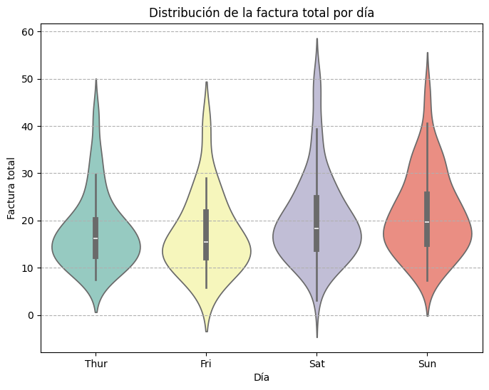

🏠 [**Inicio**](../../Readme.md) ➡️ / 📖 [**Sesión 03**](../Readme.md) ➡️ / 📝 `Ejemplo 04: Visualizaciones comparativas`

## 🎯 Objetivo

Desarrollar la habilidad para utilizar violin plots para explorar y analizar la distribución de datos numéricos, tanto dentro de categorías específicas como de manera global. 

---

## 🚀 Comencemos

Los violinplots ofrecen una representación detallada de la distribución de los datos al mostrar la forma completa y la densidad, lo que permite identificar multimodalidades y variaciones que los boxplots pueden no revelar. Sin embargo, los boxplots destacan los valores atípicos de manera más explícita con puntos fuera de los bigotes, facilitando su identificación, mientras que los violinplots no los muestran automáticamente, lo que puede hacer que sea más difícil ver los valores atípicos sin una visualización adicional.

---

### 📋 **Violinplots**

Un violinplot es una combinación de un boxplot y un KDE (Kernel Density Estimation), que muestra la distribución de los datos en diferentes categorías y permite compararlas visualmente.

Algunas de las principales ventajas de los violinplots son:

| **Ventaja**                             | **Descripción**                                                                                  |
|-----------------------------------------|--------------------------------------------------------------------------------------------------|
| **Visualización de la distribución**    | Muestra la distribución completa de los datos, incluyendo forma y dispersión.                    |
| **Comparación entre grupos**            | Facilita la comparación de la distribución entre múltiples categorías o grupos en un solo gráfico.|
| **Información sobre la densidad**       | Presenta la densidad de probabilidad, ofreciendo una visión más detallada de la distribución.     |
| **Detección de modas múltiples**        | Permite identificar múltiples picos en la distribución, revelando la presencia de modas múltiples.|
| **Personalización**                     | Fácil de personalizar con `seaborn` o `matplotlib` para ajustar a necesidades específicas.        |
| **Representación completa**             | Combina características de box plot y gráficos de densidad, proporcionando una visión más completa.   |


---

### 🎻 **Graficando violinplots**

💧 Para graficar un violinplot en `seaborn`, se utiliza la función `violinplot()` y se le pasan los datos a graficar, así como los parámetros necesarios para personalizar la visualización.

📊 Generalmente se utiliza una variable categórica en el eje `x` y una variable numérica en el eje `y`, para comparar la distribución de los datos entre las diferentes categorías, aunque no es una regla estricta, ya que se pueden personalizar de acuerdo a las necesidades específicas.

📚 Seaborn cuenta con varios datasets de ejemplo que se pueden utilizar para practicar y explorar diferentes tipos de visualizaciones. En este caso, se utilizará el dataset `tips` que contiene información sobre propinas en un restaurante, para graficar la distribución de la factura total por día de la semana.

```python
from IPython.display import display
import seaborn as sns
import matplotlib.pyplot as plt

# Datos de propinas en un restaurante (tips).
df_tips = sns.load_dataset("tips")
display(df_tips.head())

# Crear un violin plot de la factura total por día.
plt.figure(figsize=(8, 6))
sns.violinplot(x="day", y="total_bill", data=df_tips, palette="Set3", hue="day")

# Añadir título y etiquetas a los ejes.
plt.title('Distribución de la Factura Total por Día')
plt.xlabel('Día')
plt.ylabel('Factura Total')

# Añadir una cuadrícula horizontal.
plt.grid(axis='y', linestyle='--', alpha=1)

# Mostrar el gráfico de violinplot.
plt.show()
```

<details>
  <summary><b>✨Haz clic aquí para ver la imagen✨</b></summary>
  <div align="center">
      
  </div>

  El violinplot muestra la distribución de los montos de facturas en un restaurante de jueves a domingo. Las facturas del sábado presentan la mayor variabilidad, mientras que jueves y domingo tienen distribuciones más concentradas en el rango intermedio. Las medianas son similares entre los días, aunque ligeramente más altas el sábado y domingo, indicando montos de facturas algo mayores en estos días.
</details>

---

### 💡 **¿Sabías que?...**

Los violinplots se han utilizado en estudios de neurociencia para visualizar la distribución de la actividad cerebral en diferentes regiones del cerebro. Por ejemplo, los investigadores han empleado violin plots para comparar la distribución de los niveles de actividad neuronal en pacientes con diferentes trastornos mentales (como la depresión o la ansiedad) frente a grupos de control saludables. Esta visualización permite observar no solo la variabilidad y la centralidad de los datos, sino también la presencia de patrones complejos, como distribuciones bimodales, que podrían indicar la coexistencia de diferentes estados cerebrales dentro del mismo grupo.

---

⬅️ [**Anterior**](../Readme.md) | [**Siguiente**](../Reto-02/Readme.md) ➡️