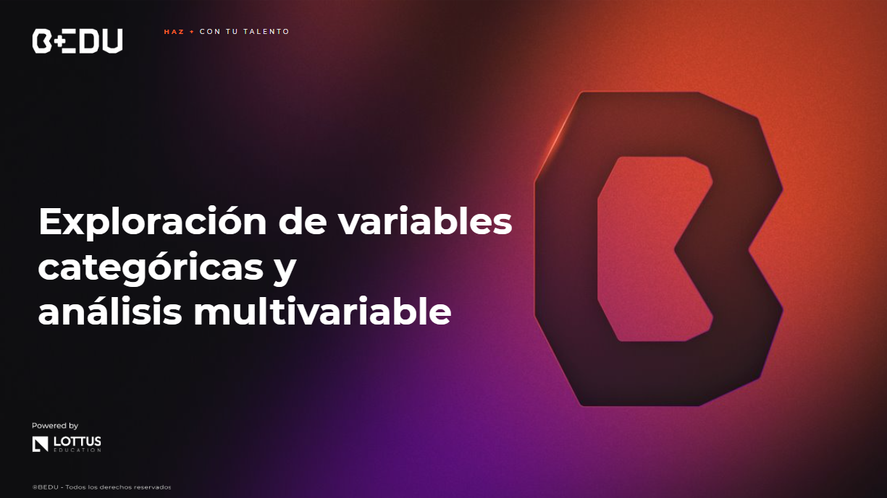

🏠 [**Inicio**](../Readme.md) ➡️ / 📖 `Sesión 03`

    

## 🎯 Objetivo

⚒️ Desarrollarás habilidades para añadir anotaciones y etiquetas en gráficas, crear y analizar tablas de contingencia, realizar visualizaciones avanzadas con gráficos multi-ejes y boxplots, y comparar variables con violinplots.

---

📘 Material del prework:
Antes de comenzar con los ejercicios de esta sesión, recordemos que en el material de prework hemos cubierto los fundamentos teóricos que aplicaremos hoy. A lo largo de esta sesión, pondremos en práctica estos conceptos mediante una serie de ejercicios y retos diseñados para reforzar y validar nuestro entendimiento. 
🔥¡Vamos a comenzar!🔥

---

## 📂 Temas de la sesión...

### 📖 Anotaciones y graficas básicas

Las anotaciones y etiquetas en gráficas transforman visualizaciones básicas en herramientas efectivas, destacando puntos clave y proporcionando contexto adicional. Facilitan la comprensión y permiten captar rápidamente los aspectos importantes de los datos, mejorando la claridad y efectividad de la gráfica.

#### 📜 **[Ejemplo 01: Anotaciones y graficas básicas](Ejemplo-01/Readme.md)**

---

### 📖 Tablas de contingencia e indexación avanzada

Las tablas de contingencia, o cruzadas, muestran la frecuencia de combinaciones de variables categóricas, ayudando a explorar relaciones y patrones. Son esenciales para analistas de datos, facilitando la toma de decisiones informadas y estrategias. Úsalas para comparar distribuciones, investigar relaciones y resumir datos categóricos.

#### 📜 **[Ejemplo 02: Tablas de contingencia e indexación avanzada](Ejemplo-02/Readme.md)**
#### 🔥 **[Reto 01: Anotaciones e indexación](Reto-01/Readme.md)**

---

### 📖 Gráficas avanzadas y multiaxis

Las visualizaciones multi-axis, que usan múltiples ejes o tipos de gráficos, son esenciales para conjuntos de datos complejos. Permiten mostrar y comparar varias variables simultáneamente, facilitando la identificación de relaciones y patrones que no serían evidentes en gráficas simples.

#### 📜 **[Ejemplo 03: Gráficas avanzadas y multiaxis](Ejemplo-03/Readme.md)**

---

### 📖 Visualizaciones comparativas

En el análisis de datos, comparar diferentes conjuntos es crucial para identificar patrones y relaciones significativas. Las visualizaciones comparativas, como los violinplots, permiten observar cómo se relacionan los datos, detectar tendencias y tomar decisiones informadas.

#### 📜 **[Ejemplo 04: Visualizaciones comparativas](Ejemplo-04/Readme.md)**
#### 🔥 **[Reto 02: Pendiente](Reto-02/Readme.md)**

---

⬅️ [**Anterior**](../Sesion-01/Readme.md) | [**Siguiente**](../Sesion-03/Readme.md)➡️