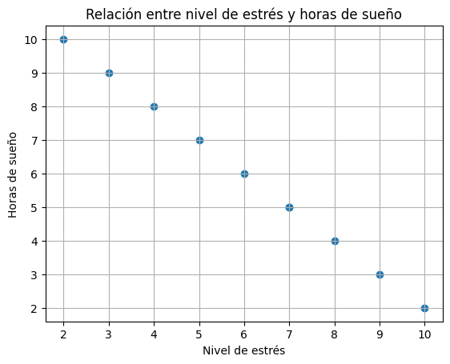

🏠 [**Inicio**](../../Readme.md) ➡️ / 📖 [**Sesión 04**](../Readme.md) ➡️ / 📝 `Ejemplo 03: Scatterplots y Pairplots`

## 🎯 Objetivo
El objetivo es entender y aplicar scatterplots y pairplots para analizar la relación entre variables cuantitativas, construyendo gráficos de dispersión que permitan visualizar correlaciones y patrones entre pares de variables. Además de interpretar los resultados, identificando correlaciones positivas, negativas o nulas, y comparando múltiples variables para detectar patrones complejos y dependencias significativas en los datos.

---

## 🚀 Comencemos
Los scatterplots son diagramas estadísticos que representan gráficamente un conjunto de datos de dos variables en un plano cartesiano, permitiendo así analizar la relación entre esas dos variables cuantitativas. 

---

### 🛠️ **Creación de un Scatterplot con python**

El ejemplo que utilizaremos será él mismo que hemos trabajado de un profesional en psicología, donde se investiga la relación entre el nivel de estrés y la cantidad de horas de sueño reportadas por un grupo de pacientes.


Aplica los siguientes pasos:

1. **Instalación de las bibliotecas necesarias:** Primero, asegúrate de tener instaladas las bibliotecas necesarias. Si no las tienes, puedes instalarlas utilizando el siguiente comando:
    
    ```python
    !pip install numpy pandas matplotlib scikit-learn
    ```
2. **Importación de las bibliotecas:** Importa las bibliotecas que vas a utilizar:
    
    ```python
    import numpy as np
    import pandas as pd
    import matplotlib.pyplot as plt
    from sklearn.datasets import make_regression
    ```
    - `matplotlib` es una biblioteca de visualización que se utiliza para crear gráficos, incluido el `scatterplot`.
    - `sklearn.datasets` contiene utilidades para generar conjuntos de datos de ejemplo, aunque en este caso no se usará directamente ya que trabajaremos con datos específicos.


3. **Creación del conjunto de datos:** Seguiremos utilizando el dataset del ejemplo 01 y 02.

    ```python
    # Crear un diccionario con los datos de nivel de estrés y horas de sueño.
    data = {
        'Nivel_de_estres': [7, 6, 8, 5, 9, 4, 7, 3, 10, 2],
        'Horas_de_sueño': [5, 6, 4, 7, 3, 8, 5, 9, 2, 10]
    }

    # Crear un DataFrame con los datos.
    df = pd.DataFrame(data)

    # Mostrar el DataFrame.
    df.head()
    ```
    Recuerda que este dataframe contiene dos columnas: `Nivel_de_estres` y `Horas_de_sueño`, que representan las variables cuantitativas que queremos analizar.


4. **Creación de un Scatterplot:** Ahora que tienes el conjunto de datos, es momento de crear el scatterplot. Este gráfico te permitirá visualizar la relación entre el nivel de estrés y las horas de sueño.

    ```python
    # Crear el scatterplot
    plt.scatter(df['Nivel_de_estres'], df['Horas_de_sueño'])

    # Personalizar el gráfico
    plt.title('Relación entre nivel de estrés y horas de sueño')
    plt.xlabel('Nivel de estrés')
    plt.ylabel('Horas de sueño')
    plt.grid(True)
    plt.show()
    ```

    - `plt.scatter()`: Crea el scatterplot, colocando los valores de `Nivel_de_estres` en el eje `X` y los de `Horas_de_sueño` en el eje `Y`.
    - `plt.title(), plt.xlabel(), y plt.ylabel()`: Agregan un título y etiquetas a los ejes, lo cual es importante para que el gráfico sea claro y entendible.
    - `plt.grid(True)`: Añade una cuadrícula al gráfico para facilitar la visualización de los puntos.

---

### 📉 **Interpretación del Scatterplot**

A partir de un diagrama de dispersión puedes identificar el tipo de correlación que existe entre dos variables:

- **Correlación directa (o positiva):** una variable aumenta cuando la otra también lo hace.
- **Correlación inversa (o negativa):** una variable aumenta cuando la otra disminuye, y viceversa.
- **Correlación nula (sin correlación):** no hay ninguna relación entre las dos variables.

Además, la correlación entre dos variables ya sea directa o inversa, también se puede clasificar según su intensidad:
- **Correlación fuerte:** las dos variables están muy relacionadas. Los puntos en el diagrama de dispersión están muy juntos, lo que facilita la identificación de la relación.
- **Correlación débil:** existe una relación entre las dos variables, pero es difícil de identificar. Los puntos en el diagrama de dispersión están muy dispersos.

Por lo tanto, podríamos obtener diferentes diagramas:

<div align="center">
    
</div>

El scatterplot resultante del ejemplo 03 muestra un patrón descendente, lo que indica una correlación negativa: a medida que el nivel de estrés aumenta, las horas de sueño disminuyen.

<div align="center">
    
</div>

Como puedes observar, los puntos forman un patrón descendente (de izquierda a derecha), esto sugiere una correlación negativa perfecta: a medida que aumenta el nivel de estrés, disminuyen las horas de sueño.

Si recuerdas el cálculo del coeficiente de correlación de Pearson en el ejemplo 01, obtuvimos un valor de `-0.999999999`, lo que refleja una correlación negativa casi perfecta. 

Este scatterplot visualiza esa relación, donde el coeficiente de Pearson confirma la fuerza y dirección de la correlación observada en el gráfico.

---

### 🛠️ **Creación de un Pairplot con python**

Para la creacion del pairplot, seguiremos los primeros 3 pasos que hemos utilizado hasta ahora pero con el dataframe con 3 variables: `Nivel_de_estres`, `Horas_de_sueño` y `Horas_de_ejercicio`.

1. **Instalación e importación de bibliotecas y creación de conjunto de datos:** 

    ```python
    # Instalar las bibliotecas necesarias
    !pip install seaborn numpy pandas matplotlib
    ```

    ```python
    import numpy as np
    import pandas as pd
    import seaborn as sns
    import matplotlib.pyplot as plt

    # Crear un diccionario con los datos
    data = {
        'Nivel_de_estres': [7, 6, 8, 5, 9, 4, 7, 3, 10, 2],
        'Horas_de_sueño': [5, 6, 4, 7, 3, 8, 5, 9, 2, 10],
        'Horas_de_ejercicio': [1, 2, 1, 3, 0, 4, 1, 3, 0, 5]
    }

    # Crear un DataFrame con los datos
    df = pd.DataFrame(data)
    
    # Mostrar el DataFrame
    df.head()
    ```

2. **Creación de un Pairplot:** El siguiente paso es crear el pairplot para visualizar las relaciones entre estas tres variables

    ```python
    # Crear el pairplot
    sns.pairplot(df)

    # Personalizar y mostrar el gráfico
    plt.suptitle('Pairplot: Nivel de Estrés, Horas de Sueño y Horas de Ejercicio', y=1.02)
    plt.show()
    ```

    - `sns.pairplot(df)`: genera un pairplot que muestra gráficos de dispersión para cada combinación posible de las variables en el dataframe. En la diagonal, verás histogramas que muestran la distribución de cada variable individualmente.
    - `plt.suptitle()`: agrega un título general al gráfico, ayudando a contextualizar lo que se está visualizando.

---

### 📉 **Interpretación del Pairplot**

<div align="center">
    
</div>

Al observar el pairplot, puedes analizar varias relaciones al mismo tiempo:

- **Correlación entre nivel de estrés y horas de sueño:** En el gráfico correspondiente, puedes verificar si se mantiene la correlación negativa que identificaste previamente.
- **Correlación entre nivel de estrés y horas de ejercicio:** Observa si hay algún patrón que indique cómo el nivel de estrés se relaciona con las horas de ejercicio.
- **Correlación entre horas de sueño y horas de ejercicio:** Este gráfico te permitirá ver si existe alguna relación entre el tiempo que los pacientes dedican al ejercicio y su calidad de sueño.

Además, los histogramas en la diagonal te ofrecen una visión rápida de cómo se distribuyen estas variables de manera individual, lo cual es útil para entender mejor los datos antes de profundizar en análisis más complejos.


---

### 💡 **¿Sabías que?...**
Aunque haya correlación entre dos variables esto no significa que exista causalidad entre ellas, es decir, la correlación entre dos variables no significa que el cambio en una variable sea la causa del cambio en la otra variable.

Es importante tener en cuenta que la correlación no implica causalidad, y es necesario realizar análisis más profundos y experimentos controlados para establecer relaciones de causa y efecto entre variables.

Algunos ejemplos clásicos de correlación sin causalidad incluyen:
- **Correlación entre el consumo de helado y la tasa de ahogamientos:** Ambos aumentan en verano, pero no hay una relación causal directa.
- **Correlación entre el número de incendios y el número de bomberos:** A mayor número de incendios, se envían más bomberos, pero no es la presencia de bomberos lo que causa los incendios.


---

⬅️ [**Anterior**](../Readme.md) | [**Siguiente**](../Reto-01/Readme.md) ➡️