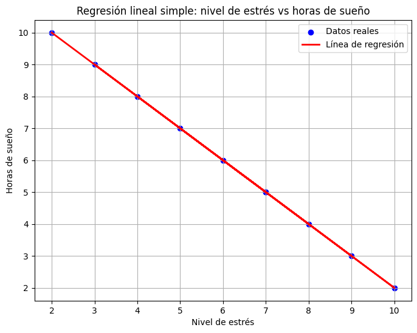

🏠 [**Inicio**](../../Readme.md) ➡️ / 📖 [**Sesión 04**](../Readme.md) ➡️ / 📝 `Ejemplo 04: Regresión lineal simple`

## 🎯 Objetivo
El objetivo es comprender y aplicar los conceptos de regresión lineal simple utilizando Python, con el fin de analizar y predecir la relación entre dos variables cuantitativas. A través de este aprendizaje, podrás desarrollar habilidades para construir modelos de regresión, interpretar los resultados y visualizar cómo una variable afecta a otra, lo que te permitirá extraer conclusiones informadas en distintos contextos profesionales.

---

## 🚀 Comencemos
la regresión lineal simple te ayuda a encontrar una ecuación que relacione dos variables de manera lineal. Es importante que la relación entre las dos variables sea lineal; de lo contrario, deberías usar otro tipo de modelo de regresión.

---

### 🛠️ **Regresión lineal simple con python**

El ejemplo que utilizaremos será él mismo que hemos trabajado de un profesional en psicología, donde se investiga la relación entre el nivel de estrés y la cantidad de horas de sueño reportadas por un grupo de pacientes. Sigue los siguientes pasos:

1.	**Instalación e importación de bibliotecas y creación de conjunto de datos:** Como lo hemos hecho hasta ahora en los ejemplos anteriores, asegúrate de tener tus bibliotecas disponibles. 
    
    ```python
    !pip install numpy pandas matplotlib scikit-learn
    ```

    ```python
    import numpy as np
    import pandas as pd
    import matplotlib.pyplot as plt
    from sklearn.linear_model import LinearRegression

    # Crear un diccionario con los datos.
    data = {
        'Nivel_de_estres': [7, 6, 8, 5, 9, 4, 7, 3, 10, 2],
        'Horas_de_sueño': [5, 6, 4, 7, 3, 8, 5, 9, 2, 10],
    }

    # Crear un DataFrame con los datos.
    df = pd.DataFrame(data)
    
    # Mostrar el DataFrame.
    df.head()
    ```

    **Recuerda:**
    - numpy y pandas se utilizan para manejar y procesar los datos.
    - matplotlib se emplea para visualizar los resultados.
    - LinearRegression de Scikit-Learn se usan para realizar la regresión lineal.

    **También en este dataframe:**
    - Nivel_de_estres representa la variable independiente `(X)`.
    - Horas_de_sueño representa la variable dependiente `(y)`.


2.	**Creación de un modelo de regresión lineal:** Ahora, crea el modelo de regresión lineal y ajústalo a los datos:

    ```python
    # Definir las variables independientes (X) y dependiente (y)
    X = df[['Nivel_de_estres']]
    y = df['Horas_de_sueño']

    # Crear una instancia del modelo de regresión lineal
    model = LinearRegression()

    # Ajustar el modelo a los datos
    model.fit(X, y)

    # Obtener los coeficientes del modelo
    coeficiente = model.coef_[0]
    intercepto = model.intercept_

    # Mostrar la ecuación de la regresión lineal
    print(f"Ecuación de la regresión lineal: y = {coeficiente:.2f}x + {intercepto:.2f}")
    ```
    ```plaintext
    🛍️ Ecuación de la regresión lineal: y = -1.00x + 12.00
    ```

    - `model.fit(X, y)`: Ajusta el modelo de regresión lineal a los datos.
    - `model.coef_`: Obtiene el coeficiente de la variable independiente.
    - `model.intercept_`: Obtiene el intercepto de la regresión lineal.
    - `print()`: Muestra la ecuación de la regresión lineal.

3.	**Visualización de la regresión lineal:** Finalmente, visualiza la línea de regresión junto con los datos.

    ```python
    # Visualizar los resultados
    plt.scatter(X, y, color='blue', label='Datos reales')
    plt.plot(X, model.predict(X), color='red', linewidth=2, label='Línea de regresión')
    plt.title('Regresión lineal simple: nivel de estrés vs horas de sueño')
    plt.xlabel('Nivel de estrés')
    plt.ylabel('Horas de sueño')
    plt.legend()
    plt.grid(True)
    plt.show()
    ```
    - `plt.scatter()`: muestra los puntos de los datos reales.
    - `plt.plot()`: dibuja la línea de regresión basada en las predicciones del modelo.

---


### 📈 **Interpretación de los resultados**
```plaintext
🛍️ Ecuación de la regresión lineal: y = -1.00x + 12.00
```

<div align="center">
    
</div>

La ecuación de la regresión lineal obtenida es:

$$
y = -1.00x + 12.00
$$

Donde:
- `y` representa las horas de sueño.
- `x` representa el nivel de estrés.

Esto indica que por cada unidad que aumenta el nivel de estrés, las horas de sueño disminuyen en 1 hora. Además, cuando el nivel de estrés es 0, las horas de sueño estimadas son 12 horas.

Como vimos en el Prework, para poder hacer una regresión lineal simple, se deben evaluar y cumplir 4 hipótesis 


| **Criterio** | **Descripción** | **Evaluación** |
|:---|:---|:---|
| **Independencia** | Los errores no deben influirse entre sí. La gráfica no muestra ningún patrón en los residuos, sugiriendo independencia. | No se detectan patrones evidentes, por lo que se asume que se cumple la hipótesis de independencia. |
| **Homoscedasticidad** | La variabilidad de los errores debe ser constante en todos los niveles de la variable independiente. | La variabilidad de los residuos no cambia significativamente, lo que indica que la homocedasticidad se cumple. |
| **Normalidad** | Los errores deben distribuirse cercanos a la normalidad (campana de Gauss). | Sin análisis detallado, no se puede asegurar completamente la normalidad, aunque no se observan desviaciones significativas. |
| **Linealidad** | La relación entre la variable independiente y la dependiente debe ser lineal. | La linealidad se cumple, evidenciada por la alineación de los datos con la línea de regresión. |


**En conclusión:** El modelo de regresión lineal simple cumple con las hipótesis de independencia, homocedasticidad y linealidad. Aunque la normalidad no se ha verificado directamente, la gráfica no sugiere incumplimientos, por lo que el modelo es adecuado para describir la relación entre el nivel de estrés y las horas de sueño en este grupo de pacientes.

---

### 💡 **¿Sabías que?...**

La regresión lineal simple es un método poderoso para analizar y predecir la relación entre dos variables cuantitativas. Algunas aplicaciones comunes de la regresión lineal simple incluyen:

- **Economía:** Analizar la relación entre el precio de un producto y la demanda.
- **Salud:** Estudiar la relación entre el peso y la altura de una persona.
- **Educación:** Investigar la relación entre el tiempo de estudio y el rendimiento académico.
- **Negocios:** Predecir las ventas en función de la publicidad.

La regresión lineal simple es una herramienta útil para entender cómo una variable influye en otra y realizar predicciones basadas en datos. Al aplicarla, puedes obtener información clave que facilita la toma de decisiones en distintos contextos profesionales.

---

⬅️ [**Anterior**](../Readme.md) | [**Siguiente**](../Reto-02/Readme.md) ➡️