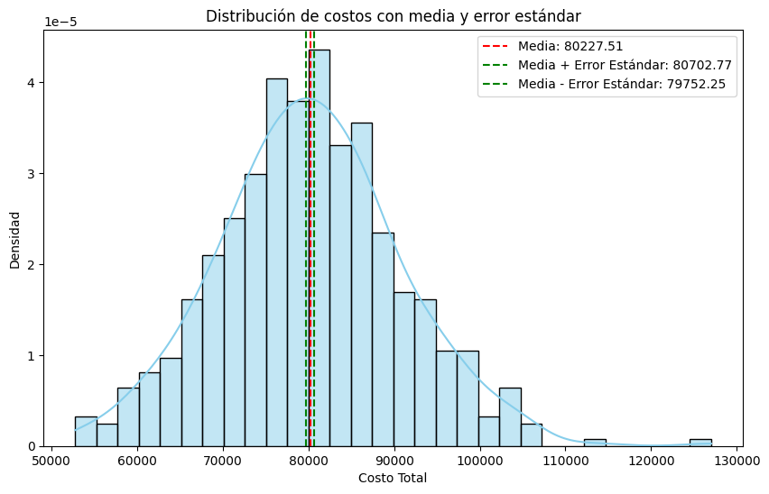

🏠 [**Inicio**](../../Readme.md) ➡️ / 📖 [**Sesión 05**](../Readme.md) ➡️ / 📝 `Ejemplo 01: Error estándar e intervalos de confianza`

## 🎯 Objetivo

Comprender y aplicar el error estándar para cuantificar la precisión de las estimaciones estadísticas, así como determinar y utilizar intervalos de confianza para estimar con certeza un rango dentro del cual se encuentra un parámetro poblacional, evaluando la variabilidad e incertidumbre en las medidas estadísticas y considerando su impacto en la inferencia estadística.

---

## 🚀 Comencemos

El **error estándar** es una medida que nos indica qué tan precisa es una estimación, cuanto más pequeño es el error estándar, más confiable es la estimación; cuanto mayor es, más variabilidad e incertidumbre hay en los resultados.

---

### 🛠️ **Cálculo del error estándar**
Antes de calcular el error estándar en Python, es importante entender que esta medida evalúa la precisión de las estadísticas muestrales, estimando cuánta variación podría existir respecto al valor real de la población. El error estándar cuantifica la incertidumbre en los datos y es esencial para análisis como la construcción de intervalos de confianza o la validación de modelos.

Utilizaremos un caso de estimación de costos en proyectos de construcción, con datos históricos de materiales y mano de obra. Los pasos a seguir son:

1. **Instalación de las bibliotecas necesarias:** Asegúrate de tener instaladas las bibliotecas necesarias. Si aún no las tienes, puedes instalarlas utilizando el siguiente comando:

    ```python
    !pip install numpy pandas
    import numpy as np
    import pandas as pd
    ```
    - `numpy` y `pandas` para el manejo de datos.


2. **Cargar los datos:** Utilizaremos los datos del archivo [Ejemplo_01_Costos_Proyectos.csv](../../Datasets/S05/Ejemplo_01_Costos_Proyectos.csv) donde encontraremos las columnas:
    - `Costo_Materiales:` Costo de los materiales para cada proyecto.
    - `Costo_Mano_de_Obra:` Costo de la mano de obra para cada proyecto.
    - `Costo_Total:` Costo total del proyecto (suma de materiales y mano de obra).


    ```python
    # Cargar los datos desde un archivo CSV, y mostrar los primeros registros.
    df = pd.read_csv('../../Ejemplo_01_Costos_Proyectos.csv') # Cambiar la ruta del archivo si es necesario.

    # Mostrar el DataFrame.
    df.head()
    ```

3. **Seleccionar la columna de costos:** Seleccionaremos la columna llamada `Costo_Total`, que representa el costo total de cada proyecto, para calcular el error estándar.

    ```python
    # Seleccionar la columna de costos 
    costos = df['Costo_Total']
    ```
4. **Cálculo de estadísticas básicas:** Primero, calcula la media y la desviación estándar de los costos. Luego, determina el tamaño de la muestra, es decir, el número total de proyectos. Estos pasos son necesarios para obtener el error estándar.

    ```python
    # Calcular la media de los costos
    media_costos = np.mean(costos)
    print(f"Media de los costos: {round(media_costos, 2)}")

    # Calcular la desviación estándar de los costos
    desviacion_estandar = np.std(costos, ddof=1)
    print(f"Desviación estándar de los costos: {round(desviacion_estandar, 2)}")

    # Calcular el tamaño de la muestra
    n = len(costos)
    print(f"Tamaño de la muestra: {n}")
    ```

    - `np.mean(costos)`: Calcula la media de los valores en la columna costos.
    - `np.std(costos, ddof=1)`: Calcula la desviación estándar de los valores en costos. El parámetro ddof=1 es necesario para que el cálculo sea correcto en el contexto de una muestra.
    - `len(costos)`: Devuelve el número total de elementos en la columna costos, es decir, el tamaño de la muestra.
    - También estamos redondeando a dos decimales con el round incluidos en los prints.
    <br>

5. **Calcular el error estándar:** Finalmente, podemos calcular el error estándar usando la fórmula:

    ```python
    # Calcular el error estándar
    error_estandar = desviacion_estandar / np.sqrt(n)
    print(f"Error Estándar: {error_estandar}")
    ```

$$
\text{Error Estándar} = \frac{\text{desviación estándar}}{\sqrt{n}}
$$

---

### 📉 **Interpretación del error estándar**
A partir del cálculo realizado con los datos generados:
- **Media de los costos:** El costo promedio de los proyectos es de aproximadamente \$80,227.51  USD.
- **Desviación estándar:** En promedio, los costos de los proyectos varían en alrededor de \$10,627.13 USD respecto al promedio. Esto significa que hay cierta variabilidad en los costos de los diferentes proyectos.
- **Error estándar:** La variabilidad en la estimación de este costo promedio es de aproximadamente \$475.26 USD. Esto nos indica que la media que hemos calculado es bastante precisa, ya que el error estándar es relativamente pequeño (en comparación con la desviación estándar)

Recordemos que el error estándar mide la precisión de la estimación de la media, mientras que la desviación estándar mide la dispersión de los datos individuales alrededor de la media.

Una forma efectiva de visualizar la relación entre la media, la desviación estándar, y el error estándar es usando un histograma de los datos de costos junto con la distribución normal superpuesta que representa la distribución de los costos. ¿Recuerdas como realizar el histograma?

```python
#Interpretacion del error estandar con un histograma
import matplotlib.pyplot as plt
import seaborn as sns

# Configurar el estilo de los gráficos
sns.set(style="whitegrid")

# Crear el histograma de los costos con la distribución normal superpuesta
plt.figure(figsize=(10, 6))
sns.histplot(costos, kde=True, color='skyblue', stat="density", bins=30)

# Agregar línea de la media
plt.axvline(media_costos, color='red', linestyle='--', label=f'Media: {round(media_costos, 2)}')

# Agregar banda de error estándar (media +/- error estándar)
plt.axvline(media_costos + error_estandar, color='green', linestyle='--', label=f'Media + Error Estándar: {round(media_costos + error_estandar, 2)}')
plt.axvline(media_costos - error_estandar, color='green', linestyle='--', label=f'Media - Error Estándar: {round(media_costos - error_estandar, 2)}')

# Añadir etiquetas y título
plt.title('Distribución de costos con media y error estándar')
plt.xlabel('Costo Total')
plt.ylabel('Densidad')
plt.legend()

# Mostrar el gráfico
plt.show()
```

<details>
  <summary><b>✨Haz clic aquí para ver la imagen✨</b></summary>
  <div align="center">
      
  </div>
</details>
<br>

**Lo que observamos es:**

- El **histograma** (en azul) muestra cómo se distribuyen los costos de los proyectos.
- La **línea roja discontinua** representa la media de los costos, que es el valor central en esta distribución.
- Las **líneas verdes discontinuas** indican la media más y menos el error estándar. Estas líneas muestran el rango dentro del cual esperaríamos que se encuentre la media muestral si tomáramos diferentes muestras.

Como puedes ver, el error estándar es pequeño en comparación con la dispersión general de los datos, lo que refuerza la idea de que la media es una estimación precisa.

---
### 🛠️ **Cálculo de los intervalos de confianza**
Un intervalo de confianza es un rango que estima dónde se encuentra un parámetro poblacional, como la media, basado en una muestra. Un intervalo estrecho indica mayor precisión, mientras que uno amplio refleja más incertidumbre.

Antes de calcular intervalos de confianza en Python, es crucial entender que estos nos indican con qué certeza nuestra estimación se acerca al valor real en la población. Un intervalo de confianza, como el `95%`, significa que estamos bastante seguros de que el valor real se encuentra dentro de ese rango. Continuaremos usando el caso de estimación de costos en proyectos de construcción con datos históricos. Los pasos son:


1. **Instalación de las bibliotecas necesarias:** Asegúrate de tener instaladas las bibliotecas necesarias. Si aún no las tienes, puedes instalarlas utilizando el siguiente comando:

    ```python
    !pip install numpy pandas scipy
    import numpy as np
    import pandas as pd
    from scipy import stats
    ```
    ```python
    # Cargar los datos desde un archivo CSV, y mostrar los primeros registros.
    df = pd.read_csv('../../Ejemplo_01_Costos_Proyectos.csv') # Cambiar la ruta del archivo si es necesario.

    # Mostrar el DataFrame.
    df.head()
    ```

2.	**Cálculo de estadísticas básicas:** Utilizaremos las mismas para el error estándar.
    
    ```python
    # Seleccionar la columna de costos
    costos = df['Costo_Total']

    # Calcular la media de los costos
    media_costos = np.mean(costos)
    print(f"Media de los costos: {round(media_costos, 2)}")

    # Calcular la desviación estándar de los costos
    desviacion_estandar = np.std(costos, ddof=1)
    print(f"Desviación estándar de los costos: {round(desviacion_estandar, 2)}")

    # Calcular el tamaño de la muestra
    n = len(costos)
    print(f"Tamaño de la muestra: {n}")
    ```

3.	**Calcular el intervalo de confianza:** podemos calcular el intervalo de confianza usando la función `stats.t.interval` de `scipy`. Vamos a calcular un intervalo de confianza del 95%, que es común en análisis estadísticos.

    ```python
    # Calcular el intervalo de confianza
    confianza = 0.95
    intervalo_confianza = stats.t.interval(confianza, n-1, loc=media_costos, scale=desviacion_estandar/np.sqrt(n))
    print(f"Intervalo de confianza al 95%: {round(intervalo_confianza[0], 2)} a {round(intervalo_confianza[1], 2)}")
    ```

- `confianza = 0.95`: Define el nivel de confianza deseado, en este caso, `95%`.
- `stats.t.interval(confianza, n-1, loc=media_costos, scale=desviacion_estandar/np.sqrt(n))`: Calcula el intervalo de confianza utilizando la distribución t de Student, que es apropiada cuando se trabaja con muestras pequeñas y se desconoce la desviación estándar poblacional.
    - `confianza`: Nivel de confianza.
    - `n-1`: Grados de libertad.
    - `loc=media_costos`: La media de la muestra.
    - `scale=desviacion_estandar/np.sqrt(n)`: El error estándar.
- `print(f"Intervalo de confianza al 95%: {round(intervalo_confianza[0], 2)} a {round(intervalo_confianza[1], 2)}")`: Muestra el intervalo de confianza calculado, redondeado a dos decimales.

---

### 📉 **Interpretación de los intervalos de confianza**

Los intervalos de confianza indican el rango en el que se espera que se encuentre el verdadero valor de un parámetro poblacional, como la media de los costos, con un cierto nivel de confianza. Aquí usamos un intervalo del `95%`.

Resultado:
- **Intervalo de confianza al 95%:** \$79,293.75 a \$81,161.27 USD.

Esto significa que, con un `95%` de confianza, la verdadera media de los costos de todos los proyectos está entre esos valores. Un intervalo estrecho sugiere una estimación precisa, mientras que uno amplio indica mayor incertidumbre. En este caso, el intervalo es estrecho, lo que refleja una estimación precisa.

---

### 💡 **¿Sabías que?...**

Al calcular intervalos de confianza, el **nivel de confianza** nos dice qué tan probable es que el intervalo incluya el verdadero valor del parámetro poblacional. Por ejemplo, un nivel de confianza del `95%` significa que, si repitiéramos el proceso con muchas muestras diferentes, el `95%` de esos intervalos contendrían la verdadera media. ¡Es por eso por lo que el `95%` es tan común en análisis estadísticos!
Sin embargo, también se pueden usar otros niveles de confianza según la precisión y certeza deseadas:
- **80%:** Acepta más riesgo con intervalos muy estrechos.
- **90%:** Menor certeza, intervalos más estrechos.
- **99%:** Mayor certeza, intervalos más amplios.
- **99.9%:** Máxima certeza, pero con intervalos muy amplios.
Además, cuando calculamos la desviación estándar de una muestra, **usamos n-1 grados de libertad** en lugar de solo n. Esto corrige el sesgo por haber usado la muestra en lugar de la población completa, dando una estimación más precisa de la variabilidad. Este ajuste es necesario para obtener resultados más confiables.

---

⬅️ [**Anterior**](../Readme.md) | [**Siguiente**](../Ejemplo-02/Readme.md) ➡️