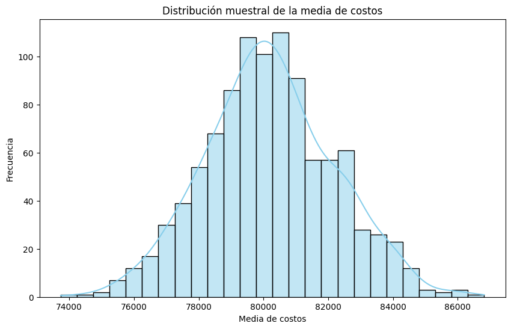
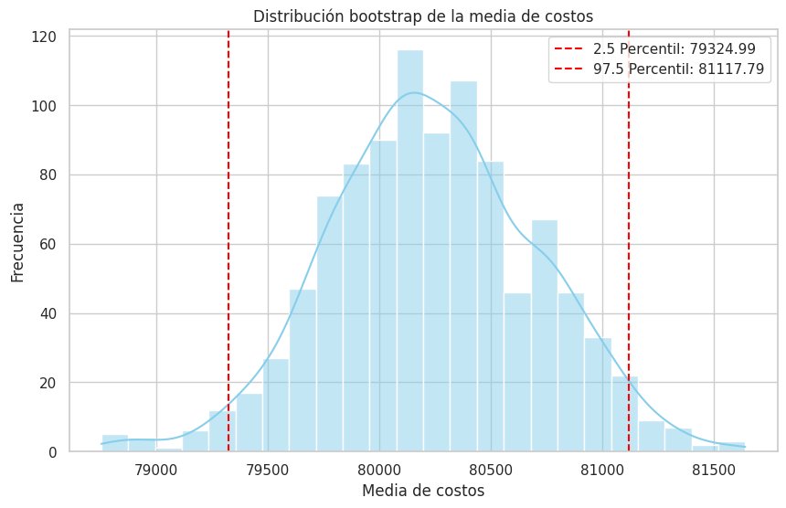

🏠 [**Inicio**](../../Readme.md) ➡️ / 📖 [**Sesión 05**](../Readme.md) ➡️ / 📝 `Ejemplo 02: Distribuciones muestrales y Bootstrap`

## 🎯 Objetivo
El objetivo es comprender y aplicar distribuciones muestrales y el método Bootstrap para realizar estimaciones precisas y robustas sobre una población a partir de datos muestrales. Las distribuciones muestrales te permiten visualizar y cuantificar la variabilidad de las estadísticas de muestra, como la media, mientras que el método Bootstrap te ayuda a evaluar la precisión de estas estimaciones sin hacer suposiciones sobre la distribución poblacional. Estos métodos son esenciales para detectar patrones en los datos, calcular intervalos de confianza y realizar inferencias estadísticas con mayor certeza.


---

## 🚀 Comencemos
Una distribución muestral es la distribución de un estadístico (como la media) calculado a partir de múltiples muestras extraídas de una población. Cuanto más pequeñas son las muestras, mayor es la variabilidad en la distribución muestral; cuanto más grandes son las muestras, más se aproxima a la distribución de la población completa.

---

### 🛠️ **Creación de distribuciones muestrales**
Las distribuciones muestrales son clave para hacer inferencias sobre la población a partir de muestras, ya que nos permiten entender la variabilidad y la precisión de nuestras estimaciones. Esta variabilidad se refleja en la forma de la distribución muestral, y su análisis es crucial para realizar estimaciones confiables y tomar decisiones basadas en datos.

**Aplica los siguientes pasos:**

1. **Instalación de las bibliotecas necesarias:** Asegúrate de tener instaladas las bibliotecas necesarias. Si aún no las tienes, puedes instalarlas utilizando el siguiente comando:

    ```python
    !pip install numpy pandas matplotlib seaborn
    ```
    ```python
    import numpy as np 
    import pandas as pd 
    import matplotlib.pyplot as plt 
    import seaborn as sns
    ```
    ```python
    # Cargar los datos desde un archivo CSV, y mostrar los primeros registros.
    df = pd.read_csv('../../Ejemplo_01_Costos_Proyectos.csv') # Cambiar la ruta del archivo si es necesario.
    # Mostrar el DataFrame.
    df.head()
    ```
    ```python
    # Seleccionar la columna de costos 
    costos = df['Costo_Total']
    ```


2. **Generar distribuciones muestrales:** Vamos a generar distribuciones muestrales de la media de los costos. Para esto, extraeremos varias muestras aleatorias del conjunto de datos original y calcularemos la media para cada una.
    ```python
    # Definir el tamaño de la muestra y el número de muestras
    tamaño_muestra = 30
    numero_muestras = 1000

    # Crear una lista para almacenar las medias muestrales
    medias_muestrales = []

    # Generar muestras y calcular la media de cada una
    for _ in range(numero_muestras):
        muestra = np.random.choice(costos, size=tamaño_muestra, replace=True)
        medias_muestrales.append(np.mean(muestra))

    # Convertir la lista de medias muestrales a un array de numpy
    medias_muestrales = np.array(medias_muestrales)
    ```

    - `tamaño_muestra = 30`: Definimos que cada muestra tendrá 30 proyectos.
    - `numero_muestras = 1000`: Definimos que generaremos 1000 muestras.
    - `np.random.choice(costos, size=tamaño_muestra, replace=True)`: Genera una muestra aleatoria de tamaño tamaño_muestra a partir de los datos de costos, con reemplazo.
    - `medias_muestrales.append(np.mean(muestra))`: Calcula la media de cada muestra y la almacena en la lista medias_muestrales.

    <br>

3. **Visualizar la distribución muestral:** Ahora vamos a graficar la distribución de las medias muestrales utilizando un histograma y sobreponer una curva de densidad para visualizar mejor la distribución.

    ```python
    # Crear un histograma de las medias muestrales
    plt.figure(figsize=(10, 6))
    sns.histplot(medias_muestrales, kde=True, color='skyblue')

    # Añadir etiquetas y título
    plt.title('Distribución muestral de la media de costos')
    plt.xlabel('Media de costos')
    plt.ylabel('Frecuencia')

    # Mostrar el gráfico
    plt.show()
    ```

    - `sns.histplot(medias_muestrales, kde=True, color='skyblue')`: Crea un histograma de las medias muestrales con una curva de densidad sobrepuesta.
    - `plt.title() y plt.xlabel()`: Añaden el título y las etiquetas a los ejes del gráfico.


---

### 📉 **Interpretación de la distribución muestral**

<div align="center">
    
</div

La gráfica muestra la distribución muestral de la media de costos de los proyectos. Algunos puntos clave:

- **Forma:** La distribución es aproximadamente normal, lo que es común debido al Teorema del límite central, indicando que las medias de las muestras se distribuyen simétricamente alrededor de un valor central.
  
- **Valor Central:** El valor central es la media de las medias muestrales, cercana a la media poblacional real.

- **Variabilidad:** La anchura de la distribución refleja la variabilidad de las medias muestrales. Una distribución estrecha indica mayor consistencia en las estimaciones, mientras que una amplia sugiere mayor incertidumbre.

Este análisis ofrece una visión clara de la precisión y consistencia de las estimaciones basadas en muestras.

---
### 🛠️ **Calculo de Bootstrap**
El Bootstrap es una técnica de remuestreo que estima la precisión de una estadística, como la media, usando múltiples muestras generadas a partir de los datos originales. Aunque un mayor número de remuestreos mejora la precisión, también incrementa el costo computacional. Este método es útil para evaluar la variabilidad y precisión de estimaciones sin asumir la distribución de la población, especialmente con muestras pequeñas o distribuciones desconocidas. Permite calcular intervalos de confianza, estimar el error estándar y evaluar la estabilidad de las estimaciones.

Aplica los siguientes pasos:

1. **Instalación de las bibliotecas necesarias:** Asegúrate de tener instaladas las bibliotecas necesarias. Si aún no las tienes, puedes instalarlas utilizando el siguiente comando:

    ```python
    !pip install numpy pandas matplotlib seaborn
    ```
    ```python
    import numpy as np 
    import pandas as pd 
    import matplotlib.pyplot as plt 
    import seaborn as sns
    ```
    ```python
    # Cargar los datos desde un archivo CSV, y mostrar los primeros registros.
    df = pd.read_csv('../../Ejemplo_01_Costos_Proyectos.csv') # Cambiar la ruta del archivo si es necesario.
    # Mostrar el DataFrame.
    df.head()
    ```
    ```python
    # Seleccionar la columna de costos 
    costos = df['Costo_Total']
    ```


2. **Aplicar el método Bootstrap:** Vamos a aplicar el método Bootstrap para estimar la media y el intervalo de confianza de los costos utilizando remuestreo con reemplazo.

    ```python
    # Definir el número de remuestreos (R) y el tamaño de cada muestra (n)
    numero_remuestreos = 1000
    tamaño_muestra = len(costos)

    # Crear una lista vacia para almacenar las medias de cada remuestreo
    medias_bootstrap = []

    # Realizar el remuestreo y calcular la media para cada muestra bootstrap
    for _ in range(numero_remuestreos):
        muestra_bootstrap = np.random.choice(costos, size=tamaño_muestra, replace=True)
        medias_bootstrap.append(np.mean(muestra_bootstrap))

    # Convertir la lista de medias bootstrap a un array de numpy
    medias_bootstrap = np.array(medias_bootstrap)

    # Calcular el intervalo de confianza al 95%
    intervalo_confianza = np.percentile(medias_bootstrap, [2.5, 97.5])

    # Mostrar los resultados
    print(f"Media estimada (Bootstrap): {np.mean(medias_bootstrap):.2f}")
    print(f"Intervalo de confianza al 95%: {intervalo_confianza[0]:.2f} a {intervalo_confianza[1]:.2f}")
    ```

    - `numero_remuestreos = 1000`: Definimos que realizaremos 1000 remuestreos.
    - `np.random.choice(costos, size=tamano_muestra, replace=True)`: Realiza el remuestreo con reemplazo a partir de los datos originales.
    - `medias_bootstrap.append(np.mean(muestra_bootstrap))`: Calcula la media de cada muestra bootstrap y la almacena en la lista medias_bootstrap.
    - `np.percentile(medias_bootstrap, [2.5, 97.5])`: Calcula el intervalo de confianza al 95% de las medias bootstrap.

    <br>

3. **Visualizar los resultados del Bootstrap:** Finalmente, vamos a graficar las distribuciones de las medias obtenidas a través del Bootstrap y el intervalo de confianza.

    ```python
    # Crear un histograma de las medias bootstrap con la curva de densidad
    plt.figure(figsize=(10, 6))
    sns.histplot(medias_bootstrap, kde=True, color='skyblue')

    # Añadir líneas para el intervalo de confianza
    plt.axvline(intervalo_confianza[0], color='red', linestyle='--', label=f'2.5 Percentil: {intervalo_confianza[0]:.2f}')
    plt.axvline(intervalo_confianza[1], color='red', linestyle='--', label=f'97.5 Percentil: {intervalo_confianza[1]:.2f}')

    # Añadir etiquetas y título
    plt.title('Distribución bootstrap de la media de costos')
    plt.xlabel('Media de costos')
    plt.ylabel('Frecuencia')
    plt.legend()

    # Mostrar el gráfico
    plt.show()
    ```

    - `sns.histplot(medias_bootstrap, kde=True, color='skyblue')`: Crea un histograma de las medias bootstrap con una curva de densidad sobrepuesta.
    - `plt.axvline(intervalo_confianza[0], color='red', linestyle='--')`: Añade una línea para el límite inferior del intervalo de confianza.
    - `plt.axvline(intervalo_confianza[1], color='red', linestyle='--')`: Añade una línea para el límite superior del intervalo de confianza.


---

### 📉 **Interpretación de los resultados del Bootstrap**

<div align="center">
    
</div

La gráfica que has obtenido muestra la distribución de las medias de los costos obtenidas mediante el método Bootstrap. Aquí tienes algunas claves para interpretar el gráfico:

- **Forma de la distribución**
    La distribución tiene una forma aproximadamente normal, lo que indica que las medias de las muestras bootstrap tienden a agruparse alrededor de un valor central. Esta es una propiedad esperada, especialmente cuando se utiliza el Bootstrap con un número grande de remuestreos.

- **Intervalo de Confianza**
    - Las líneas rojas verticales marcan el **2.5 percentil y el 97.5 percentil**, lo que corresponde al intervalo de confianza al **95%** para la media de los costos.
    - En este caso, el intervalo de confianza se encuentra entre aproximadamente $\$79,260.30$ y $\$81,128.97$ USD. Esto significa que, con un **95%** de confianza, puedes afirmar que la verdadera media poblacional de los costos se encuentra dentro de este rango.

- **Variabilidad y precisión**
    - La anchura del intervalo de confianza refleja la variabilidad de las estimaciones de la media. Un intervalo más estrecho indicaría menos variabilidad y, por lo tanto, una estimación más precisa de la media poblacional.
    - La concentración de las medias bootstrap alrededor del valor central sugiere que la media estimada es razonablemente precisa y que no hay una gran dispersión en las diferentes muestras.


---

### 💡 **¿Sabías que?...**
- Cuando calculas un intervalo de confianza del **95%** usando el método Bootstrap, se utilizan los percentiles **2.5 y 97.5**.

- Esto se hace porque al capturar el **95%** central de tus estimaciones, necesitas dejar fuera el 5% más extremo: **2.5%** en la parte inferior y **2.5%** en la superior. 

- Así, aseguras que el intervalo incluye el rango donde probablemente se encuentra la verdadera media con un **95%** de confianza.


---

⬅️ [**Anterior**](../Readme.md) | [**Siguiente**](../Reto-01/Readme.md) ➡️