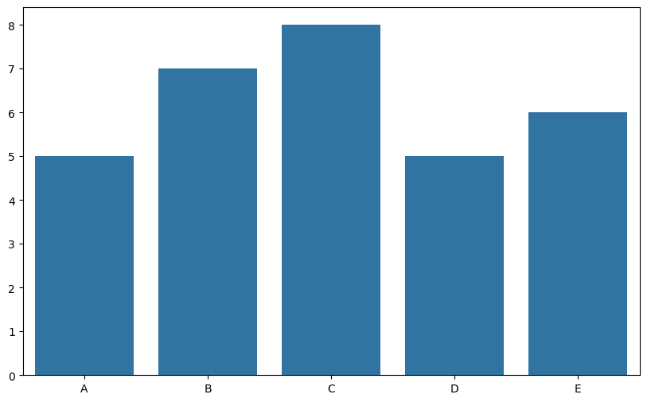
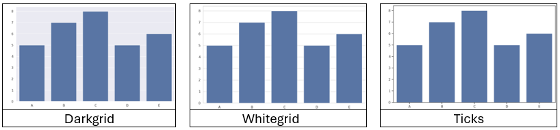
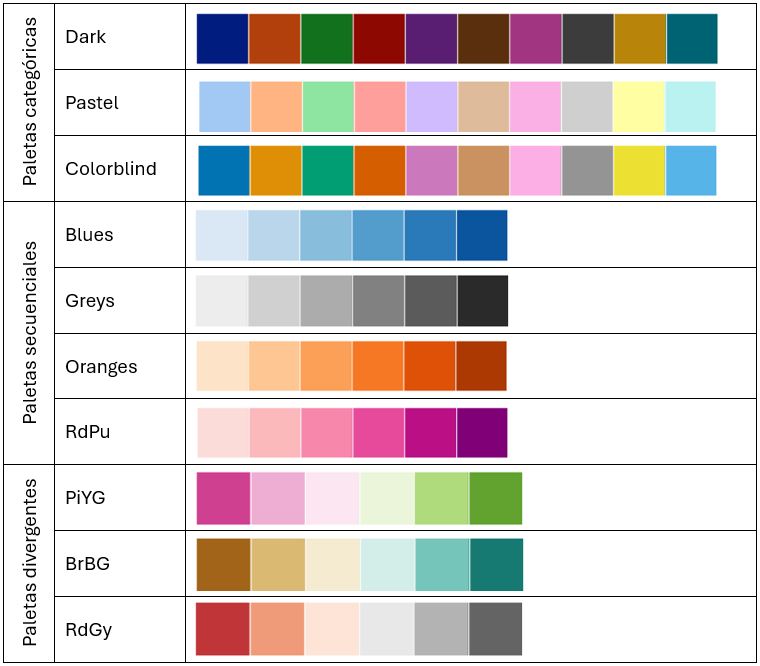
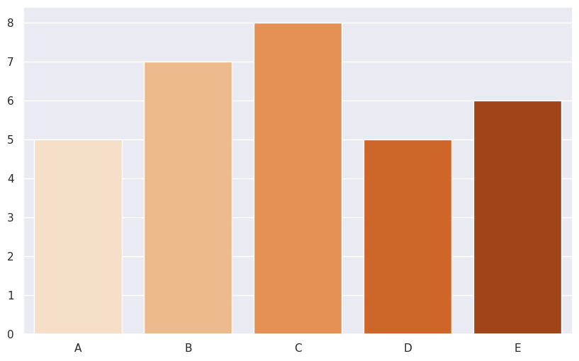
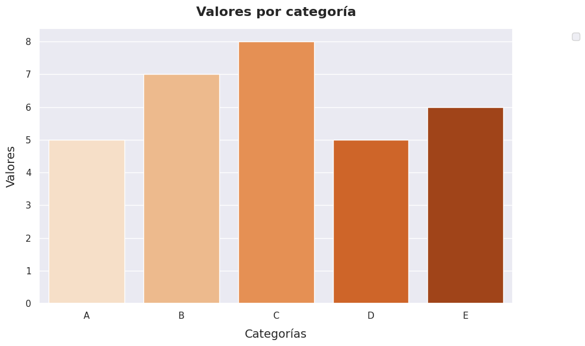

🏠 [**Inicio**](../../Readme.md) ➡️ / 📖 [**Sesión 06**](../Readme.md) ➡️ / 📝 `Ejemplo 01: Estilos y personalización de gráficos`

## 🎯 Objetivo

Adquirir habilidades para implementar conceptos de diseño visual en la elaboración de gráficos de datos. Realzando la estética de las visualizaciones y facilitando una comunicación más clara y efectiva de la información.

---

## 🚀 Comencemos

La forma en que diseñas un gráfico influye en cómo se entiende la información. Los estilos y temas que elijas son clave para mejorar la claridad y efectividad de la comunicación. Elementos como colores, tipos de líneas y fuentes hacen los gráficos más atractivos y comprensibles, ayudando a resaltar la información importante y a hacerla más accesible para quienes la observan. 

---

### 🛠️ **Estilos y personalización de gráficos**

Aplicaremos conceptos de diseño, como colores, tipos de líneas, fuentes, leyendas, etiquetas, temas predeterminados, espaciado y márgenes, en una gráfica de barras usando Matplotlib y Seaborn en Python:

1. **📊 Grafica básica:** Hagamos los pasos básicos para construir una gráfica de barras.

    ```python
    import matplotlib.pyplot as plt
    import seaborn as sns
    
    # Datos de ejemplo
    categorias = ['A', 'B', 'C', 'D', 'E']
    valores = [5, 7, 8, 5, 6]
    
    # Crear la figura y el eje
    fig, ax = plt.subplots(figsize=(10, 6))
    
    # Gráfica de barras
    sns.barplot(x=categorias, y=valores, ax=ax)
    
    # Mostrar la gráfica
    plt.show()
    ```


    - **Importación de bibliotecas:** Importa Matplotlib y Seaborn para crear gráficos estilizados.
    - **Datos de ejemplo:** Define listas de categorías y valores.
    - **Crear figura y eje:** `fig, ax = plt.subplots(figsize=(10, 6))` establece un área de 10x6 pulgadas para la gráfica.
    - **Generar gráfica:** `sns.barplot(x=categorias, y=valores, ax=ax)` dibuja una gráfica de barras en el eje creado.
    - **Mostrar gráfica:** con `plt.show()`.

    <br>

    **La grafica que obtendremos será:**

    <div align="center">
        
    </div>

2. **🖌️ Estilos predeterminados:** Facilitan configuraciones visuales uniformes y profesionales en tus gráficos. Aunque útiles como base, es esencial personalizarlos para adaptar colores, fuentes y otros elementos según las necesidades de tu proyecto y resaltar aspectos clave de los datos.

    <br>
    Seaborn ofrece varios estilos predeterminados que se pueden utilizar para mejorar la apariencia de las visualizaciones. Algunos de estos estilos son:

    <div align="center">
        
    </div>

    <br>

    **Agregaremos a nuestro código la línea para establecer un estilo:**

    ```python
    # Establecer un estilo
    sns.set_theme(style="darkgrid") # Despues de los imports
    ```

    ✨ Puedes encontrar listas completas de estilos aquí para [Seaborn](https://seaborn.pydata.org/tutorial/aesthetics.html) y aquí para [Matplotlib](https://matplotlib.org/stable/tutorials/introductory/customizing.html).

    <br>

3. **🎨 Colores:** Elegir una paleta adecuada es importante para un gráfico atractivo y fácil de interpretar. Asegúrate de que los colores sean coherentes con los datos y la audiencia, evitando tonos brillantes y garantizando accesibilidad para personas con daltonismo, para lograr gráficos claros y comprensibles.
    
    **Aquí tienes algunas de las paletas de colores más comunes en Seaborn:**

    <div align="center">
        
    </div>

    **Agregaremos a nuestro código la línea para personalizar los colores:**

    ```python
    # Crear la figura y el eje
    fig, ax = plt.subplots(figsize=(10, 6))

    # Gráfica de barras con personalización de colores,se agrega despues de fig,ax.
    sns.barplot(x=categorias, y=valores, ax=ax, palette=sns.color_palette("Oranges", n_colors=len(categorias)), hue=categorias, legend=False)
    ```

    - `sns.barplot(x=categorias, y=valores, ax=ax)`: Crea una gráfica de barras usando `categorias` en el eje x y `valores` en el eje y.
    - `palette=sns.color_palette("Oranges", n_colors=len(categorias))`: Aplica la paleta "Oranges" a las barras, ajustada al número de categorías.
    - `hue=categorias`: Añade colores basados en las categorías (aunque aquí no se crean subgrupos).
    - `legend=False`: Desactiva la leyenda automática, ya que no se están utilizando subgrupos.

    <br>

    **Nuestra personalización se ve hasta ahora de esta manera:**

    <div align="center">
        
    </div>

    ✨ Puedes encontrar listas completas de estilos aquí para [Seaborn](https://seaborn.pydata.org/tutorial/color_palettes.html) y aquí para [Matplotlib](https://matplotlib.org/stable/gallery/color/index.html).

    <br>

4. **🏷️ Leyendas y etiquetas:** Coloca las leyendas donde no obstruyan los datos y utiliza etiquetas claras en ejes y datos para facilitar la comprensión y mejorar la interpretación del gráfico.

    ```python
    # Etiqueta del eje x
    ax.set_xlabel('Categorías', fontsize=14, labelpad=10)
    # Etiqueta del eje y
    ax.set_ylabel('Valores', fontsize=14, labelpad=10)
    
    # Título del gráfico
    ax.set_title('Valores por Categoría', fontsize=16, fontweight='bold', pad=15)  
    
    # Agregar leyenda fuera del área del gráfico
    handles, labels = ax.get_legend_handles_labels()
    
    # Posicionar la leyenda fuera del gráfico
    ax.legend(handles, labels, loc='upper right', bbox_to_anchor=(1.15, 1))  
    ```

    - **Etiquetas claras y descriptivas:**
        - `ax.set_xlabel('Categorías', fontsize=14, labelpad=10)`: Etiqueta el eje x como "Categorías" con fuente tamaño 14 y padding de 10.
        - `ax.set_ylabel('Valores', fontsize=14, labelpad=10)`: Etiqueta el eje y como "Valores" con fuente tamaño 14 y padding de 10.
        - `ax.set_title('Valores por categoría', fontsize=16, fontweight='bold', pad=15)`: Añade un título "Valores por categoría" con fuente tamaño 16 en negrita y padding de 15.

    - **Leyenda que no obstruya los datos:**
        - `handles, labels = ax.get_legend_handles_labels()`: Obtiene elementos y etiquetas de la leyenda.
        - `ax.legend(handles, labels, loc='upper right', bbox_to_anchor=(1.15, 1))`: Coloca la leyenda en la esquina superior derecha, fuera del área del gráfico.


    <br>

5. **📏 Espaciado y márgenes:** Esto nos ayuda a evitar que los elementos se vean abarrotados y para mejorar la legibilidad. Puedes ajustar el espaciado y los márgenes de un gráfico utilizando la función `plt.tight_layout()` o configurando manualmente los márgenes con `plt.subplots_adjust()`.

    ```python
    # Ajustar los márgenes para evitar que se vea abarrotado
    plt.tight_layout()
    ```

    <div align="center">
        
    </div>

    Con esto te aseguras de que la disposición final del gráfico sea optimizada, evitando que las etiquetas o la leyenda queden cortadas o se solapen.

    <br>

6. 📝💻**Código final:**

    ```python
    import matplotlib.pyplot as plt
    import seaborn as sns

    # Establecer el estilo darkgrid
    sns.set_theme(style="darkgrid")

    # Datos de ejemplo
    categorias = ['A', 'B', 'C', 'D', 'E']
    valores = [5, 7, 8, 5, 6]

    # Crear la figura y el eje
    fig, ax = plt.subplots(figsize=(10, 6))

    # Gráfica de barras con la paleta "Oranges" ajustada al número de categorías
    sns.barplot(x=categorias, y=valores, ax=ax, palette=sns.color_palette("Oranges", n_colors=len(categorias)), hue=categorias, legend=False)

    # Etiqueta del eje x
    ax.set_xlabel('Categorías', fontsize=14, labelpad=10)

    # Etiqueta del eje y
    ax.set_ylabel('Valores', fontsize=14, labelpad=10)

    # Título del gráfico
    ax.set_title('Valores por categoría', fontsize=16, fontweight='bold', pad=15)

    # Obtener los elementos y etiquetas de la leyenda
    handles, labels = ax.get_legend_handles_labels()

    # Posicionar la leyenda fuera del gráfico
    ax.legend(handles, labels, loc='upper right', bbox_to_anchor=(1.15, 1))

    # Ajustar los márgenes para evitar que se vea abarrotado
    plt.tight_layout()

    # Mostrar la gráfica
    plt.show()
    ```

⬅️ [**Anterior**](../Readme.md) | [**Siguiente**](../Ejemplo-02/Readme.md) ➡️
