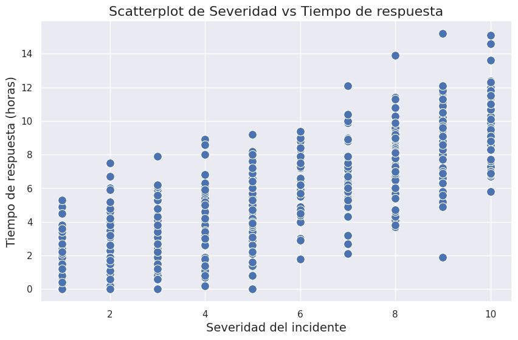
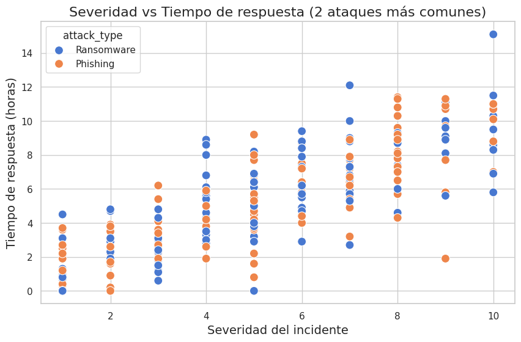
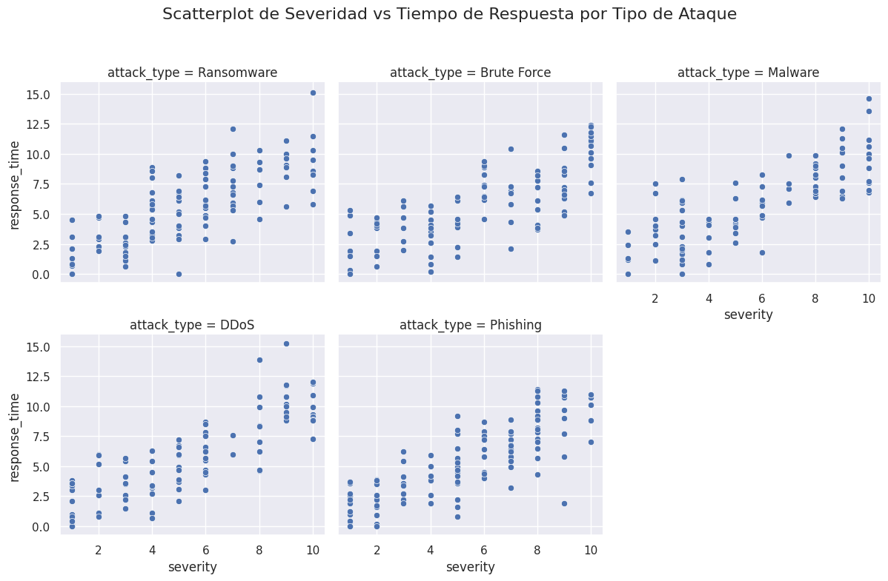
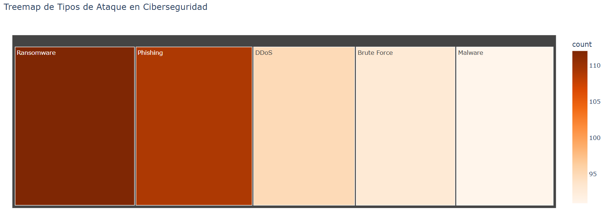
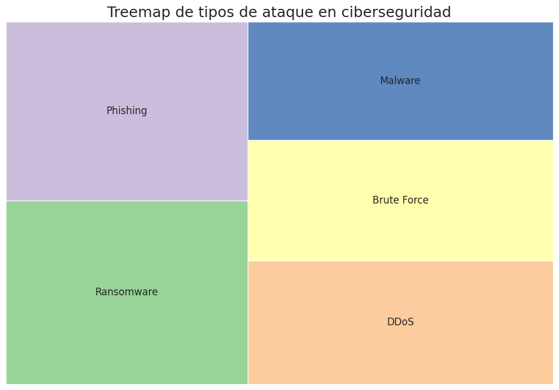
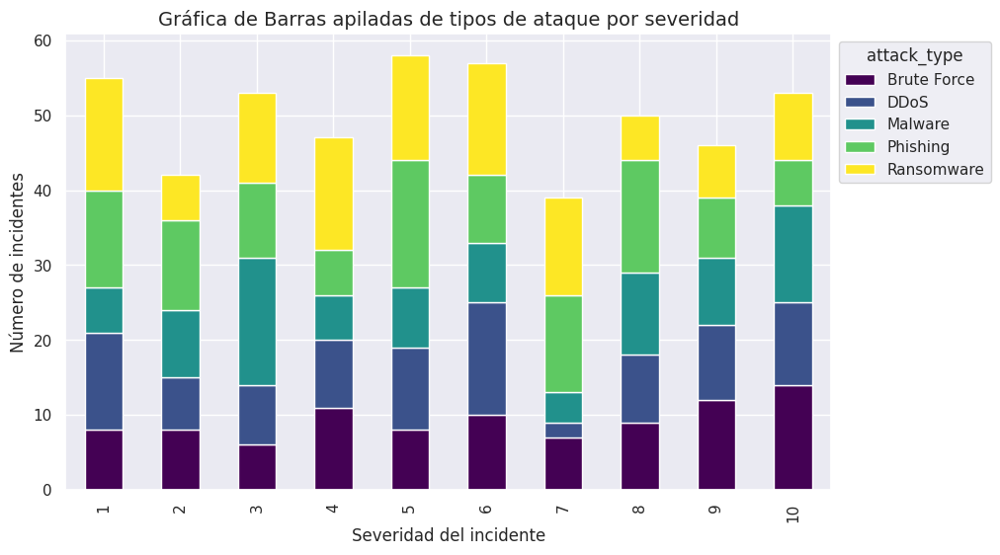

🏠 [**Inicio**](../../Readme.md) ➡️ / 📖 [**Sesión 06**](../Readme.md) ➡️ / 📝 `Ejemplo 02: Visualizaciones jerárquicas y comparativas`

## 🎯 Objetivo

Aprender a crear visualizaciones de datos efectivas para comunicar información de manera clara, identificando patrones y tendencias en los datos. Esto les permitirá analizar y presentar datos de forma visualmente atractiva y comprensible a traves de  Scatterplot por categorías, Scatterplot con variables condicionantes, Treemaps y gráfica de barras apiladas.

---

## 🚀 Comencemos

- Un **Scatterplot por categorías** te permite visualizar la relación entre dos variables continuas, diferenciando los datos según una variable categórica. Los puntos se colorean según la categoría, lo que facilita la identificación de patrones y comparaciones entre grupos.

- Un **Scatterplot con variables condicionantes** va un paso más allá, permitiendo dividir el gráfico en múltiples subplots basados en una o más variables categóricas. Esto te ayuda a observar cómo la relación entre las variables continuas cambia bajo diferentes condiciones.

---

## 🛠️ **Creación de Scatterplot por categorías y con variables condicionantes**

Para poder crear este tipo de gráfico, utilizaremos un dataset con información sobre ataques cibernéticos que encontraremos en el archivo [Ejemplo_02_03_Cybersecurity_Dataset](../../Datasets/S06/Ejemplo_02_03_Cybersecurity_Dataset.csv) donde encontraremos las columnas:

- `attack_type`: El tipo de ataque
- `severity`: Mide la gravedad del incidente
- `response_time`: El tiempo de respuesta de atención

**Aplica los siguientes pasos:**

1. **📊 Creación del scatterplot:** Este código genera un scatterplot básico que muestra la relación entre la severidad de los incidentes y el tiempo de respuesta.

    ```python
    import pandas as pd
    import matplotlib.pyplot as plt
    import seaborn as sns
    
    # Cargar el dataset
    cybersecurity_data = pd.read_csv('S06/Ejemplo_02_03_Cybersecurity_Dataset.csv') # Cambia la ruta del archivo si es necesario
    
    # Configurar el estilo de Seaborn
    sns.set(style="darkgrid")
    
    # Crear el Scatterplot sin dividir por categorías
    plt.figure(figsize=(10, 6))
    sns.scatterplot(data=cybersecurity_data, x='severity', y='response_time', color='b', s=100)
    
    # Añadir título y etiquetas a los ejes
    plt.title('Scatterplot de Severidad vs Tiempo de respuesta', fontsize=16)
    plt.xlabel('Severidad del incidente', fontsize=14)
    plt.ylabel('Tiempo de respuesta (horas)', fontsize=14)
    
    # Mostrar la gráfica
    plt.show()
    ```

    - `sns.scatterplot(data=cybersecurity_data, x='severity', y='response_time', color='b', s=100)`: 
        -    Se crea un scatterplot simple, donde todos los puntos son del mismo color (color='b' para azul).
        -   `x='severity' y y='response_time'` especifican los ejes del gráfico.
        -   `s=100` ajusta el tamaño de los puntos.

<details>
  <summary><b>✨Haz clic aquí para ver la imagen✨</b></summary>
  <div align="center">
      
  </div>
</details>
<br>

2. **📊 Scatterplot por categoría:** Para analizar cómo varían la severidad y el tiempo de respuesta según las categorías de ataque más frecuentes, un scatterplot por categoría es ideal.

    ```python
    # Verificar la frecuencia de cada tipo de ataque para identificar los dos más comunes
    attack_type_counts = cybersecurity_data['attack_type'].value_counts()
    top_two_attack_types = attack_type_counts.index[:2]
    
    # Filtrar el dataset para incluir solo los dos tipos de ataques más comunes
    filtered_data = cybersecurity_data[cybersecurity_data['attack_type'].isin(top_two_attack_types)]
    
    # Crear el Scatterplot para los dos tipos de ataques más comunes
    plt.figure(figsize=(10, 6))
    sns.scatterplot(data=filtered_data, x='severity', y='response_time', hue='attack_type', palette='muted', s=100)
    
    # Añadir título y etiquetas a los ejes
    plt.title('Severidad vs Tiempo de respuesta (2 ataques más comunes)', fontsize=16)
    plt.xlabel('Severidad del incidente', fontsize=14)
    plt.ylabel('Tiempo de respuesta (horas)', fontsize=14)
    
    # Mostrar la gráfica
    plt.show()
    ```

    **🤔 ¿Que estamos haciendo?**

    - *Identificar los tipos de ataque más frecuentes:*
        - `attack_type_counts = cybersecurity_data['attack_type'].value_counts()`: Cuenta la frecuencia de cada tipo de ataque.
        - `top_two_attack_types = attack_type_counts.index[:2]`: Selecciona los dos tipos de ataques más comunes.

    - *Filtrar el dataset:*
        - `filtered_data = cybersecurity_data[cybersecurity_data['attack_type'].isin(top_two_attack_types)]`: Filtra el dataset para incluir solo los registros que corresponden a los dos tipos de ataques más frecuentes.

<details>
  <summary><b>✨Haz clic aquí para ver la imagen✨</b></summary>
  <div align="center">
      
  </div>
</details>

<br>

3. **📊 Creación de scatterplot con variables condicionantes**: Recuerda que un scatterplot con variables condicionantes te permite observar la relación entre dos variables continuas mientras divides los datos en subconjuntos basados en una o más variables categóricas. Podrías crear un scatterplot que te permitirá analizar la relación entre severidad y tiempo de respuesta, condicionada por el tipo de ataque.

    ```python
    # Crear un FacetGrid para scatterplots condicionados por 'attack_type'
    g = sns.FacetGrid(cybersecurity_data, col="attack_type", col_wrap=3, height=4)
    g.map(sns.scatterplot, "severity", "response_time", color="b")
    
    # Añadir título
    g.fig.suptitle('Scatterplot de Severidad vs Tiempo de Respuesta por Tipo de Ataque', fontsize=16)
    g.fig.tight_layout(rect=[0, 0, 1, 0.95])
    
    # Mostrar la gráfica
    plt.show()
    ```


    **🤔 ¿Que estamos haciendo?** 
    
    - `sns.FacetGrid`: Crea una cuadrícula de gráficos basada en la variable attack_type. Cada gráfico muestra la relación entre severity y response_time para un tipo de ataque específico.
    - `col="attack_type"`: Divide los gráficos por la categoría attack_type.
    - `col_wrap=3`: Ajusta el número de gráficos por fila.
    - `g.map(sns.scatterplot, "severity", "response_time", color="b")`: Genera scatterplots para cada subconjunto de datos.
    - `g.fig.tight_layout(rect=[0, 0, 1, 0.95])`: ajusta automáticamente los subplots para que no se superpongan y deja un espacio en la parte superior del gráfico para acomodar el título

<details>
  <summary><b>✨Haz clic aquí para ver la imagen✨</b></summary>
  <div align="center">
      
  </div>
</details>

---

### 📉 **Interpretación de Scatterplot por categorías y con variables condicionantes**

Interpretar un scatterplot por categorías implica analizar la relación entre dos o más variables continuas mientras se observa cómo esta relación puede diferir entre diferentes grupos o categorías. Lo principal que debes observar es:

- **Relación general entre las variables continuas**  
  Examina la relación entre las variables en los ejes (x e y) para identificar si existe una tendencia general, como una correlación positiva o negativa.

- **Diferencias entre categorías**  
  Observa cómo los diferentes colores (categorías) se agrupan y si alguna categoría muestra patrones distintos en comparación con otras.

- **Identificación de patrones y outliers**  
  Busca patrones específicos dentro de las categorías y detecta puntos fuera de la tendencia general (outliers) que podrían requerir un análisis adicional.

- **Conclusiones basadas en las categorías**  
  Evalúa si la categoría afecta significativamente la relación entre las variables y si esta influencia varía entre categorías.

---

### 🛠️ **Creación de Treemaps**

Un **Treemap** es una técnica visual que muestra datos jerárquicos o categóricos mediante rectángulos de diferentes tamaños y colores. Cada rectángulo representa una categoría, y su tamaño y color reflejan la proporción o el valor de los datos, facilitando la comparación de múltiples categorías en una sola visualización.

- **Plotly Express:** Biblioteca interactiva en Python que permite crear gráficos dinámicos y personalizables. Es ideal para presentaciones, dashboards, y explorar datos en profundidad con interactividad.

- **Squarify:** Biblioteca especializada en crear treemaps estáticos. Es adecuada para generar gráficos rápidos y simples cuando no se requiere interactividad, manteniendo la eficiencia.

---

#### **Treemap con Plotly Express**

Los pasos que haremos para iniciar son los que ya conoces: Instalaremos las bibliotecas, en este caso Plotly y Pandas, cargaremos el dataset (seguiremos usando el de ciberseguridad) y después crearemos el Treemap con Plotly Express:

```python
!pip install plotly
```
```python
import pandas as pd
import plotly.express as px

# Cargar el dataset
cybersecurity_data = pd.read_csv('S06/Ejemplo_02_03_Cybersecurity_Dataset.csv') # Cambia la ruta del archivo si es necesario

# Contar la cantidad de incidentes por tipo de ataque
incident_counts = cybersecurity_data['attack_type'].value_counts().reset_index()
incident_counts.columns = ['attack_type', 'count']

# Crear el Treemap basado en el conteo de incidentes
fig = px.treemap(incident_counts,
                 path=['attack_type'],
                 values='count',
                 color='count',
                 color_continuous_scale='Oranges',
                 title='Treemap de Tipos de Ataque en Ciberseguridad')

# Mostrar el Treemap
fig.show()
```
**🤔 ¿Que estamos haciendo?** 
- *Agrupar los datos:*
    -   `value_counts()`: Cuenta la frecuencia de cada tipo de ataque en el dataset.
    -   `reset_index()`: Resetea el índice para que los datos puedan ser utilizados fácilmente en el treemap.

- *px.treemap:*
    -   `path=['attack_type']`: Especifica la jerarquía de los datos, en este caso, estamos creando el treemap basado en el tipo de ataque (attack_type).
    -   `values='count'`: Usamos un conteo de incidentes por tipo de ataque, lo que asegura que estamos pasando valores numéricos y agregables.
    -   `color='count'`: Asigna un color a cada bloque basado en el conteo. Puedes cambiar esta variable por otra que te interese resaltar.
    -   `color_continuous_scale='Oranges'`: Define la paleta de colores utilizada. Puedes reemplazar 'Oranges' por otras paletas como 'Reds', 'Purples', 'Oranges', 'Greens', 'Viridis', 'Cividis', 'Plasma', etc.

- *Interactividad:*
    -   El treemap generado por Plotly es interactivo. Puedes pasar el cursor sobre los bloques para ver detalles adicionales y hacer clic en los bloques para desglosar la información

<details>
  <summary><b>✨El Treemap que obtenemos es:✨</b></summary>
  <div align="center">
      
  </div>
</details>

---

#### **Treemap con Squarify**

Seguimos los pasos que conocemos: instalamos la biblioteca y cargamos el dataset. Aquí también agrupamos los datos y debemos calcular el tamaño que cada grupo representará en el Treemap y por último, usaremos squarify para generar el Treemap, mapeando el tamaño de cada rectángulo al número de incidentes de cada tipo de ataque.

```python
!pip install squarify
```
```python
import pandas as pd
import squarify
import matplotlib.pyplot as plt

# Cargar el dataset
cybersecurity_data = pd.read_csv('S06/Ejemplo_02_03_Cybersecurity_Dataset.csv') # Cambia la ruta del archivo si es necesario

# Agrupar los datos por 'attack_type' y contar la frecuencia de cada tipo de ataque
attack_counts = cybersecurity_data['attack_type'].value_counts().reset_index()
attack_counts.columns = ['attack_type', 'count']

# Crear el Treemap
plt.figure(figsize=(12, 8))
squarify.plot(sizes=attack_counts['count'], label=attack_counts['attack_type'], alpha=.8, color=plt.cm.Accent(range(len(attack_counts))))

# Añadir título
plt.title('Treemap de tipos de ataque en ciberseguridad', fontsize=18)
plt.axis('off')  # Quitar los ejes

# Mostrar la gráfica
plt.show()
```

**🤔 ¿Que estamos haciendo?** 

- *Crear el Treemap:*
    -   `squarify.plot`: Genera el treemap.
    -   `sizes`: Define el tamaño de cada rectángulo basado en el conteo de incidentes.
    -   `label`: Etiqueta cada rectángulo con el tipo de ataque.
    -   `color=plt.cm.Accent`: Aplica una paleta de colores para diferenciar los tipos de ataque.
    -   `alpha=.8`: Ajusta la transparencia de los colores.

- *Personalización:*
    -   `plt.title`: Añade un título a la gráfica.
    -   `plt.axis('off')`: Elimina los ejes para que solo se muestre el treemap. 

<details>
  <summary><b>✨El Treemap que obtenemos es:✨</b></summary>
  <div align="center">
      
  </div>
</details>

---

### 📉 **Interpretación de Treemaps**

Lo que debes observar en este tipo de grafico es:

- **Tamaño de los rectángulos**  
  Los rectángulos más grandes representan categorías con valores más altos; los más pequeños indican valores más bajos.

- **Colores de los rectángulos**  
  Colores más intensos suelen indicar valores mayores, mientras que colores más claros indican valores menores.

- **Jerarquía de los datos**  
  Los rectángulos anidados muestran subcategorías dentro de categorías más generales.

- **Distribución y comparación visual:**  
  Permite comparar visualmente las proporciones entre categorías, identificando rápidamente las más dominantes.


Por ejemplo, en nuestro grafico podemos visualizar: 

- *Distribución de ataques*: El treemap muestra que los tipos de ataque Phishing, Malware, Ransomware, Brute Force, y DDoS están representados por áreas de diferentes tamaños, lo que indica la proporción de cada tipo de ataque en el conjunto de datos.

- *Proporciones relativas*: Malware parece tener la mayor representación en el dataset, seguido de DDoS, lo que sugiere que estos tipos de ataques son más comunes o tienen mayor impacto.

- *Comparación visual*: Ransomware y Brute Force tienen áreas similares, lo que indica que su incidencia o severidad es comparable en este contexto.

---

### 🛠️ **Creación de gráfica de barras apiladas**

Una gráfica de **barras apiladas** es una visualización que muestra la composición de diferentes categorías dentro de un conjunto de datos. Cada barra se divide en segmentos apilados, donde cada segmento representa la contribución de una categoría al total, facilitando la comparación de categorías tanto dentro de una barra como entre distintas barras mediante el uso de colores.

Esto podemos realizarlo de la siguiente manera:

```python
import pandas as pd
import matplotlib.pyplot as plt

# Cargar el dataset
cybersecurity_data = pd.read_csv('S06/Ejemplo_02_03_Cybersecurity_Dataset.csv') # Cambia la ruta del archivo si es necesario

# Crear una tabla cruzada que muestre el número de incidentes por severidad y tipo de ataque
crosstab_data = pd.crosstab(cybersecurity_data['severity'], cybersecurity_data['attack_type'])

# Crear la gráfica de barras apiladas
crosstab_data.plot(kind='bar', stacked=True, figsize=(10, 6), colormap='viridis')

# Añadir título y etiquetas a los ejes
plt.title('Gráfica de Barras apiladas de tipos de ataque por severidad', fontsize=14)
plt.xlabel('Severidad del incidente', fontsize=12)
plt.ylabel('Número de incidentes', fontsize=12)
plt.legend(title='attack_type', bbox_to_anchor=(1, 1), loc='upper left')

# Mostrar la gráfica
plt.show()
```

**🤔 ¿Que estamos haciendo?** 

- *Agrupar los datos:*
    -   `pd.crosstab`: Este método crea una tabla cruzada que cuenta la cantidad de incidentes para cada combinación de severidad y tipo de ataque.

- *Crear la gráfica de barras apiladas:*
    -   `kind='bar', stacked=True`: Genera una gráfica de barras apiladas. Cada barra representa una severidad y está dividida en segmentos que representan los diferentes tipos de ataque.
    - `colormap='viridis'`: Aplica una paleta de colores a las barras apiladas. Puedes cambiar viridis por otra paleta de colores si lo prefieres.

- *Personalización:*
    -   `plt.title`: Añade un título descriptivo a la gráfica.
    -   `plt.xlabel y plt.ylabel`: Etiquetas para los ejes x e y.
    -   `bbox_to_anchor=(1, 1)`: Ajusta la posición de la leyenda fuera del área del gráfico. 1 mueve la leyenda hacia la derecha del gráfico, mientras que 1 la alinea con la parte superior del gráfico.
    -   `loc='upper left'`: Establece la posición de la leyenda en la parte superior izquierda del cuadro delimitador especificado por bbox_to_anchor

<details>
  <summary><b>✨La grafica que obtenemos es:✨</b></summary>
  <div align="center">
      
  </div>
</details>

---

### 📉 **Interpretación de gráfica de barras apiladas**

Lo que debes observar en este tipo de grafico es:

- **Interpretación de cada barra**  
  La altura total de la barra muestra el valor total para un grupo, y los segmentos indican la distribución de subcategorías dentro de ese grupo.

- **Comparación de segmentos**  
  El tamaño de cada segmento refleja la contribución de la subcategoría dentro de la barra; segmentos más grandes indican mayor contribución.

- **Comparación entre barras**  
  Compara la altura total y los segmentos de las barras para ver cómo varían las subcategorías entre diferentes grupos.

- **Tendencias generales:**  
  Observa si ciertos subgrupos aumentan o disminuyen consistentemente entre categorías.

Por ejemplo, en nuestro grafico podemos visualizar: 

- *Distribución de tipos de ataque*: Phishing y Ransomware parecen ser los tipos de ataque más frecuentes, especialmente en incidentes con severidades de nivel 1, 3, 5, y 6.
- *Variabilidad en severidad*: Los incidentes con severidades más bajas (1-3) y más altas (9-10) tienen una distribución más equilibrada entre los tipos de ataque, mientras que en niveles intermedios, ciertos ataques dominan.
- *Tendencias por severidad*: La severidad no está fuertemente dominada por un solo tipo de ataque, pero hay una presencia consistente de Malware y DDoS a lo largo de las diferentes severidades, especialmente en los niveles más altos.

---

⬅️ [**Anterior**](../Readme.md) | [**Siguiente**](../Reto-01/Readme.md) ➡️