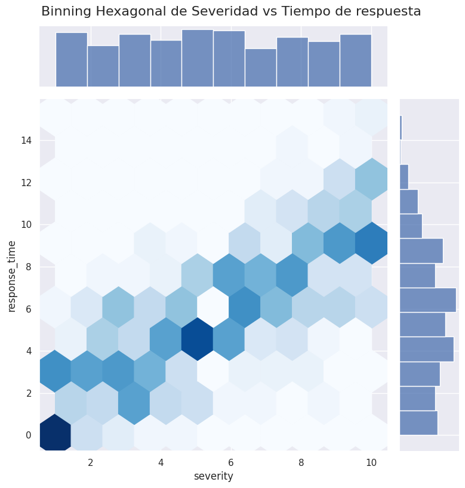

🏠 [**Inicio**](../../Readme.md) ➡️ / 📖 [**Sesión 06**](../Readme.md) ➡️ / 📝 `Ejemplo 03: Visualizaciones de densidad`

## 🎯 Objetivo

El objetivo es comprender y aplicar la técnica de binning hexagonal para visualizar la densidad de datos en grandes conjuntos. Esta técnica permite identificar patrones, agrupaciones y anomalías que pueden no ser evidentes con otros tipos de gráficos.

---

## 🚀 Comencemos

Un **binning hexagonal** es una técnica útil para visualizar la densidad de puntos en un scatterplot, especialmente cuando tienes una gran cantidad de datos. En lugar de dibujar puntos individuales, los datos se agrupan en hexágonos, y el color de cada hexágono indica la cantidad de puntos dentro de él.

---

### 🛠️ **Creación de un binning hexagonal**

Puedes crear un binning hexagonal con los datos del csv de ciberseguridad que usamos en el Ejemplo 02 y utilizando la función `sns.jointplot` con el tipo `'hex'` de Seaborn.

```python
import pandas as pd
import seaborn as sns
import matplotlib.pyplot as plt

# Cargar el dataset
cybersecurity_data = pd.read_csv("S06/Ejemplo_02_03_Cybersecurity_Dataset.csv")

# Crear un jointplot con binning hexagonal
sns.jointplot(x='severity', y='response_time', data=cybersecurity_data, kind='hex', cmap='Blues', height=8)

# Añadir título
plt.suptitle('Binning Hexagonal de Severidad vs Tiempo de respuesta', y=1.02, fontsize=16)

# Mostrar la gráfica
plt.show()
```

**🤔 ¿Que estamos haciendo?**

- `sns.jointplot(kind='hex')`:
    - Crea un scatterplot con binning hexagonal, mostrando la densidad de los puntos.
    - `cmap='Blues'` establece el mapa de colores.
    - `height=8` ajusta el tamaño de la figura.


<details>
  <summary><b>✨El binning hexagonal se muestra asi:✨</b></summary>
  <div align="center">
      
  </div>
</details>

---

### 📉 **Interpretación de los resultados binning hexagonal**

**Lo que debes observar en este tipo de grafico es:**

- **Hexágonos como contenedores de datos**  
  El binning hexagonal agrupa puntos en hexágonos, cada uno representando una área con una cantidad de datos.

- **Color como indicador de densidad**  
  El color de los hexágonos muestra la densidad; colores más oscuros indican más puntos, colores más claros indican menos.

- **Interpretación de la distribución**  
  Los hexágonos oscuros indican áreas de alta densidad, mientras que los claros indican baja densidad. Los patrones generales muestran cómo los datos se agrupan o dispersan.

- **Comparación con un Scatterplot tradicional**  
  El binning hexagonal resuelve la superposición de puntos en scatterplots tradicionales, facilitando la visualización de la densidad en grandes conjuntos de datos.

**Por ejemplo, en nuestro grafico podemos visualizar:**

- *Densidad de los hexágonos*: Los hexágonos oscuros indican alta concentración de incidentes con severidad alrededor de 6 y tiempos de respuesta de 5-6 horas, mientras que los claros muestran áreas con menos datos.

- *Patrón general*: Existe una ligera correlación positiva entre severidad y tiempo de respuesta, donde ambos tienden a aumentar juntos.

- *Interpretación de los gráficos de barras*: Los gráficos de barras en los márgenes muestran la distribución de la severidad y el tiempo de respuesta, proporcionando un contexto sobre la frecuencia de los incidentes.

---

⬅️ [**Anterior**](../Readme.md) | [**Siguiente**](../Reto-02/Readme.md) ➡️