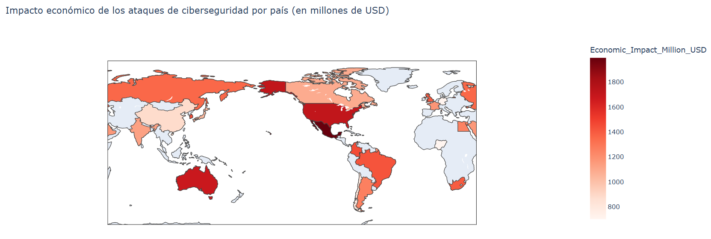

🏠 [**Inicio**](../../Readme.md) ➡️ / 📖 [**Sesión 06**](../Readme.md) ➡️ / 📝 `Ejemplo 04: Mapas y visualizaciones geoespaciales`

## 🎯 Objetivo

El objetivo es comprender y aplicar el uso de mapas cloropléticos para interpretar y comunicar información geoespacial. Estos mapas te permiten representar la variación de una variable en diferentes áreas geográficas mediante el uso de colores.

---

## 🚀 Comencemos

Un **mapa cloroplético** es una técnica útil para visualizar la distribución geográfica de datos, especialmente cuando necesitas representar la variación de una variable en diferentes áreas. En lugar de mostrar cada punto individualmente, las áreas geográficas se colorean según el valor de la variable, y el color indica la intensidad o cantidad del dato en esa región. Este tipo de mapa es ideal para identificar patrones regionales y comparar datos entre distintas áreas geográficas de manera clara y efectiva, pare este ejemplo usaremos el dataset [Ejemplo_04_Cybersecurity_Word_Dataset.csv](../../Datasets/S06/Ejemplo_04_Cybersecurity_Word_Dataset.csv) que contiene información sobre el impacto económico de los ataques de ciberseguridad en diferentes países.

---

### 🛠️ **Creación de un mapa cloroplético**

Para este tipo de gráfico, también utilizaremos la librería ploty.express, ¿la recuerdas? Aplica lo siguiente:

```python
from IPython.display import display
import pandas as pd
import plotly.express as px

# Cargar el dataset
cybersecurity_world_data = pd.read_csv('S06/Ejemplo_04_Cybersecurity_Word_Dataset.csv')

# Verificar las primeras filas del dataset
display(cybersecurity_world_data.head())

# Separador visual
print("-"*100)

# Agrupar los datos por país y sumar el impacto económico
impacto_economico_por_pais = cybersecurity_world_data.groupby('Country', as_index=False)['Economic_Impact_Million_USD'].sum()

# Crear el mapa cloroplético
fig = px.choropleth(impacto_economico_por_pais,
                    locations='Country',
                    locationmode='country names',
                    color='Economic_Impact_Million_USD',
                    hover_name='Country',
                    color_continuous_scale='Reds',
                    title='Impacto económico de los ataques de ciberseguridad por país (en millones de USD)')

# Mostrar el mapa
fig.show()
```

**🤔 ¿Que estamos haciendo?**

- `•	groupby('Country')`: Agrupa los datos por país para calcular el impacto económico total de los ataques de ciberseguridad en cada país.
  - `px.choropleth`: Crea el mapa cloroplético:
  -	`locations='Country'`: Especifica la columna que contiene los nombres de los países.
  - `color='Economic_Impact_Million_USD'`: Usa la columna de impacto económico para definir los colores en el mapa.
  - `locationmode='country names'`: Indica que los nombres de los países se están utilizando para ubicar los datos.
  - `color_continuous_scale='Reds'`: Define la paleta de colores usada para representar los datos.

- `hover_name='Country'`: Muestra el nombre del país cuando pasas el cursor sobre él.
- `fig.show()`: Muestra el mapa cloroplético interactivo.

<details>
  <summary><b>✨Nuestro resultado es:✨</b></summary>
  <div align="center">
      
  </div>
</details>

---

### 📉 **Interpretación de los resultados mapa cloroplético**

Lo que debes observar en este tipo de grafico es:

- **Colores y escala**  
  Colores más intensos indican valores altos, y más claros indican valores bajos; consulta la leyenda para interpretar correctamente.

- **Patrones geográficos**  
  Observa la distribución de colores para identificar concentraciones regionales y patrones significativos.

- **Comparación regional**  
  Compara valores entre regiones para detectar diferencias y anomalías.

- **•	Identificación de tendencias**  
  Busca tendencias globales o locales y clusters que indiquen factores regionales influyentes.


**En resumen…**

Un mapa cloroplético es una herramienta para obtener insights sobre la distribución geográfica de una variable específica. Te permite comparar regiones de un vistazo, identificar patrones geográficos, y detectar posibles anomalías que podrían no ser obvias en otras formas de visualización de datos. Al interpretar un mapa cloroplético, te enfocas en los colores, patrones, y diferencias regionales para comprender mejor los datos que estás analizando.

---

⬅️ [**Anterior**](../Readme.md) | [**Siguiente**](../Sesion-07/Readme.md) ➡️