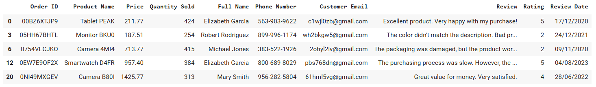
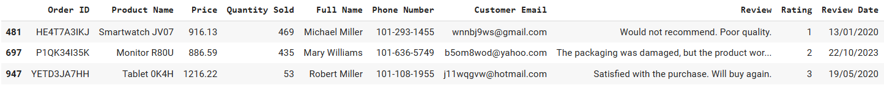
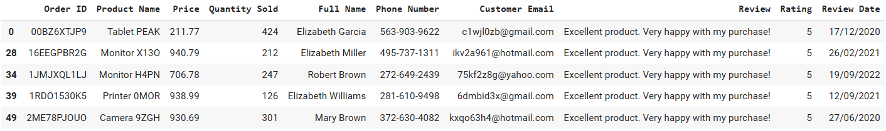
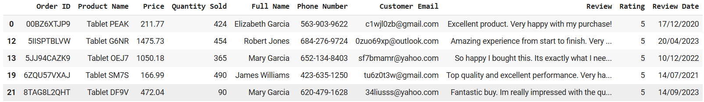
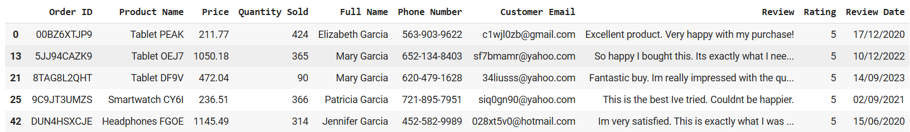
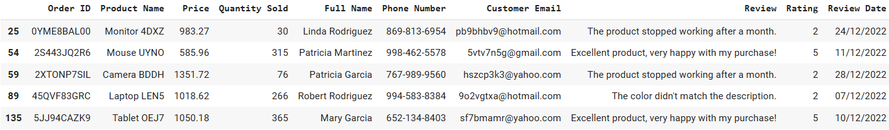
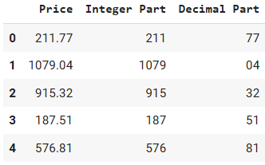
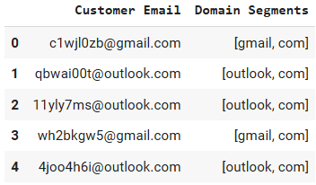
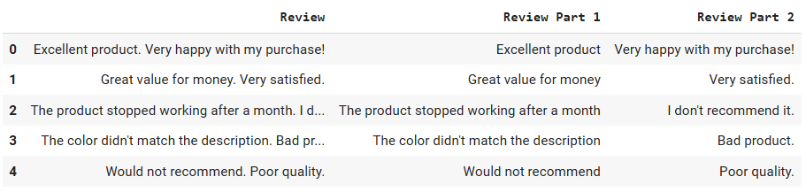

🏠 [**Inicio**](../../Readme.md) ➡️ / 📖 [**Sesión 07**](../Readme.md) ➡️ / 📝 `Ejemplo 01: Expresiones regulares`

## 🎯 Objetivo

Desarrollar habilidades para utilizar expresiones regulares en Python, permitiendo la extracción y manipulación eficiente de patrones específicos en textos, como direcciones de correo electrónico, números de teléfono o fechas, facilitando el análisis de grandes volúmenes de datos textuales.

---

## 🚀 Comencemos

Las **expresiones regulares** permiten identificar y manipular patrones en textos, automatizando tareas complejas y mejorando el análisis de grandes volúmenes de datos textuales de manera rápida y precisa.

Algunos ejemplos sencillos son:
- Buscar URLs en un texto: Extraer todas las direcciones web (URLs) de un documento o un correo electrónico.
- Filtrar hashtags en redes sociales: Identificar y extraer hashtags específicos en publicaciones de redes sociales.
- Validar números de teléfono: Comprobar que los números de teléfono ingresados en un formulario siguen un formato correcto.


---

### 🛠️ **Sintaxis básica de expresiones regulares**
Para poder hacer uso de Regex en Python es necesario:

1.  **Importar el Módulo re**: Python tiene un módulo integrado llamado re que se utiliza para trabajar con expresiones regulares. También usaremos Pandas y cargaremos el dataset [Ejemplo_01_03_Amazon_Sales_Dataset.csv](../../Datasets/S07/Ejemplo_01_03_Amazon_Sales_Dataset.csv)

    ```python
    import pandas as pd
    import re

    # Cargar el dataset
    df = pd.read_csv('./Ejemplo_01_03_Amazon_Sales_Dataset.csv') # Modifica la ruta de acuerdo a tu entorno de trabajo
    
    # Mostrar las primeras filas del dataset
    df.head()
    ```

2.  **Usar funciones del módulo re:** Estas también las revisamos en el Prework. 
    - re.findall(): Encuentra todas las ocurrencias de un patrón en una cadena y las devuelve como una lista.

    - re.search(): Busca la primera ocurrencia de un patrón en una cadena.

    - re.split(): Divide una cadena en partes utilizando un patrón como delimitador.

    <br>

3.  **Practicar diversas expresiones regulares:**

    **🔍 Ejemplos con re.findall**

    - **Buscar direcciones de correo electrónico**
        - La función `find_gmail_emails()` devuelve `True` si se encuentra al menos una coincidencia (es decir, si el correo electrónico pertenece a Gmail), o `False` si no se encuentra ninguna coincidencia.
        - La función `apply()` se usa para aplicar find_gmail_emails() a cada elemento en la columna `Customer Email`.
        - Los resultados booleanos `(True o False)` se utilizan para filtrar el DataFrame, seleccionando solo las filas donde la función devuelve True.
        - `df_result` contendrá solo los registros que tienen correos electrónicos de Gmail.

        <br>

        ```python
        # 1. Buscar direcciones de correo electrónico que coincidan con un patrón específico (por ejemplo, Gmail)
        def find_gmail_emails(text):
            pattern = r'@gmail\.com'
            result = re.findall(pattern, text)

            # Si hay al menos una coincidencia, devuelve True, de lo contrario, False
            return bool(result)

        # Filtrar el DataFrame para obtener solo los registros con correos electrónicos de Gmail
        df_gmail = df[df['Customer Email'].apply(find_gmail_emails)]

        # Mostrar los primeros registros filtrados
        df_gmail.head(5)
        ```

        **Resultados:**
        <div align="center">
            
        </div>

        <br>

    - **Buscar números de teléfono que comiencen con "101"**

        ```python
        def find_phone_numbers(text):
            pattern = r'\b101-\d{3}-\d{4}\b'
            result = re.findall(pattern, text)
            return bool(result)

        df_phone_numbers = df[df['Phone Number'].apply(find_phone_numbers)]
        df_phone_numbers.head(5)
        ```

        **Resultados:**
        <div align="center">
            
        </div>

        <br>

    - **Buscar reseñas que contengan la palabra "excellent"**

        ```python
        def find_reviews_with_excellent(text):
            pattern = r'\bexcellent\b'
            result = re.findall(pattern, text, re.IGNORECASE)
            return bool(result)

        df_excellent_reviews = df[df['Review'].apply(find_reviews_with_excellent)]
        df_excellent_reviews.head(5)
        ```

        **Resultados:**
        <div align="center">
            
        </div>

    ---

    **🔎 Ejemplos con re.search**

    - **Buscar productos cuyo nombre comience con "Tablet"**

        ```python
        def find_product_tablet(text):
            pattern = r'^Tablet\b'
            result = re.search(pattern, text)
            return bool(result)

        df_product_tablet = df[df['Product Name'].apply(find_product_tablet)]
        df_product_tablet.head(5)
        ```

        **Resultados:**
        <div align="center">
            
        </div>
    
    - **Buscar nombres completos que contengan "Garcia"**

        ```python
        def find_name_garcia(text):
            pattern = r'\bGarcia\b'
            result = re.search(pattern, text, re.IGNORECASE)
            return bool(result)

        df_name_garcia = df[df['Full Name'].apply(find_name_garcia)]
        df_name_garcia.head(5)
        ```

        **Resultados:**
        <div align="center">
            
        </div>
    
        <br>

    - **Buscar fechas de revisión en diciembre 2022**

        ```python
        def find_december_reviews(text):
            pattern = r'\b\d{2}/12/2022\b'
            result = re.search(pattern, text)
            return bool(result)

        df_december_reviews = df[df['Review Date'].apply(find_december_reviews)]
        df_december_reviews.head(5)
        ```

        **Resultados:**
        <div align="center">
            
        </div>

    ---

    **✂️ Ejemplos con re.split**

    - **Dividir los precios en parte entera y parte decimal**

        ```python
        def split_price(text):
            # Dividir el precio en parte entera y parte decimal
            parts = re.split(r'\.', str(text))
            if len(parts) == 2:
                return parts[0], parts[1]  # Parte entera y parte decimal
            return parts[0], '00'  # Si no hay decimal, se asume .00

        df[['Integer Part', 'Decimal Part']] = df['Price'].apply(lambda x: pd.Series(split_price(x)))
        df[['Price', 'Integer Part', 'Decimal Part']].head(5)
        ```

        **Resultados:**
        <div align="center">
            
        </div>
    
        <br>

    - **Dividir las direcciones de correo electrónico en segmentos separados por puntos**

        ```python
        def split_email_domain_segments(text):
            # Dividir el dominio del correo electrónico en segmentos separados por puntos
            email_parts = re.split(r'@', text)
            if len(email_parts) == 2:
                domain_segments = re.split(r'\.', email_parts[1])
                return domain_segments
            return []

        df['Domain Segments'] = df['Customer Email'].apply(split_email_domain_segments)
        df[['Customer Email', 'Domain Segments']].head(5)
        ```

        **Resultados:**
        <div align="center">
            
        </div>

        <br>

    - **Dividir las reseñas en dos columnas a partir de un punto**

        ```python
        def split_review_into_two_parts(text):
            parts = re.split(r'\.\s*', text, maxsplit=1)
            if len(parts) == 2:
                return parts[0], parts[1]
            return parts[0], ''

        df[['Review Part 1', 'Review Part 2']] = df['Review'].apply(lambda x: pd.Series(split_review_into_two_parts(x)))
        df[['Review', 'Review Part 1', 'Review Part 2']].head(5)
        ```

        **Resultados:**
        <div align="center">
            
        </div>
---

⬅️ [**Anterior**](../Readme.md) | [**Siguiente**](../Reto-01/Readme.md) ➡️
