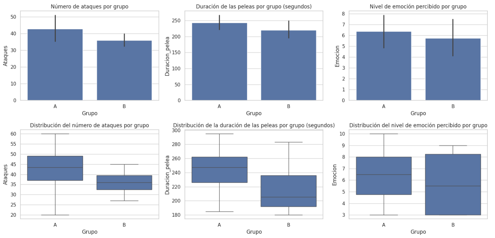

🏠 [**Inicio**](../../Readme.md) ➡️ / 📖 [**Sesión 07**](../Readme.md) ➡️ / 📝 `Ejemplo 02: Pruebas A/B`

## 🎯 Objetivo

El objetivo es adquirir la capacidad de utilizar pruebas A/B para evaluar de manera precisa cómo dos variantes de un producto o proceso se desempeñan comparativamente. También aprender a aplicar análisis estadísticos, como la prueba Z y la prueba exacta de Fisher, para determinar si las diferencias observadas entre las variantes son estadísticamente significativas o podrían ser resultado del azar.

---

## 🚀 Comencemos

Una prueba A/B es una técnica de experimentación que se utiliza para comparar dos versiones de un producto, proceso o elemento para determinar cuál es más efectivo en alcanzar un objetivo específico. En este tipo de prueba, los participantes se dividen aleatoriamente en dos grupos: 
- **Grupo A (control):** interactúa con la versión original
- **Grupo B (tratamiento):** experimenta la nueva versión con una modificación. 

Al analizar los resultados de ambos grupos, se pueden identificar diferencias en el rendimiento y determinar si los cambios introducidos en la variante B son beneficiosos, basándose en datos cuantitativos y objetivos.


---

### 🛠️ **Desarrollo de una prueba A/B**
Aprenderemos cómo aplicar pruebas A/B utilizando un ejemplo de un torneo de artes marciales. Imaginemos que queremos saber qué tipo de reglas hacen las peleas más emocionantes y mejoran el rendimiento de los competidores. Analizaremos datos como el número de ataques, la duración de las peleas y la emoción percibida por los espectadores para determinar qué reglas son más efectiva.
**Aplica los siguientes pasos:**

1. **Definir los objetivos de la prueba.**
Establece claramente los objetivos de la prueba A/B. En nuestro caso, los objetivos serán:
    - Evaluar cuál conjunto de reglas fomenta un mayor rendimiento atlético.
    - Determinar cuál formato de competencia hace que las peleas sean más emocionantes para los espectadores.
    - Medir el impacto de las nuevas reglas en términos de número de ataques, duración de las peleas y percepción del nivel de emoción por parte del público.

    <br>

2. **Diseñar el experimento (selecciona las métricas).**

    Decide las reglas específicas y las variantes que vas a probar, asegurando que estas son claras, justas y viables. En el ejemplo, tendremos dos grupos:

    - **Grupo A (Control):** Competencias bajo las reglas estándar actuales (tiempo determinado y sistema de puntos tradicional).
    - **Grupo B (Tratamiento):** Competencias bajo reglas modificadas (por ejemplo, tiempo reducido o puntos extra por ciertos movimientos como patadas giratorias).
    <br>

3. **Seleccionar y asignar participantes (crear las variantes y asignación aleatoria).**
La asignación aleatoria es importante para reducir el sesgo y garantizar que las diferencias observadas se deban a las métricas evaluadas y no a otras variables. En nuestro ejemplo, asignamos aleatoriamente a los competidores a uno de los dos grupos desde los cuartos de final en adelante.

    - **Grupo A (Control):** Compite con las reglas estándar.
    - **Grupo B (Tratamiento):** Compite con las reglas modificadas.

    <br>

4. **Implementa la prueba y recopila datos (recopilación de datos).**
    - En nuestro ejemplo, organiza las peleas según las reglas asignadas a cada grupo, asegurando que todos los participantes conozcan las reglas y que las condiciones sean consistentes y justas, salvo por las diferencias en las reglas de competencia. 

    - Durante y después de cada pelea, recopila datos como el número de ataques, la duración de las peleas y el nivel de emoción percibido por los espectadores, utilizando encuestas o métricas de interacción. 

    - Usaremos los datos del archivo [Ejemplo_02_Martial_Arts_Data.csv](../../Datasets/S07/Ejemplo_02_Martial_Arts_Data.csv)
    
    ```python
    from scipy.stats import ttest_ind
    import pandas as pd
    import seaborn as sns
    import matplotlib.pyplot as plt

    # Cargar el archivo CSV
    df = pd.read_csv('./S07/Ejemplo_02_Martial_Arts_Data.csv') # Cambiar la ruta del archivo

    # Separar los datos en dos grupos: A (Control) y B (Tratamiento)
    grupo_a = df[df['Grupo'] == 'A']
    grupo_b = df[df['Grupo'] == 'B']
    ```
    
    <br>

5. **Analizar los resultados (pruebas estadísticas).**
    Utiliza herramientas estadísticas, como pruebas t, para determinar si las diferencias observadas en las métricas seleccionadas (número de ataques, duración de las peleas y nivel de emoción) entre los dos grupos son estadísticamente significativas.

    ```python
    # Comparación de medias para el número de ataques
    ataques_a = grupo_a['Ataques']
    ataques_b = grupo_b['Ataques']
    t_stat_ataques, p_val_ataques = ttest_ind(ataques_a, ataques_b)

    # Comparación de medias para la duración de las peleas
    duracion_a = grupo_a['Duracion_pelea']
    duracion_b = grupo_b['Duracion_pelea']
    t_stat_duracion, p_val_duracion = ttest_ind(duracion_a, duracion_b)

    # Comparación de medias para el nivel de emoción
    emocion_a = grupo_a['Emocion']
    emocion_b = grupo_b['Emocion']
    t_stat_emocion, p_val_emocion = ttest_ind(emocion_a, emocion_b)

    # Resultados
    print(f"Comparación del número de ataques: t-stat = {t_stat_ataques:.4f}, p-value = {p_val_ataques:.4f}")
    print(f"Comparación de la duración de las peleas: t-stat = {t_stat_duracion:.4f}, p-value = {p_val_duracion:.4f}")
    print(f"Comparación del nivel de emoción: t-stat = {t_stat_emocion:.4f}, p-value = {p_val_emocion:.4f}")
    ```

    **Los resultados que obtenemos con nuestro dataset son:**
    - **Comparación del número de ataques:** `t-stat = 1.4375`, `p-value = 0.1725`
    - **Comparación de la duración de las peleas:** `t-stat = 1.2707`, `p-value = 0.2246`
    - **Comparación del nivel de emoción:** `t-stat = 0.5004`, `p-value = 0.6246`

---

### 📉 **Interpretación de los resultados**
Una prueba A/B no está completa sin la interpretación de resultados y la toma de decisiones. 

Evaluaremos si las reglas modificadas (Grupo B) lograron los objetivos comparados con las reglas estándar (Grupo A) utilizando una prueba t. Si el `t-stat` es alto y el valor `p` es menor que `0.05`, se considerará que hay una diferencia significativa entre los grupos.

**Entonces:**

| Métrica                | t-stat       | p-value   | Interpretación del t-stat                                             | Conclusión                                      |
|------------------------|--------------|-----------|-----------------------------------------------------------------------|-------------------------------------------------|
| **Ataques**            | 1.4375       | 0.1725    | El grupo A tiene un número mayor de ataques en promedio.              | P > 0.05, la diferencia no es significativa.    |
| **Duración de las peleas** | 1.2707   | 0.2246    | El grupo A tiene peleas más largas en promedio.                       | P > 0.05, no hay diferencia significativa.      |
| **Nivel de emoción**   | 0.5004       | 0.6246    | No hay una diferencia significativa en la emoción percibida.          | P > 0.05, sin evidencia de diferencia.          |


Con base en los resultados de las pruebas t, no se encontraron diferencias estadísticamente significativas entre el grupo A (control) y el grupo B (tratamiento) en las métricas evaluadas (número de ataques, duración de las peleas y nivel de emoción). Esto sugiere que las reglas modificadas no tuvieron un impacto significativo. Para visualizar estas comparaciones, podríamos usar gráficos de barras y/o boxplots.

<details>
<summary>🔍 <b>Ver código para visualización de datos</b></summary>

```python
# Configurar el estilo de los gráficos
sns.set(style="whitegrid")

# Datos para los gráficos
metrics = ['Ataques', 'Duracion_pelea', 'Emocion']
titles_bar = ['Número de ataques por grupo', 'Duración de las peleas por grupo (segundos)', 'Nivel de emoción percibido por grupo']
titles_box = ['Distribución del número de ataques por grupo', 'Distribución de la duración de las peleas por grupo (segundos)', 'Distribución del nivel de emoción percibido por grupo']

# Crear gráficos de barras y boxplots
for i, (metric, title_bar, title_box) in enumerate(zip(metrics, titles_bar, titles_box)):
    # Crear una figura y ejes para los gráficos de barras
    fig, axes = plt.subplots(1, 2, figsize=(12, 4))

    # Gráfico de barras
    sns.barplot(x='Grupo', y=metric, data=df, ax=axes[0])
    axes[0].set_title(title_bar)

    # Boxplot
    sns.boxplot(x='Grupo', y=metric, data=df, ax=axes[1])
    axes[1].set_title(title_box)

    plt.tight_layout()
    plt.show()
```

</details>

<br>

<div align="center">
    
</div>

A partir de las gráficas, podemos concluir que aunque hay pequeñas diferencias en las medias, no son lo suficientemente grandes para ser significativas, lo que coincide con los resultados de las pruebas t.

---

⬅️ [**Anterior**](../Readme.md) | [**Siguiente**](../Reto-02/Readme.md) ➡️
