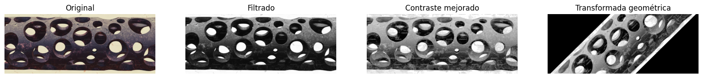

🏠 [**Inicio**](../../Readme.md) ➡️ / 📖 [**Sesión 07**](../Readme.md) ➡️ / 📝 `Ejemplo 04:  Procesamiento de imágenes`

## 🎯 Objetivo

El objetivo de que los alumnos aprendan Procesamiento de imagenes es adquieran la habilidad de utilizar algoritmos para mejorar la calidad visual de las imágenes, extraer información relevante y preparar datos visuales para análisis complejos en diversas aplicaciones. 

---

## 🚀 Comencemos

El **procesamiento de imágenes** es un campo de la computación que utiliza algoritmos para realizar operaciones en imágenes digitales, con el fin de mejorar su calidad visual, extraer información relevante o prepararlas para análisis posteriores. Estas técnicas permiten ajustar brillo, contraste, color, reducir ruido y destacar detalles, inspirándose en la percepción visual humana. Es una disciplina fundamental en diversas aplicaciones, desde la mejora de fotos en redes sociales hasta la detección de tumores en imágenes médicas, combinando matemáticas y programación para manipular imágenes a nivel de píxeles.

---

### 🛠️ **Técnicas de procesamiento de imágenes**
Es importante mencionar que, para estas técnicas, utilizaremos **OpenCV**, una popular biblioteca de procesamiento de imágenes en Python, para demostrar tres técnicas fundamentales usando como ejemplo en el análisis de imágenes de la industria manufacturera. Las técnicas son:

- **Filtrado:** Esta técnica se utiliza para eliminar el ruido presente en las imágenes, mejorando la claridad y facilitando la detección de defectos superficiales como arañazos o imperfecciones en las piezas metálicas.

- **Mejoramiento de contraste:** Aumentar el contraste en las imágenes ayuda a resaltar defectos menores que podrían no ser visibles en condiciones normales, como grietas o corrosión en las superficies metálicas. 

- **Transformaciones geométricas:** En el análisis de piezas que deben cumplir con especificaciones geométricas estrictas, las transformaciones geométricas permiten alinear las imágenes de las piezas con un modelo de referencia. Esto es útil para detectar desviaciones o deformaciones en comparación con el diseño original. 

1. **Instalación de las bibliotecas necesarias:** Asegúrate de tener instaladas las bibliotecas necesarias. Si aún no las tienes, puedes instalarlas utilizando el siguiente comando:

    ```python
    !pip install opencv-python
    ```
        
    ```python
    import cv2
    import numpy as np
    from matplotlib import pyplot as plt
    ```

2. **Cargar y mostrar una imagen:** Cargaremos una imagen de una pieza metálica y la mostraremos en la pantalla.

    ```python
    # Cargar la imagen de ejemplo
    image = cv2.imread('pieza_metálica.jpg', cv2.IMREAD_COLOR)

    # Convertir la imagen a escala de grises
    gray_image = cv2.cvtColor(image, cv2.COLOR_BGR2GRAY)

    # 1. Filtrado: Aplicar un filtro de suavizado para eliminar el ruido
    smoothed_image = cv2.GaussianBlur(gray_image, (5, 5), 0)

    # 2. Mejoramiento de contraste: Utilizar ecualización de histograma para mejorar el contraste
    equalized_image = cv2.equalizeHist(smoothed_image)

    # 3. Transformaciones geométricas: Rotar la imagen para alinearla con un modelo de referencia
    (h, w) = equalized_image.shape[:2]
    center = (w // 2, h // 2)
    angle = 45  # por ejemplo, una rotación de 45 grados
    scale = 1.0
    rotation_matrix = cv2.getRotationMatrix2D(center, angle, scale)
    rotated_image = cv2.warpAffine(equalized_image, rotation_matrix, (w, h))
    ```


3. **Mostrar las imágenes procesadas:** Mostraremos las imágenes originales y procesadas en una cuadrícula para comparar los resultados.

    ```python
    # Configurar el tamaño de la figura para mostrar las imágenes
    plt.figure(figsize=(20, 10))

    # Mostrar la imagen original
    plt.subplot(1, 4, 1)  # Crear el primer subplot en una cuadrícula de 1x4
    plt.title('Original')  # Título del subplot
    plt.imshow(cv2.cvtColor(image, cv2.COLOR_BGR2RGB))  # Convertir la imagen de BGR a RGB y mostrarla
    plt.axis('off')  # Ocultar los ejes para una mejor visualización

    # Mostrar la imagen filtrada (suavizada)
    plt.subplot(1, 4, 2)  # Crear el segundo subplot en la cuadrícula de 1x4
    plt.title('Filtrado')  # Título del subplot
    plt.imshow(smoothed_image, cmap='gray')  # Mostrar la imagen suavizada en escala de grises
    plt.axis('off')  # Ocultar los ejes

    # Mostrar la imagen con contraste mejorado
    plt.subplot(1, 4, 3)  # Crear el tercer subplot en la cuadrícula de 1x4
    plt.title('Contraste mejorado')  # Título del subplot
    plt.imshow(equalized_image, cmap='gray')  # Mostrar la imagen con contraste mejorado en escala de grises
    plt.axis('off')  # Ocultar los ejes

    # Mostrar la imagen transformada geométricamente (rotada)
    plt.subplot(1, 4, 4)  # Crear el cuarto subplot en la cuadrícula de 1x4
    plt.title('Transformada geométrica')  # Título del subplot
    plt.imshow(rotated_image, cmap='gray')  # Mostrar la imagen rotada en escala de grises
    plt.axis('off')  # Ocultar los ejes

    # Mostrar todas las imágenes en una sola ventana
    plt.show()
    ```
---

### 📉 **Interpretación de los resultados:**

¿Qué estamos haciendo?

- **Filtrado:** Se aplica un filtro Gaussiano `(cv2.GaussianBlur)` para suavizar la imagen y reducir el ruido, lo que ayuda en la detección de defectos superficiales.

- **Mejoramiento de contraste:** Se utiliza la ecualización del histograma `(cv2.equalizeHist)` para mejorar el contraste de la imagen en escala de grises, lo que hace que los defectos menores como grietas o corrosión sean más visibles.

- **Transformaciones geométricas:** La imagen se rota utilizando `cv2.getRotationMatrix2D` y `cv2.warpAffine` para alinear las piezas según un ángulo deseado, ayudando a detectar desviaciones o deformaciones en comparación con un modelo de referencia.

<div align="center">
    
</div>

De esta manera, hemos aplicado tres técnicas fundamentales de procesamiento de imágenes en Python utilizando OpenCV, para mejorar la calidad visual de las imágenes, extraer información relevante y preparar datos visuales para análisis complejos en diversas aplicaciones.

---

⬅️ [**Anterior**](../Readme.md) | [**Siguiente**](../../Sesion-08/Readme.md) ➡️