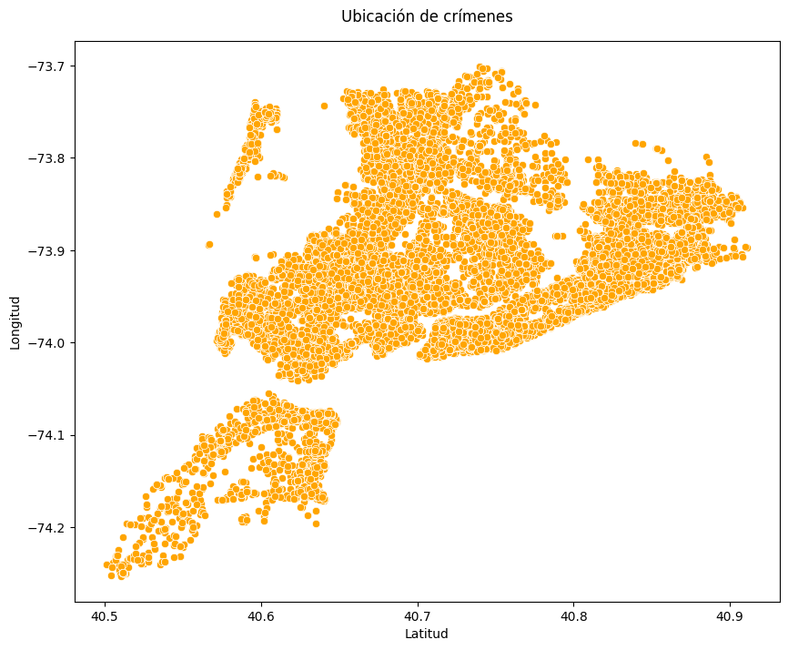
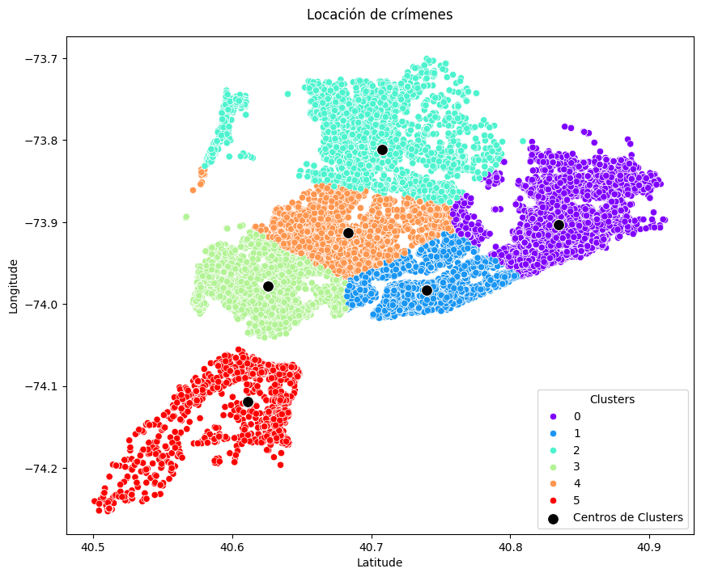

🏠 [**Inicio**](../../Readme.md) ➡️ / 📖 [**Sesión 08**](../Readme.md) ➡️ / 📝 `Ejemplo 01: Agrupamiento por K-Medias utilizando coordenadas geográficas`

## 🎯 Objetivo

Aplicar el algoritmo de **agrupamiento por K-Medias** para clasificar registros en diferentes grupos basados en características geográficas. Utilizaremos datos de arrestos realizados por el NYPD en Nueva York, explorando patrones de localización para identificar posibles ubicaciones estratégicas para casetas de vigilancia o patrullas.

---

## 🚀 Comencemos

El **agrupamiento por K-Medias** es una técnica de clasificación no supervisada que organiza los datos en grupos, o "clusters", de elementos similares. Este método es aplicable cuando se desea descubrir estructuras o patrones en datos grandes y no etiquetados. A continuación, utilizaremos el dataset de arrestos para analizar cómo el K-Medias puede ayudar a identificar agrupamientos de crímenes basados en coordenadas geográficas, [Ejemplo_01_Crime_Data.csv](../../Datasets/S08/Ejemplo_01_Crime_Data.csv).

---

### 🛠️ **Aplicación del agrupamiento por K-Medias**

Sigue los siguientes pasos para aplicar K-Medias al dataset de arrestos, considerando las coordenadas geográficas:

1. **Instalación de las bibliotecas necesarias:** Asegúrate de tener instaladas las bibliotecas necesarias para realizar el análisis. Si no las tienes, instálalas con el siguiente comando:

    ```bash
    !pip install pandas numpy scikit-learn matplotlib
    ```
2. **Importación de las bibliotecas:** Importa las bibliotecas que vas a utilizar:

    ```python
    from IPython.display import display
    from sklearn.cluster import KMeans
    import matplotlib.pyplot as plt
    import pandas as pd
    import numpy as np
    import seaborn as sns
    ```

3. **Carga y exploración del conjunto de datos:** Carga el dataset de arrestos y explora las primeras filas para familiarizarte con los datos:

    ```python
    # Cargar el conjunto de datos
    df = pd.read_csv('../S08/Ejemplo_01_Crime_Data.csv') # Cambia la ruta al archivo, de acuerdo a tu entorno de trabajo.

    # Mostrar las primeras filas del DataFrame
    df.head()
    ```

4. **Preprocesamiento de datos:** Antes de aplicar el algoritmo de K-Medias, es necesario preprocesar los datos para manejar valores nulos y seleccionar las columnas relevantes para el análisis:

    > **📝 Nota:** Es posible implementar dos estrategias diferentes, de acuerdo a los datos existentes.

    - **Estrategia 1:** Eliminar las filas con valores 0 o nulos en las columnas de Latitud y Longitud.
        ```python
        # Filtrar los datos para eliminar filas donde Latitude o Longitude sean 0
        df_cleaned = df[(df['Latitude'] != 0) & (df['Longitude'] != 0)]
        ```
    - **Estrategia 2:** Extraer los valores de Latitud y Longitud por los valores de la columna Georeferenced_Location aplicando una expresión regular.
        ```python
        # Extraer las coordenadas de la columna Georeferenced_Location
        df_cleaned[['Longitude', 'Latitude']] = df['Georeferenced_Location'].str.extract(r'POINT \((-?\d+\.\d+) (-?\d+\.\d+)\)').astype(float)
        ```

5. **Visualización de los datos:** Vamos a realizar una visualización general de los datos para entender la distribución de los crímenes en Nueva York:

    ```python
    # Crea un scatterplot con las localizaciones de los crímenes.
    fig = plt.figure(figsize=(10, 8))
    ax = fig.add_subplot()

    ax.set_title('Ubicación de crímenes', pad=15)
    ax.set_xlabel('Latitud')
    ax.set_ylabel('Longitud')

    sns.scatterplot(x='Latitude', y='Longitude', data=df_cleaned, ax=ax, color='orange')
    plt.show()
    ```
    <details>
        <summary><b>✨Haz clic aquí para ver la imagen✨</b></summary>
        <div align="center">
            
        </div>

    El scatterplot muestra las ubicaciones de los arrestos de la NYPD en Nueva York durante el año actual, con cada punto representando un arresto. Las áreas con mayor densidad de puntos indican zonas con alta actividad delictiva, reflejando patrones geográficos de criminalidad en la ciudad.
    </details>

    <br>

6. **Establecer centros de vigilancia o patrullas:** Para establecer centros de vigilancia efectivos en una región, necesitamos dividirla en varias subregiones, aunque inicialmente no sepamos cómo definirlas ni a qué subregión pertenece cada instancia de actividad delictiva. Si disponemos de recursos para seis centros de vigilancia o patrullas.

    ```python
    # Inicializa el modelo K-Means con 6 clusters, un máximo de 10,000 iteraciones, y una inicialización automática del número de centroides
    k_means = KMeans(n_clusters=6, max_iter=10000, n_init='auto')

    # Ajusta el modelo K-Means a los datos de latitud y longitud en el DataFrame 'df_cleaned'
    k_means.fit(df_cleaned[['Latitude', 'Longitude']])

    # Obtiene las coordenadas de los centros de los clusters formados por el modelo
    centers = k_means.cluster_centers_

    # Imprime las coordenadas de los centros de los clusters
    print(centers)
    ```
    La salida del código anterior mostrará las coordenadas de los centroides de los clusters formados por el modelo K-Medias. Por ejemplo:
    ```plaintext
    [[ 40.8347403  -73.9030803 ]
    [ 40.74010875 -73.98249653]
    [ 40.70808826 -73.81101422]
    [ 40.62568428 -73.97826437]
    [ 40.68351756 -73.91331392]
    [ 40.61118258 -74.11909069]]
    ```

    Los centroides representan las coordenadas de los centros de las posibles ubicaciones estratégicas para casetas de vigilancia o patrullas en Nueva York, basadas en la distribución de los crímenes en la ciudad.

    > **📝 Nota:** Es posible que los datos varíen ligeramente de acuerdo a la ejecución.

    <br>

7. **Clasificación de sub regiones:** Vamos a clasificar nuestros datos para poder colorearlos y visualizar mejor las ubicaciones:

    ```python
    # Predecir las clasificaciones de los datos utilizando el modelo K-Means ajustado
    clasificaciones = k_means.predict(df_cleaned[['Latitude', 'Longitude']])

    # Crear una figura y un eje para el scatterplot
    fig, ax = plt.subplots(figsize=(10, 8))

    # Establecer el título y las etiquetas de los ejes
    ax.set_title('Locación de crímenes', pad=15)
    ax.set_xlabel('Latitude')
    ax.set_ylabel('Longitude')

    # Graficar los datos de latitud y longitud, coloreados según las clasificaciones
    sns.scatterplot(x='Latitude', y='Longitude', data=df_cleaned, ax=ax, hue=clasificaciones, palette='rainbow')

    # Graficar los centros de los clusters en el scatterplot
    sns.scatterplot(x=centers[:, 0], y=centers[:, 1], ax=ax, s=100, color='black', label='Centros de Clusters')

    # Añadir la leyenda
    ax.legend(title='Clusters')

    # Mostrar el gráfico
    plt.show()
    ```

    <details>
        <summary><b>✨Haz clic aquí para ver la imagen✨</b></summary>
        <div align="center">
            
        </div>

    El scatterplot muestra las agrupaciones en seis clusters de colores distintos, que representan las posibles ubicaciones estratégicas para casetas de vigilancia o patrullas en Nueva York.
    </details>

    <br>
---

### 📉 **Interpretación de los resultados**

La visualización de los clusters te permite ver cómo el algoritmo de K-Medias agrupa los crímenes en diferentes áreas geográficas basadas en sus coordenadas. Cada color representa un cluster distinto, y los puntos marcan los centroides de estos clusters, lo que ayuda a identificar ubicaciones estratégicas para casetas de vigilancia o patrullas.

---

### 💡 **¿Sabías que?...**

El algoritmo de K-Medias es sensible a la escala de los datos y a la inicialización de los centroides. Es importante normalizar los datos y probar con diferentes inicializaciones para obtener mejores resultados. En este caso, las coordenadas geográficas no requieren normalización, ya que están en la misma escala.

Otro aspecto a considerar es el parametros de `random_state` en el modelo K-Medias. Este parámetro controla la aleatoriedad en la inicialización de los centroides y puede afectar los resultados. Si deseas obtener los mismos resultados en diferentes ejecuciones, puedes fijar el valor de `random_state` a un número específico, por ejemplo:

```python
k_means = KMeans(n_clusters=6, max_iter=10000, n_init='auto', random_state=42)
```

- random_state: int, default=None
    - Controla la aleatoriedad en la inicialización de los centroides. Si es un entero, `random_state` fija la semilla aleatoria. Si es `None`, la inicialización es aleatoria.

---

⬅️ [**Anterior**](../Readme.md) | [**Siguiente**](../Reto-01/Readme.md) ➡️