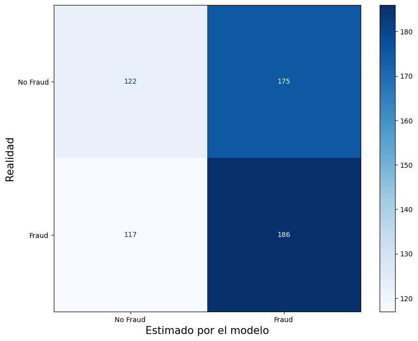
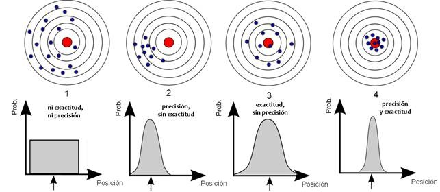

🏠 [**Inicio**](../../Readme.md) ➡️ / 📖 [**Sesión 08**](../Readme.md) ➡️ / 📝 `Ejemplo 03: Matriz de confusión para evaluación de modelos`

## 🎯 Objetivo

Aprender a utilizar la **Matriz de Confusión** y otras métricas para evaluar el rendimiento de un modelo de clasificación. En este caso, utilizaremos un dataset de transacciones de tarjetas de crédito para predecir si una transacción es fraudulenta o no, y analizaremos la precisión del modelo utilizando la matriz de confusión, exactitud, precisión, sensibilidad, especificidad y F1 score.

---

## 🚀 Comencemos

La **Matriz de Confusión** es una herramienta utilizada para evaluar el rendimiento de un modelo de clasificación, mostrando el número de predicciones correctas e incorrectas categorizadas por cada clase. Además, podemos calcular métricas como la exactitud, precisión, sensibilidad, especificidad y F1 score para obtener una evaluación más detallada del modelo. En este ejemplo, utilizaremos un dataset de transacciones de tarjetas de crédito para analizar cómo estas métricas pueden ayudar a evaluar el desempeño del modelo de regresión logística en la detección de fraudes. Utilizaremos el archivo [Ejemplo_03_Credit_Card_Fraud_Dataset.csv](../../Datasets/S08/Ejemplo_03_Credit_Card_Fraud_Dataset.csv).

---

### 🛠️ **Aplicación de la matriz de confusión y métricas de evaluación**

Sigue los siguientes pasos para aplicar la matriz de confusión y calcular las métricas de evaluación al dataset de detección de fraudes:

1. **Instalación de las bibliotecas necesarias:** Asegúrate de tener instaladas las bibliotecas necesarias para realizar el análisis. Si no las tienes, instálalas con el siguiente comando:

    ```bash
    !pip install pandas numpy scikit-learn matplotlib seaborn
    ```

2. **Importación de las bibliotecas:** Importa las bibliotecas que vas a utilizar:

    ```python
    from sklearn.model_selection import train_test_split
    from sklearn.linear_model import LogisticRegression
    from sklearn.metrics import confusion_matrix, ConfusionMatrixDisplay, classification_report
    import matplotlib.pyplot as plt
    import pandas as pd
    import numpy as np
    ```

3. **Carga y exploración del conjunto de datos:** Carga el dataset de detección de fraudes y explora las primeras filas para familiarizarte con los datos:

    ```python
    # Cargar el conjunto de datos
    df = pd.read_csv('Ejemplo_03_Credit_Card_Fraud_Dataset.csv')  # Ajusta la ruta al archivo según tu entorno de trabajo.

    # Mostrar las primeras filas del DataFrame
    df.head()
    ```

4. **Preprocesamiento de datos:** Selecciona las columnas relevantes para el análisis:

    ```python
    # Seleccionar las columnas relevantes para el análisis
    X = df[['Transaction Amount', 'Transaction Month', 'Transaction Year', 'Transaction Day', 
            'Transaction Hour', 'Transaction Minute', 'Transaction Second', 'Merchant ID']]
    y = df['Fraudulent Flag']
    ```

5. **División del conjunto de datos:** Divide el conjunto de datos en conjuntos de entrenamiento y prueba:

    ```python
    # Dividir los datos en entrenamiento y prueba (80% entrenamiento, 20% prueba)
    X_train, X_test, y_train, y_test = train_test_split(X, y, test_size=0.2, random_state=42)
    ```

6. **Aplicación de la regresión logística:** Aplica el algoritmo de regresión logística a los datos de entrenamiento:

    ```python
    # Inicializar el modelo de Regresión Logística
    logreg = LogisticRegression(max_iter=1000)

    # Ajustar el modelo a los datos de entrenamiento
    logreg.fit(X_train, y_train)

    # Realizar predicciones con el conjunto de prueba
    y_pred = logreg.predict(X_test)

    # Obtener el score del modelo en los datos de prueba
    score = logreg.score(X_test, y_test)
    print(f"Precisión del modelo: {score:.2f}")
    ```
    ```plaintext
    🛍️ Precisión del modelo: 0.51
    ```
    <!-- Resumen -->
    La precisión del modelo es del 51%, lo que indica que el modelo clasifica correctamente aproximadamente la mitad de las transacciones.

    <br>

7. **Generar y visualizar la matriz de confusión:** Utiliza la matriz de confusión para evaluar el rendimiento del modelo:

    ```python
    # Crear la matriz de confusión
    cm = confusion_matrix(y_test, y_pred)

    # Visualizar la matriz de confusión con tamaño ajustado
    disp = ConfusionMatrixDisplay(confusion_matrix=cm, display_labels=['No Fraud', 'Fraud'])
    fig, ax = plt.subplots(figsize=(10, 8))  # Ajustar el tamaño de la figura aquí
    disp.plot(cmap='Blues', ax=ax)  # Pasar el objeto ax al método plot
    plt.ylabel('Realidad', fontsize=15, y=0.5)
    plt.xlabel('Estimado por el modelo', fontsize=15)
    plt.show()
    ```

    <details>
        <summary><b>✨Haz clic aquí para ver la imagen✨</b></summary>
        <div align="center">
            
        </div>
    </details>

    <br>

8. **Calcular métricas de evaluación:** Calcula la exactitud, precisión, sensibilidad, especificidad y F1 score del modelo:

    ```python
    # Generar el informe de clasificación
    report = classification_report(y_test, y_pred, target_names=['No Fraud', 'Fraud'], output_dict=True)

    # Convertir el informe a un DataFrame
    report_df = pd.DataFrame(report).transpose()
    report_df.head()
    ```
    |                | precision | recall    | f1-score  | support   |
    |----------------|-----------|-----------|-----------|-----------|
    | **No Fraud**   | 0.510460  | 0.410774  | 0.455224  | 297.000000 |
    | **Fraud**      | 0.515235  | 0.613861  | 0.560241  | 303.000000 |
    | **accuracy**   | 0.513333  | 0.513333  | 0.513333  | 0.513333   |
    | **macro avg**  | 0.512848  | 0.512318  | 0.507732  | 600.000000 |
    | **weighted avg**| 0.512872 | 0.513333  | 0.508258  | 600.000000 |


    Esto producirá un informe de clasificación que incluye las siguientes métricas:

    - **Exactitud (Accuracy)**: Proporción de predicciones correctas sobre el total de predicciones.
    - **Precisión (Precision)**: Proporción de verdaderos positivos sobre el total de predicciones positivas. Indica cuán precisas son las predicciones de la clase positiva.
    - **Sensibilidad (Recall o Sensitivity)**: Proporción de verdaderos positivos sobre el total de verdaderos positivos y falsos negativos. Indica cuántos casos positivos reales fueron identificados correctamente.
    - **Especificidad (Specificity)**: Proporción de verdaderos negativos sobre el total de verdaderos negativos y falsos positivos. Indica cuántos casos negativos reales fueron identificados correctamente.
    - **F1 Score**: Media armónica de la precisión y la sensibilidad. Proporciona un equilibrio entre precisión y sensibilidad.

---

### 📉 **Interpretación de los resultados**

De acuerdo a los resultados obtenidos, podemos interpretar lo siguiente:

- **Exactitud (Accuracy)**: El modelo tiene una exactitud de 51.33%, lo que significa que clasifica correctamente un poco más de la mitad de las transacciones. Este rendimiento es solo ligeramente mejor que un modelo de azar (50%).

- **Precisión (Precision)**: 
  - Para "No Fraud", la precisión es de 51.05%, indicando que poco más de la mitad de las predicciones de no fraude son correctas.
  - Para "Fraud", la precisión es de 51.52%, sugiriendo un comportamiento similar para la detección de fraudes.

- **Sensibilidad (Recall)**:
  - Para "No Fraud", la sensibilidad es de 41.08%, lo que indica que el modelo detecta menos de la mitad de las transacciones no fraudulentas correctamente.
  - Para "Fraud", la sensibilidad es de 61.39%, lo que muestra que el modelo es mejor detectando fraudes que identificando transacciones legítimas.

- **F1 Score**: 
  - Los F1 scores son de 45.52% para "No Fraud" y 56.02% para "Fraud", reflejando un balance entre precisión y sensibilidad. El modelo es moderadamente mejor en la detección de fraudes.

- **Promedios Globales**:
  - **Macro Avg**: Este promedio toma en cuenta las métricas de ambas clases de manera equitativa, independientemente del número de casos en cada clase. Los valores de precisión, sensibilidad y F1 score rondan el 51%, lo que indica un rendimiento bajo del modelo.
  - **Weighted Avg**: Este promedio pondera las métricas de acuerdo al número de muestras en cada clase. Dado que los valores ponderados son similares a los valores de cada clase, se sugiere que el dataset no está fuertemente desbalanceado.

El modelo muestra un rendimiento limitado, especialmente en la detección de transacciones no fraudulentas, y apenas supera un modelo aleatorio. Para mejorar la detección de fraudes, sería útil considerar técnicas avanzadas y ajustes adicionales del modelo.

Otro tipo de interpretación visual podria ser la siguiente imagen:

<details>
    <summary><b>✨Haz clic aquí para ver la imagen✨</b></summary>
    <div align="center">
        
    </div>
</details>

---

### 💡 **¿Sabías que?...**

### Modelos de clasificación que utilizan la matriz de confusión

La matriz de confusión se puede utilizar con cualquier tipo de modelo de clasificación, incluyendo pero no limitado a:

1. **Regresión Logística**: Es un modelo de clasificación supervisada utilizado para predecir resultados binarios.
2. **Árboles de Decisión**: Modelos que utilizan una estructura de árbol para tomar decisiones y clasificar datos.
3. **Random Forest**: Un conjunto de árboles de decisión que mejora la precisión de la clasificación mediante la combinación de múltiples árboles.
4. **Máquinas de Vectores de Soporte (SVM)**: Modelos que buscan un hiperplano que mejor separe las clases en un espacio de características de alta dimensión.
5. **K-Nearest Neighbors (KNN)**: Modelo basado en la proximidad de un punto a sus vecinos más cercanos en un espacio de características.

---

⬅️ [**Anterior**](../Readme.md) | [**Siguiente**](../Reto-02/Readme.md) ➡️