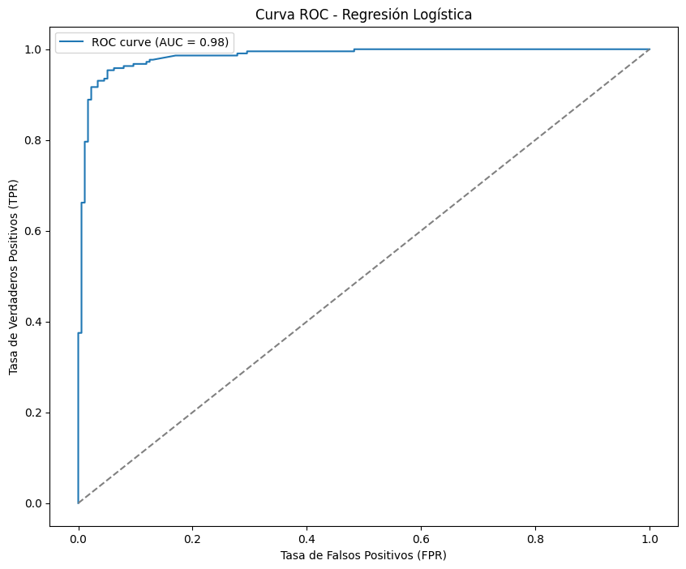

🏠 [**Inicio**](../../Readme.md) ➡️ / 📖 [**Sesión 08**](../Readme.md) ➡️ / 📝 `Ejemplo 04: Curva ROC / AUC`

## 🎯 Objetivo

Aprender a utilizar la **Curva ROC** y el **Área Bajo la Curva (AUC)** para evaluar el rendimiento de un modelo de clasificación. En este caso, utilizaremos un dataset de comentarios de YouTube para predecir si un comentario es spam o no, y analizaremos la capacidad del modelo para distinguir entre clases utilizando la curva ROC y el AUC.

---

## 🚀 Comencemos

La **Curva ROC (Receiver Operating Characteristic)** es una herramienta utilizada para evaluar el rendimiento de un modelo de clasificación binaria, mostrando la relación entre la tasa de verdaderos positivos (TPR) y la tasa de falsos positivos (FPR) para diferentes umbrales de decisión. El **Área Bajo la Curva (AUC)** mide la capacidad del modelo para distinguir entre las clases. En este ejemplo, utilizaremos un dataset de comentarios de YouTube para analizar cómo estas métricas pueden ayudar a evaluar el desempeño del modelo de regresión logística en la detección de spam. Utilizaremos el archivo [Ejemplo_04_Youtube_Spam_Dataset.csv](../../Datasets/S08/Ejemplo_04_Youtube_Spam_Dataset.csv).

---

### 🛠️ **Aplicación de la Curva ROC y AUC para la evaluación de modelos en detección de spam**

1. **Instalación de las bibliotecas necesarias:** Asegúrate de tener instaladas las bibliotecas necesarias para realizar el análisis. Si no las tienes, instálalas con el siguiente comando:

    ```bash
    pip install pandas numpy scikit-learn matplotlib
    ```

2. **Importación de las bibliotecas:** Importa las bibliotecas que vas a utilizar:

    ```python
    from sklearn.linear_model import LogisticRegression
    from sklearn.model_selection import train_test_split
    from sklearn.feature_extraction.text import TfidfVectorizer
    from sklearn.metrics import roc_curve, roc_auc_score
    import matplotlib.pyplot as plt
    import pandas as pd
    ```

3. **Carga y exploración del conjunto de datos:** Carga el dataset de detección de spam y explora las primeras filas para familiarizarte con los datos:

    ```python
    # Cargar el conjunto de datos
    df = pd.read_csv('Ejemplo_04_Youtube_Spam_Dataset.csv')  # Ajusta la ruta al archivo según tu entorno de trabajo.

    # Mostrar las primeras filas del DataFrame
    df.head()
    ```

4. **Preprocesamiento de datos:** Convierte el texto de los comentarios a una representación numérica usando TF-IDF:

    ```python
    # Convertir el texto a una representación TF-IDF
    tfidf = TfidfVectorizer(stop_words='english')
    X = tfidf.fit_transform(df['CONTENT'])

    # Variable objetivo
    y = df['CLASS']
    ```

    - **`tfidf = TfidfVectorizer(stop_words='english')`**: Inicializa un vectorizador TF-IDF, que convierte el texto en una representación numérica basada en la frecuencia de términos (TF) y la frecuencia inversa de documentos (IDF). El parámetro `stop_words='english'` elimina palabras comunes en inglés que no aportan mucho significado, como "the", "is", "in", etc.

    - **`X = tfidf.fit_transform(df['CONTENT'])`**: Ajusta el vectorizador TF-IDF a los datos de texto en la columna `'CONTENT'` del DataFrame `df` y transforma estos datos en una matriz de características numéricas. Cada fila de la matriz representa un comentario y cada columna representa una palabra del vocabulario generado, con valores que indican la importancia de cada palabra en cada comentario según TF-IDF.

    - **`y = df['CLASS']`**: Asigna la columna `'CLASS'` del DataFrame `df` a la variable `y`, que es la variable objetivo que indica si un comentario es spam (1) o no spam (0). Esta variable se utilizará para entrenar y evaluar el modelo de clasificación.

    <br>

5. **División del conjunto de datos:** Divide el conjunto de datos en conjuntos de entrenamiento y prueba:

    ```python
    # Dividir los datos en entrenamiento y prueba (80% entrenamiento, 20% prueba)
    X_train, X_test, y_train, y_test = train_test_split(X, y, test_size=0.2, random_state=42)
    ```

6. **Aplicación de la regresión logística:** Aplica el algoritmo de regresión logística a los datos de entrenamiento:

    ```python
    # Inicializar el modelo de Regresión Logística
    logreg = LogisticRegression(max_iter=1000)

    # Ajustar el modelo a los datos de entrenamiento
    logreg.fit(X_train, y_train)

    # Predecir las probabilidades en el conjunto de prueba
    y_prob = logreg.predict_proba(X_test)[:, 1]

    # Obtener el score del modelo en los datos de prueba
    score = logreg.score(X_test, y_test)
    print("Score del modelo:", score)

    # Calcular la curva ROC y el AUC
    fpr, tpr, thresholds = roc_curve(y_test, y_prob)
    auc = roc_auc_score(y_test, y_prob)
    print("AUC:", auc)
    ```
    ```plaintext
    Score del modelo: 0.9387755102040817
    AUC: 0.9844802188552189
    ```

7. **Generar y visualizar la curva ROC:** Utiliza la curva ROC para evaluar el rendimiento del modelo:

    ```python
    # Calcular la curva ROC y el AUC
    fpr, tpr, thresholds = roc_curve(y_test, y_prob)
    auc = roc_auc_score(y_test, y_prob)

    # Visualizar la curva ROC
    plt.figure(figsize=(10, 8))
    plt.plot(fpr, tpr, label=f'ROC curve (AUC = {auc:.2f})')
    plt.plot([0, 1], [0, 1], linestyle='--', color='gray')
    plt.xlabel('Tasa de Falsos Positivos (FPR)')
    plt.ylabel('Tasa de Verdaderos Positivos (TPR)')
    plt.title('Curva ROC - Regresión Logística')
    plt.legend()
    plt.show()
    ```

    <details>
        <summary><b>✨Haz clic aquí para ver la imagen✨</b></summary>
        <div align="center">
            
        </div>
    </details>

    <br>

---

### 📉 **Interpretación de los resultados**

1. **Precisión del modelo**:
   - La precisión del modelo es **0.9388** (o 93.88%), lo que significa que el modelo de regresión logística predice correctamente si un comentario es spam o no en aproximadamente el 94% de los casos. Este alto nivel de precisión indica que el modelo es bastante efectivo para clasificar los comentarios como spam o no spam en este conjunto de datos específico.

2. **Curva ROC**:
   - La **Curva ROC (Receiver Operating Characteristic)** en el gráfico se aproxima mucho a la esquina superior izquierda, lo cual es un signo de un modelo robusto. Esta forma indica que el modelo tiene una alta **Tasa de Verdaderos Positivos (TPR)** y una baja **Tasa de Falsos Positivos (FPR)** a través de varios umbrales de decisión. En términos simples, el modelo es muy bueno para maximizar los verdaderos positivos mientras minimiza los falsos positivos, lo cual es crucial en tareas de clasificación como la detección de spam.

3. **Área Bajo la Curva (AUC)**:
   - El **AUC (Área Bajo la Curva)** es **0.9845** (o 98.45%), lo que indica una capacidad excelente del modelo para distinguir entre comentarios de spam y comentarios legítimos. Un AUC cercano a 1 implica que el modelo tiene una alta discriminación entre las clases. En este caso, un AUC de 0.9845 sugiere que el modelo tiene un 98.45% de probabilidad de clasificar correctamente un comentario aleatorio como spam o no spam, lo que refuerza la efectividad del modelo en la detección de spam.

---

⬅️ [**Anterior**](../Readme.md) | [**Siguiente**](../Reto-03/Readme.md) ➡️