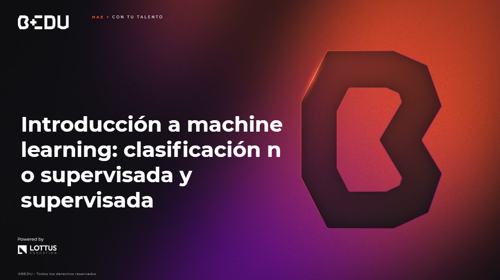

🏠 [**Inicio**](../Readme.md) ➡️ / 📖 `Sesión 08`

    

## 🎯 Objetivo

⚒️ Aplicar técnicas de machine learning para la clasificación de datos utilizando métodos supervisados y no supervisados, y evaluar su rendimiento.

---

📘 Material del prework: Antes de comenzar con los ejercicios de esta sesión, recordemos que en el material de prework hemos cubierto los fundamentos teóricos que aplicaremos hoy. A lo largo de esta sesión, pondremos en práctica estos conceptos mediante una serie de ejercicios y retos diseñados para reforzar y validar nuestro entendimiento. 🔥¡Vamos a comenzar!🔥

---

## 📂 Temas de la sesión...

### 📖 Agrupamiento por K-Medias (Clasificación no supervisada)

El agrupamiento por K-Medias es un algoritmo de clasificación no supervisada que agrupa los datos en K grupos distintos. Los grupos se crean de tal forma que los puntos de datos en el mismo grupo son más similares entre sí que con los puntos de datos de otros grupos.

En la vida real se puede comparar con la forma en que las personas clasifican objetos en su vida diaria. Por ejemplo, al clasificar frutas, las personas tienden a agrupar frutas similares en categorías como frutas cítricas, frutas tropicales, frutas de hueso, e incluso las que están en mejor estado.

##### 📜 **[Ejemplo 01: Agrupamiento por K-Medias (Clasificación no supervisada)](Ejemplo-01/Readme.md)**
##### 🔥 **[Reto 01: Segmentación de clientes por K-Medias](Reto-01/Readme.md)**

---

### 📖 Regresión logística (Clasificación supervisada)

La regresión logística es un algoritmo de aprendizaje supervisado utilizado para tareas de clasificación, especialmente para predecir la probabilidad de que una instancia pertenezca a una clase específica. En redes sociales, se aplica para detectar contenidos inapropiados y comportamientos sospechosos, clasificando comentarios como spam u ofensivos para mejorar la moderación del contenido.

##### 📜 **[Ejemplo 02: Regresión logística (Clasificación supervisada)](Ejemplo-02/Readme.md)**

---

### 📖 Matriz de confusión

Una matriz de confusión es una herramienta utilizada en aprendizaje supervisado para evaluar el rendimiento de un modelo de clasificación, mostrando la cantidad de predicciones correctas e incorrectas para cada clase a través de verdaderos positivos, verdaderos negativos, falsos positivos y falsos negativos. En la detección de fraude financiero, ayuda a analizar cuántas transacciones fraudulentas se detectan correctamente y cuántas legítimas se clasifican erróneamente, permitiendo ajustar los modelos para mejorar su precisión.

##### 📜 **[Ejemplo 03:  Matriz de confusión](Ejemplo-03/Readme.md)**
##### 🔥 **[Reto 02: Pendiente](Reto-02/Readme.md)**
---

### 📖 Curva ROC / AUC

La curva ROC es una gráfica que evalúa el rendimiento de un modelo de clasificación binaria al mostrar la relación entre la tasa de verdaderos positivos y la tasa de falsos positivos, mientras que el AUC mide el área bajo esta curva, indicando la capacidad del modelo para distinguir entre clases. En sistemas de visión por computadora, se utiliza para evaluar la precisión de los modelos que identifican patrones en imágenes, como en sistemas de seguridad que diferencian entre personas y objetos, donde un AUC alto refleja un buen rendimiento.

##### 📜 **[Ejemplo 04: Curva ROC / AUC](Ejemplo-04/Readme.md)**
##### 🔥 **[Reto 03: Pendiente](Reto-03/Readme.md)**
---

⬅️ [**Anterior**](../Sesion-07/Readme.md) | 🏠 [**Inicio**](../Readme.md)